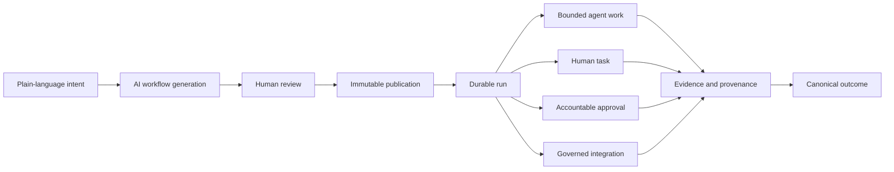
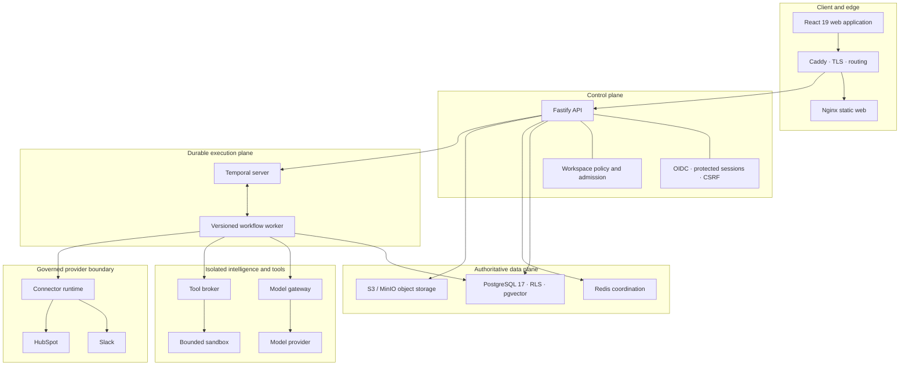

<p align="center">
  
</p>

<h1 align="center">Knotline</h1>

<p align="center">
  <strong>Turn operational intent into governed, durable, auditable execution.</strong>
</p>

<p align="center">
  Knotline is an AI-native operations platform for designing, approving, executing,
  and proving complex recurring work across people, agents, and connected systems.
</p>

<p align="center">
  <a href="https://knotline.in"><strong>Open Knotline</strong></a> ·
  <a href="./docs/demo/knotline/2026-08-02-complete-product-demo.md">Product tour</a> ·
  <a href="./docs/README.md">Documentation</a> ·
  <a href="#run-knotline-locally">Run locally</a>
</p>

<p align="center">
  
  
  
  
  
</p>

---

## Knotline in one minute

Most operational processes begin as a sentence and end up fragmented across
documents, chat threads, forms, scripts, and individual judgment. Knotline turns
that sentence into an executable system:

```text
Describe the operation
  → generate a typed workflow
  → review and publish an immutable version
  → execute through agents, people, and integrations
  → require approval where authority matters
  → preserve evidence for every decision
  → produce one authoritative outcome
```

A workflow is not a prompt or a checklist. It is a versioned graph with typed
inputs, explicit owners, bounded AI work, human decisions, integration actions,
failure routes, and terminal outcomes. Every run uses the published definition
that started it and remains inspectable from immutable input to final result.



## The product model

| Concept               | What it means in Knotline                                                                                                |
| --------------------- | ------------------------------------------------------------------------------------------------------------------------ |
| **Workflow**          | A typed directed graph of triggers, agents, people, decisions, integrations, transformations, and outcomes.              |
| **Published version** | An immutable executable contract with a canonical SHA-256 hash. Editing creates a new draft; history is never rewritten. |
| **Run**               | A durable execution pinned to one published version and one immutable input payload.                                     |
| **Agent**             | A versioned, capability-scoped AI worker with structured input, output, tools, knowledge, memory, and evaluation policy. |
| **Human task**        | Accountable work claimed by one person and submitted through a typed, immutable form.                                    |
| **Approval**          | A policy gate containing the proposed action, exact diff, risk, evidence, expiry, and recorded decision.                 |
| **Connection**        | A workspace-authorized external system with declared actions, encrypted OAuth credentials, health, and bounded receipts. |
| **Knowledge source**  | A classified, indexed document or website with permission-aware retrieval and attributable source coordinates.           |
| **Canonical outcome** | The single authoritative result emitted by the terminal path, including completed and intentionally skipped nodes.       |

## What Knotline includes

| Product area               | Capability                                                                                                                                                          |
| -------------------------- | ------------------------------------------------------------------------------------------------------------------------------------------------------------------- |
| **Workflow generation**    | Converts short operational requests into typed graphs with meaningful inputs, roles, approval policy, integrations, failure paths, and mutually exclusive outcomes. |
| **Workflow Studio**        | Visual graph editing, deterministic validation, semantic diff, optimistic concurrency, version history, restore, import, export, and atomic publication.            |
| **Durable execution**      | Temporal-backed orchestration with persisted run controls, timers, retries, task queues, pause, continuation, cancellation, and process-loss recovery.              |
| **Human-in-the-loop work** | Claimable inbox tasks, typed evidence forms, immutable submissions, accountable ownership, reminders, and escalation paths.                                         |
| **Approvals**              | Separation-of-duties enforcement, self-approval policy, expiry, exact proposed changes, recorded reasons, reminders, and immutable decisions.                       |
| **Agents**                 | Agent Builder, versioned instructions and capabilities, structured contracts, model gateway isolation, knowledge attachment, memory policy, tools, and evaluations. |
| **Connections**            | OAuth lifecycle, capability discovery, publication-time readiness checks, runtime token refresh, idempotent actions, and delivery receipts.                         |
| **Company knowledge**      | Safe document processing, classification, deterministic chunking, hybrid retrieval, pgvector search, short-lived authorization proofs, and citations.               |
| **Operations**             | Pulse, global search, notifications, run history, timelines, generated reports, export, workspace membership, and policy controls.                                  |
| **Governance**             | Tenant isolation, immutable definitions, append-only evidence, content-free operational logs, spend admission, kill switches, and audit-ready provenance.           |

## A complete operational journey

The critical customer access workflow exercises the platform from request to
audited resolution:

```text
Critical incident intake
  → evidence-backed agent triage
  → Slack coordination notice
  → accountable recovery approval
  → human-owned recovery execution
  → recovery-result routing
  → customer communication
  → communication validation
  → auditable incident closure
  → closure decision
  → Slack resolution update
  → resolved outcome
```

The verified resolved path executed 12 of 14 nodes, skipped only the two
irrelevant escalation nodes, delivered the coordination messages, and emitted
`resolved_outcome` as the authoritative terminal result. The alternative path
remains explicit and inspectable without being executed.

An enterprise onboarding workflow uses the same primitives to assess readiness,
gate CRM creation behind approval, create and associate HubSpot company/contact
records, announce the handoff in Slack, and route rejected or failed work to an
accountable escalation owner.

## How execution works

1. **Admission is transactional.** The API resolves the published version,
   validates workspace policy and required capabilities, reserves declared
   execution capacity, creates the entire task projection, appends the first
   event, and writes the start request in one PostgreSQL transaction.
2. **Temporal owns orchestration.** A stable workflow ID makes start recovery
   idempotent. Timers and waits survive worker or process restarts.
3. **Each node has explicit semantics.** System nodes execute deterministically;
   agent, human, approval, and integration nodes dispatch to isolated queue
   classes with separate authority.
4. **People remain in control.** Approval and human nodes suspend the workflow
   until an authorized, version-checked signal arrives.
5. **External actions are governed.** The worker records send-started evidence,
   uses idempotency keys, invokes an authorized connector, and retains a bounded
   receipt. Ambiguous operations become `uncertain` instead of being retried
   blindly.
6. **Routing is evidence-driven.** Conditions evaluate a restricted expression
   language against declared outputs; expressions are parsed as data and never
   evaluated as JavaScript.
7. **One terminal path wins.** The runtime closes irrelevant branches, records
   every completed and skipped node, and emits one canonical outcome.

## System architecture

Knotline separates its control plane, durable execution plane, model boundary,
tool boundary, and provider boundary. PostgreSQL is authoritative for product
state; Temporal is authoritative for orchestration history. Redis is used only
for non-authoritative coordination.



### Authority by subsystem

| Subsystem               | Authority                                                                                                                                                             |
| ----------------------- | --------------------------------------------------------------------------------------------------------------------------------------------------------------------- |
| PostgreSQL              | Workspaces, identities, definitions, published versions, run/task projections, approvals, events, evidence, connector receipts, knowledge ACLs, and admission ledger. |
| Temporal                | Durable orchestration history, activity scheduling, signals, timers, retries, and compatible workflow replay.                                                         |
| Redis                   | Ephemeral coordination and caches; never ownership, entitlement, fencing, or spend authority.                                                                         |
| S3 / MinIO              | Original documents and derived artifacts referenced by immutable database metadata.                                                                                   |
| Model gateway           | Provider isolation, role-specific model access, structured output enforcement, usage, cost, and provenance.                                                           |
| Tool broker and sandbox | Policy-checked tool invocation and bounded execution outside the worker process.                                                                                      |
| Connector runtime       | OAuth refresh, provider calls, idempotency, safe error mapping, and bounded action receipts.                                                                          |

## Engineering guarantees

### Workflow integrity

- Draft writes require the current revision and `If-Match` ETag; stale editors
  cannot overwrite newer work.
- Publication is atomic and blocked by stable validation findings.
- Published versions, node/edge rows, canonical exports, and hashes are
  immutable.
- Restore creates a new draft instead of modifying history.
- Conditions use a restricted parser with no dynamic evaluation, prototype
  access, or function construction.

### Durable and safe execution

- Delivery is at least once; state commits require the expected state version
  and fencing token.
- External operations record intent before invocation and distinguish confirmed
  failure from ambiguous delivery.
- Pause, continuation, cancellation, approvals, and human submissions are durable
  signals rather than browser state.
- Admission reserves exact integer base units and fails closed at workspace or
  global spend stops.
- Kill switches stop new work without deleting existing histories or evidence.

### Tenant and identity boundaries

- PostgreSQL row-level security is enabled and forced on durable tenant tables.
- Every repository operation runs inside explicit workspace/principal context.
- Google OIDC and single-use email links establish identity; sessions remain in
  protected cookies with CSRF enforcement.
- Approval policy can enforce independent reviewers and prohibit self-approval.
- Logs and traces use request, content, and proof hashes instead of raw customer
  payloads.

## AI without surrendering authority

Knotline uses AI where interpretation is valuable, but it does not treat model
output as authority.

- Workflow generation returns a schema-validated graph, not executable text.
- Publication independently validates structure, policy, agents, connections,
  expressions, and terminal behavior.
- Agent versions declare capabilities, instructions, model role, knowledge,
  memory, tools, and structured output contracts.
- Model access passes through an isolated gateway that records provenance,
  usage, latency, and cost while enforcing role boundaries.
- Consequential actions remain behind explicit approval or human-task nodes.
- Retrieved content is treated as untrusted evidence and cannot replace system
  or workflow policy.

## Permission-aware knowledge

Documents and approved HTTPS pages become versioned knowledge sources through a
controlled ingestion path:

```text
Upload
  → checksum and media validation
  → safe extraction
  → deterministic sections and chunks
  → injection-signal analysis
  → lexical + vector indexing
  → authoritative ACL projection
  → permission-filtered retrieval
  → source-coordinate citation
```

Authorization is a pre-filter, never a post-filter. A title, snippet, score,
count, or citation is returned only when the source has a complete, fresh,
authoritative ACL projection and the caller presents a current signed proof.
Deleting a source invalidates serving ACLs and outstanding proofs before its
content disappears from retrieval.

## Governed integrations

Connections are workspace resources—not environment-wide bearer tokens hidden
inside workflow code.

### Slack

- `message.post`
- `message.update`
- `message.delete`

### HubSpot

- `object.create` for contacts and companies
- `object.update`
- `association.create`

OAuth state is short-lived, workspace-bound, user-bound, single-use, and hashed
at rest. Access and refresh tokens are encrypted before storage. Publication
checks that referenced connections are compatible and executable; runtime
refreshes credentials when necessary and stores hashes, timing, status, and
bounded provider responses rather than credentials.

See [Live Slack and HubSpot connectors](./docs/operations/knotline/live-slack-hubspot-connectors.md)
for provider setup, payloads, and failure behavior.

## Product surfaces

| Surface         | Purpose                                                                                                  |
| --------------- | -------------------------------------------------------------------------------------------------------- |
| **Workflows**   | Library, prompt-based generation, visual map, Studio, validation, publication, and history.              |
| **Runs**        | Live execution room, outline, graph, timeline, controls, evidence, authoritative outcome, and export.    |
| **Approvals**   | Risk, proposed action, exact diff, evidence, decision, reminder, and decision history.                   |
| **Human work**  | Claimable tasks, immutable evidence forms, ownership, validation, and submission.                        |
| **Agents**      | Builder, capabilities, instructions, knowledge, tools, memory, model behavior, versions, and evaluation. |
| **Connections** | OAuth authorization, scopes, actions, health tests, lifecycle, and receipts.                             |
| **Knowledge**   | Document/website ingestion, classification, source health, preview, search, and citations.               |
| **Pulse**       | Operational summaries, attention queues, trends, and report generation.                                  |
| **Search**      | Workspace-wide discovery across workflows, runs, tasks, agents, people, and knowledge.                   |
| **Workspace**   | Members, roles, settings, notifications, policies, and identity controls.                                |

## Technology

| Layer                    | Technology                                                                                     |
| ------------------------ | ---------------------------------------------------------------------------------------------- |
| Web                      | React 19, TypeScript 6, Vite, React Router, React Flow, accessible responsive UI               |
| API                      | Fastify, Zod, protected cookie sessions, OIDC/OAuth callbacks, OpenAPI contracts               |
| Orchestration            | Temporal workflows, activities, signals, task queues, deterministic replay                     |
| Persistence              | PostgreSQL 17, forced RLS, append-only evidence, pgvector, transactional outbox                |
| Coordination and objects | Redis, MinIO locally, provider-neutral S3 object contract                                      |
| AI                       | Isolated model gateway, structured outputs, capability-scoped agents, evaluations              |
| Integrations             | Provider-neutral connector SDK, Slack API, HubSpot CRM API, OAuth token lifecycle              |
| Execution isolation      | Tool broker, policy boundary, bounded sandbox                                                  |
| Infrastructure           | Docker Compose, Caddy, Nginx, reproducible service images                                      |
| Quality                  | Vitest, Playwright, accessibility and visual suites, ESLint, strict TypeScript, contract gates |
| Supply chain             | Pinned actions/images, secret/dependency/license scans, SBOM, reproducible-build verification  |

## Run Knotline locally

### Prerequisites

- Node.js `>=24.14.0 <25`
- pnpm `11.9.0`
- Docker Engine with the Compose plugin

### Start the full product

```bash
corepack prepare pnpm@11.9.0 --activate
pnpm install --frozen-lockfile
pnpm local:preview
```

`local:preview` starts PostgreSQL, Redis, MinIO, Mailpit, Temporal, the API, web
application, and durable worker. Open the URL printed by Vite.

Stop the stack while preserving local volumes:

```bash
pnpm local:down
```

### Build the service images

```bash
pnpm release:build
pnpm release:up
```

Stop the release stack with:

```bash
pnpm release:down
```

## Verification

The primary engineering gate is:

```bash
pnpm verify
```

Focused suites are available when working inside a specific boundary:

```bash
pnpm test                 # activated unit suites
pnpm test:workflows       # workflow contracts, publication, RLS, and history
pnpm test:runtime         # durable runtime and worker behavior
pnpm test:retrieval       # permission-aware retrieval and query plans
pnpm test:connectors      # connector SDK and API behavior
pnpm test:browser         # end-to-end browser journeys
pnpm test:a11y            # accessibility coverage
pnpm typecheck            # strict monorepo type checking
pnpm lint                 # package and application linting
```

CI separates verification into static-contract, unit/coverage, dependency
integration, browser/accessibility, platform-pinned visual regression,
reproducible-build, container-policy, and supply-chain scanning lanes. Each lane
emits evidence artifacts rather than relying on a single opaque result.

## Repository map

```text
apps/
  web/                 React product surfaces and responsive design system
  api/                 HTTP control plane, identity, policy, and callbacks
  worker/              Temporal workflow and activity execution
  model-gateway/       isolated model-provider service boundary
  tool-broker/         governed tool invocation service
  sandbox/             bounded execution environment

packages/
  contracts/           schemas for workflows, runtime, agents, and APIs
  db/                  migrations, RLS policies, repositories, and ledgers
  agent-runtime/       capability-scoped published-agent execution
  agent-evaluation/    evaluation datasets, runs, and release checks
  connector-sdk/       provider-neutral connection and action contracts
  document-processing/ safe file parsing and processing contracts
  retrieval/           deterministic chunking and hybrid ranking
  knowledge-graph/     permission-aware entities, relations, and provenance
  model-gateway/       model roles, structured outputs, usage, and cost
  tool-broker/         tool policy and execution contracts
  operations/          logs, metrics, tracing, and operational primitives
  ui/                  shared accessible interface components

infra/                 local, release, and hosted Compose topologies
tooling/               migrations, gates, scans, repair, and release tooling
tests/                 browser, accessibility, visual, and integration journeys
docs/                  architecture decisions and operational specifications
```

## Documentation map

- [Documentation index](./docs/README.md)
- [Complete product tour](./docs/demo/knotline/2026-08-02-complete-product-demo.md)
- [Versioned workflow operations](./docs/operations/knotline/versioned-workflows.md)
- [Durable runtime](./docs/operations/knotline/durable-runtime.md)
- [Agent runtime and memory](./docs/operations/knotline/agent-runtime-and-memory.md)
- [Permission-aware retrieval](./docs/operations/knotline/permission-aware-retrieval.md)
- [Secure connector platform](./docs/operations/knotline/secure-connector-platform.md)
- [Live Slack and HubSpot connectors](./docs/operations/knotline/live-slack-hubspot-connectors.md)
- [Tool broker and sandbox](./docs/operations/knotline/tool-broker-and-sandbox.md)
- [Authentication security](./docs/operations/knotline/authentication-security.md)
- [Security assurance](./docs/operations/knotline/security-assurance.md)
- [Architecture decisions](./docs/architecture/knotline/adr-0001-fastify-typescript-control-plane.md)

## Deployment boundaries

The hosted reference topology runs the real API, worker, PostgreSQL, Redis,
Temporal, object storage, model gateway, tool broker, sandbox, and web edge as a
single-server Docker Compose deployment. It is appropriate for controlled
product operation and end-to-end validation; it does not imply multi-region or
managed-service resilience.

The accepted production architecture is documented separately and targets
isolated AWS environments, ECS/Fargate, RDS PostgreSQL Multi-AZ, ElastiCache,
S3/KMS, managed secrets, private networking, artifact promotion, and explicit
recovery evidence. Architecture intent is kept separate from claims about the
currently operated topology.

See [ADR-0004: AWS as the production infrastructure platform](./docs/architecture/knotline/adr-0004-aws-production-platform.md).
