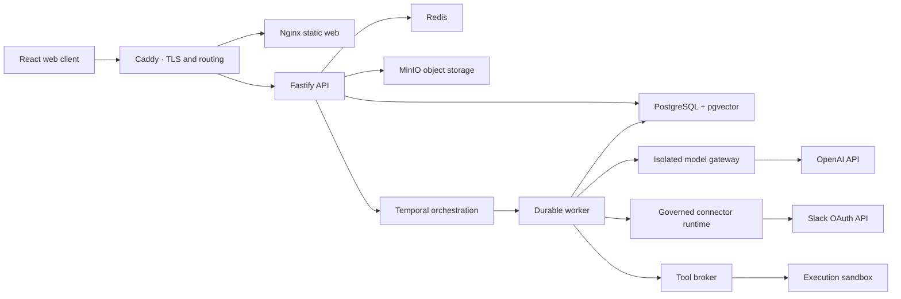

<p align="center">
  
</p>

<h1 align="center">Knotline</h1>

<p align="center">
  A governed AI workflow system for recurring, high-accountability operations.
</p>

<p align="center">
  <a href="https://knotline.in">Live deployment</a> ·
  <a href="./docs/demo/knotline/2026-08-02-complete-product-demo.md">Product demo</a> ·
  <a href="./docs/deployment/resume-demo.md">Deployment guide</a> ·
  <a href="./docs/README.md">Documentation</a>
</p>

## What Knotline demonstrates

Knotline turns a plain-language operational goal into a typed, reviewable, and
versioned workflow. Agents prepare bounded decisions, people retain authority
over consequential actions, connectors perform approved external work, and the
runtime preserves an auditable path from request to outcome.

The live deployment has completed an end-to-end critical incident workflow with:

- Google OAuth and protected cookie sessions;
- AI-assisted workflow generation and a published incident-response agent;
- durable orchestration through Temporal and PostgreSQL;
- a real Slack OAuth connection with initial and final delivery receipts;
- explicit approval, recovery, customer-communication, and audit tasks;
- mutually exclusive resolved and escalated outcomes; and
- an authoritative run record with immutable input and version history.

## Verified journey

```text
Incident intake
  → AI evidence triage
  → Slack coordination notice
  → accountable approval
  → human-owned recovery
  → recovery validation
  → customer communication
  → auditable closure
  → Slack resolution update
  → resolved outcome
```

The verified resolved path executed 12 steps, skipped the 2 irrelevant
escalation steps, and completed with no failed or pending tasks.

## Architecture



The résumé deployment runs these components with Docker Compose on one personal
Linux server. It preserves the real product behavior while intentionally
avoiding claims of multi-region resilience.

## Technology

| Area           | Stack                                                               |
| -------------- | ------------------------------------------------------------------- |
| Web            | React 19, TypeScript, Vite, React Router, React Flow                |
| API            | Fastify, Zod, TypeScript                                            |
| Runtime        | Temporal workflows and activities                                   |
| Data           | PostgreSQL 17, pgvector, Redis, MinIO                               |
| AI             | Isolated model gateway with strict structured outputs               |
| Integrations   | Governed OAuth/HTTP connector runtime and delivery receipts         |
| Infrastructure | Docker Compose, Caddy, Nginx                                        |
| Quality        | Vitest, Playwright, ESLint, TypeScript, contract and security gates |

## Governance and safety

- Workflow and agent definitions are immutable after publication.
- High-risk actions require an accountable approval path.
- Human-task submissions and run inputs are retained as audit evidence.
- Connector credentials are encrypted and provider actions are recorded.
- Model calls pass through an isolated gateway with bounded roles and outputs.
- PostgreSQL tenant isolation and explicit workspace context protect data access.
- Secrets are supplied through ignored environment files, never committed
  deployment configuration.

## Local development

Prerequisites:

- Node.js `>=24.14.0 <25`
- pnpm `11.9.0`
- Docker Engine with the Compose plugin

```bash
corepack prepare pnpm@11.9.0 --activate
pnpm install --frozen-lockfile
pnpm local:preview
```

Open the local URL printed by Vite. Stop the local services with:

```bash
pnpm local:down
```

## Verification

Run the activated engineering gate:

```bash
pnpm verify
```

Useful focused checks:

```bash
pnpm test
pnpm typecheck
pnpm lint
pnpm verify:secrets
```

## Deployment

The public résumé deployment uses the base Compose definition plus a hardened
single-server overlay. Configuration values belong only in the ignored
`infra/resume/.env.resume` file.

See [the deployment guide](./docs/deployment/resume-demo.md) for configuration,
TLS, first-use acceptance, operations, cost controls, and scope boundaries.

## Repository map

```text
apps/
  api/             HTTP control plane and identity callbacks
  web/             customer and operator web surfaces
  worker/          Temporal workflow and activity execution
  model-gateway/   isolated AI provider boundary
  tool-broker/     governed tool invocation
  sandbox/         bounded execution environment
packages/
  contracts/       typed workflow and runtime contracts
  db/              migrations, repositories, and tenant isolation
  connector-sdk/   provider-neutral connector contracts
  agent-runtime/   published agent execution
infra/             local, release, and résumé deployment definitions
docs/              architecture, operations, product, and deployment records
```

## Scope

This repository is a working product implementation and portfolio deployment,
not a claim of a fully operated enterprise SaaS. The live environment is a
single-server topology and should be evaluated within the boundaries documented
in the deployment guide.

Built by [Shubham Revankar](https://github.com/shubhamrevankar).
