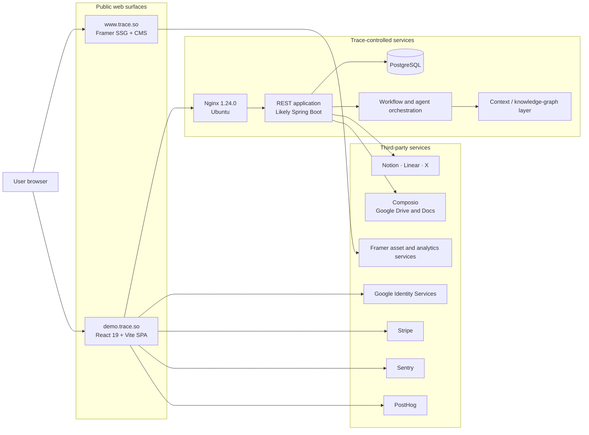

# Trace.so Technical Architecture and Public-Surface Analysis

**Subject:** [Trace](https://www.trace.so/)  
**Product application:** [demo.trace.so](https://demo.trace.so/)  
**Public API:** [api.trace.so](https://api.trace.so/)  
**Analysis date:** 2026-07-29  
**Timezone:** Asia/Kolkata  
**Method:** Passive inspection of publicly accessible website content, HTML,
JavaScript and CSS bundles, HTTP headers, DNS, TLS metadata, public API behavior,
company posts, Y Combinator material, and press coverage.

## Scope and safety

This report only uses public, unauthenticated information. The analysis did not:

- authenticate to Trace;
- access customer or private company data;
- attempt to bypass authorization;
- enumerate user or team identifiers;
- perform port scanning, credential testing, fuzzing, load testing, or
  exploitation;
- submit forms, create accounts, initiate payments, or modify external state.

Some findings are direct observations and others are architectural inferences.
Confidence labels are used throughout:

- **Confirmed:** directly visible in a public response, source bundle, DNS
  record, or first-party statement.
- **High-confidence inference:** multiple technical fingerprints strongly point
  to the conclusion, but private source code was not available.
- **Unverified claim:** stated by Trace or another public source but not
  independently observable from the public product.

## Executive summary

Trace is a B2B workflow-orchestration product intended to coordinate tasks
between AI agents and human team members. It connects to company systems,
represents operational work as a directed graph, assigns graph nodes to humans
or AI agents, and tracks outputs, dependencies, status, approvals, and external
system synchronization.

The public system is split into three separately deployed surfaces:

| Surface | Observed implementation | Hosting |
|---|---|---|
| `www.trace.so` | Framer-generated marketing site with static generation, CMS content, React hydration, Framer Motion, and Framer analytics | Framer |
| `demo.trace.so` | Vite-built React 19 single-page application with route-level code splitting | Vercel |
| `api.trace.so` | REST API behind Nginx on Ubuntu; response patterns strongly indicate Spring Boot/Spring Security | AWS EC2, `us-west-1` |

The API health endpoint confirms PostgreSQL. No public evidence identifies a
separate graph database, vector database, queue, scheduler, or LLM provider.

The product application is a mixture of:

- API-backed workflow and integration functionality;
- real authentication and Stripe checkout paths;
- predefined onboarding simulations;
- hard-coded dashboard, knowledge-graph, agent-activity, and administrative
  demonstration data.

The public assets reveal the workflow data model, API route inventory,
authentication strategy, integrations, pricing, frontend library versions,
telemetry configuration, and several security and maturity signals.

## System architecture



## Product and company context

### Product positioning

Trace describes itself as an “AI orchestration layer for modern teams.” The
stated design is:

1. connect company tools and communication systems;
2. construct a persistent representation of people, teams, projects, clients,
   tickets, documents, and relationships;
3. convert a plain-English process into a visual workflow;
4. allocate suitable steps to AI agents;
5. pause judgment-sensitive steps for human work or approval;
6. retain status, input, output, assignment, and audit information;
7. learn from repeated workflow execution and suggest further automation.

First-party and YC descriptions refer to the organizational representation as a
knowledge graph or unified index.

### Public company facts

- Founded in 2025.
- Y Combinator Summer 2025 batch.
- Founders:
  - Tim Cherkasov, co-founder and CEO.
  - Artur Romanov, co-founder and CTO.
- The YC profile listed a team size of three at the time of analysis.
- The company has been described as London-based, while its LinkedIn presence
  lists San Francisco.
- Trace announced a USD 3 million seed round in February 2026.
- Publicly named investors include Y Combinator, Zeno Ventures, Goodwater
  Capital, Transpose Platform Management, Formosa Capital, WeFunder, and angel
  operators.
- Trace reported more than 550 active workflows at the time of the funding
  announcement.
- Trace reported that approximately 10–14% of workflow tasks were assigned to
  its agents. This is a first-party traction claim and was not independently
  verified.

### Sources

- [Trace homepage](https://www.trace.so/)
- [Trace funding announcement](https://www.trace.so/blog/trace-raised-dollar3m-to-build-the-context-layer-for-ai-at-work)
- [Y Combinator company profile](https://www.ycombinator.com/companies/trace-so)
- [Y Combinator launch page](https://www.ycombinator.com/launches/OAG-trace-route-repetitive-tasks-to-ai-agents)
- [TechCrunch funding coverage](https://techcrunch.com/2026/02/26/trace-raises-3-million-to-solve-the-agent-adoption-problem/)
- [Trace LinkedIn company page](https://www.linkedin.com/company/trace-so)

## Domain and deployment inventory

### `www.trace.so`

**Confirmed observations**

- `www.trace.so` has a CNAME to `sites.framer.app`.
- The observed IPv4 addresses were:
  - `31.43.160.6`
  - `31.43.161.6`
- HTTP response header: `server: Framer/5d364ee`.
- Generator metadata: `Framer 69e7cf7`.
- `server-timing` identified:
  - a cached response;
  - optimized static generation;
  - a request served through region `ap-south-1` for the India-based inspection.
- HSTS was present with `max-age=31536000`.
- `X-Content-Type-Options: nosniff` was present.
- The observed homepage HTML response was approximately 738,292 bytes before
  transfer compression.
- The homepage’s last-modified value was 2026-07-14 during inspection.

### `demo.trace.so`

**Confirmed observations**

- CNAME:
  `b7c9bfa9bf795ee7.vercel-dns-017.com`.
- Observed IPv4 addresses:
  - `216.150.1.129`
  - `216.150.16.129`
- HTTP response header: `server: Vercel`.
- The root HTML is a small application shell of approximately 2,873 bytes.
- The same shell is returned for product routes such as `/account` and
  `/workflows`, confirming an SPA fallback.
- HSTS was present with `max-age=63072000`.
- Static responses included `Access-Control-Allow-Origin: *`.
- The HTML loads:
  - `/assets/index-DmxBD7Hr.js`
  - `/assets/index-zFX6kTo0.css`
- The initial JavaScript bundle was approximately 475,895 bytes.
- The initial CSS bundle was approximately 98,993 bytes.
- Route and shared chunks downloaded during inspection added approximately
  809,651 bytes.
- Lazy-loaded Sentry and PostHog chunks added approximately 545,520 bytes.

### `api.trace.so`

**Confirmed observations**

- IPv4 address: `52.9.40.155`.
- Reverse DNS:
  `ec2-52-9-40-155.us-west-1.compute.amazonaws.com`.
- This directly identifies AWS EC2 in `us-west-1`.
- The hostname did not expose a CNAME or visible managed load-balancer name.
- HTTP server header:
  `nginx/1.24.0 (Ubuntu)`.
- TLS certificate:
  - subject: `api.trace.so`;
  - issuer: Let’s Encrypt `YE2`;
  - ECDSA certificate;
  - TLS 1.3 successfully negotiated;
  - observed cipher: `TLS_AES_256_GCM_SHA384`;
  - certificate period during inspection:
    2026-07-20 through 2026-10-18.
- `/healthcheck` returned:

  ```json
  {
    "services": {
      "postgresql": "UP"
    },
    "status": "UP"
  }
  ```

- `/templates` returned HTTP 401 without authentication.
- `/openapi.json`, `/docs`, `/swagger-ui/index.html`, and
  `/actuator/health` returned HTTP 404.
- Error JSON, cache headers, frame-denial headers, and security behavior are
  highly characteristic of Spring Boot with Spring Security.
- The API did not expose an HSTS header during inspection.
- The API returned `X-Frame-Options: DENY`.
- CORS preflight allowed arbitrary origins, the requested method, and the custom
  `Trace-Auth-Token` header.

**High-confidence backend inference**

```text
Internet
  ↓
Nginx 1.24.0 on Ubuntu
  ↓
Java or Kotlin Spring Boot application
  ↓
PostgreSQL
```

No public evidence proves Java versus Kotlin, the exact Spring version,
containerization, or whether additional private services sit behind the API.

## Marketing-site implementation

The marketing site is a Framer project rather than a repository-built
application.

### Rendering and delivery

- Framer static generation produces a complete HTML document.
- React and Framer runtime modules hydrate interactive components in the
  browser.
- Framer preloads modules generated with a Rolldown-based runtime.
- The response preconnects to `framerusercontent.com`.
- Responsive image variants are requested through width and scale-down query
  parameters.
- A Framer handover data block serializes CMS records and page data into the
  HTML.

### Public Framer project identifier

The observed asset and search paths contain the Framer site identifier:

```text
5lzm3SUSiFkIPIJc12cHRt
```

### Framer modules observed

- Rolldown runtime
- React
- Motion
- Framer runtime
- AutoDitherImage component
- Shared component libraries
- Route/page components
- Main hydration script

Example module paths:

```text
https://framerusercontent.com/sites/5lzm3SUSiFkIPIJc12cHRt/rolldown-runtime.Dh6celcD.mjs
https://framerusercontent.com/sites/5lzm3SUSiFkIPIJc12cHRt/react.BpKPsBQp.mjs
https://framerusercontent.com/sites/5lzm3SUSiFkIPIJc12cHRt/motion.BQGYy2DG.mjs
https://framerusercontent.com/sites/5lzm3SUSiFkIPIJc12cHRt/framer.BrmEXdqG.mjs
https://framerusercontent.com/sites/5lzm3SUSiFkIPIJc12cHRt/script_main.DPRuWt5w.mjs
```

Asset hashes may change after a site deployment.

### CMS and search

The page embeds records for:

- blog post slugs, dates, titles, and cover images;
- testimonials;
- legal-page slugs;
- collection queries and pagination;
- record identifiers.

Framer search indexes:

```text
https://framerusercontent.com/sites/5lzm3SUSiFkIPIJc12cHRt/searchIndex-uCYSvn533bGT.json
https://framerusercontent.com/sites/5lzm3SUSiFkIPIJc12cHRt/searchIndex-y4F2NrcyfGg6.json
```

### Sitemap

The observed [sitemap](https://www.trace.so/sitemap.xml) contained:

```text
https://www.trace.so/
https://www.trace.so/contact
https://www.trace.so/blog/ai-agents-are-working-roi-isnt
https://www.trace.so/blog/why-we-build-evaluation-into-handoff-layer
https://www.trace.so/blog/ai-agents-growing-faster-than-enterprise-oversight
https://www.trace.so/blog/trace-raised-dollar3m-to-build-the-context-layer-for-ai-at-work
```

The legal and waitlist pages were not listed.

### SEO

Observed homepage metadata:

```text
Title: Trace
Description: AI orchestration layer for modern teams
Open Graph type: website
Open Graph title: Trace
Twitter card: summary_large_image
Canonical/Open Graph URL: https://www.trace.so/
Robots: max-image-preview:large
```

### Fonts and visual assets

Fonts visible across the generated page:

- Geist
- Geist Mono
- Inter
- JetBrains Mono

The marketing site uses:

- SVG product and partner marks;
- responsive PNGs;
- an MP4 product visual;
- Framer-hosted `.woff2` files;
- some Google Fonts resources;
- CSS-defined dashboard and terminal-style demonstrations.

### Analytics

The marketing site loads:

```text
https://events.framer.com/script?v=2
```

No Google Analytics, Google Tag Manager, PostHog, Mixpanel, Amplitude, Plausible,
or Hotjar marker was found in the inspected homepage HTML.

### Marketing/legal maturity signals

The current legal documents contain inherited template content:

- page titles identify “Nexflow”;
- body copy describes a Nexflow workflow-validation product;
- contact emails use `support@nexflow.dev` and `privacy@nexflow.dev`;
- duplicate footer fragments include “Codexa” copyright text;
- Trace branding appears around the inherited legal copy.

This is evidence of incomplete legal-content migration, not evidence about the
underlying production service.

## Product frontend architecture

### Build and framework

The product is a Vite application, not Next.js.

Evidence includes:

- `__vite__mapDeps`;
- Vite module-preload handling;
- hashed route chunks;
- a minimal `index.html` containing a single `#root`;
- client-side React Router routes;
- Vercel SPA fallback behavior.

### Confirmed library versions

| Library | Observed version |
|---|---:|
| React | 19.1.0 |
| React DOM | 19.1.0 |
| React Router | 7.6.3 |
| Dagre | 1.1.5 |
| Graphlib | 2.2.4 |
| Stripe JS wrapper | 7.8.0 |
| Sentry JavaScript | 10.3.0 |
| PostHog JS | 1.257.2 |

### Additional frontend libraries and patterns

- React Flow / XYFlow-style workflow canvas
- D3/force-graph-based knowledge-graph view
- Tailwind-style utility CSS
- CSS variables with light and dark design tokens
- Radix UI primitives
- shadcn-style component composition
- Lucide icon components
- Sonner toast notifications
- React Markdown
- UUID generation
- TourGuide-style onboarding library
- responsive media-query hooks

The generated CSS strongly resembles Tailwind CSS v4 output, including
`@property` registrations and compiled utility selectors. The exact Tailwind
package version was not preserved as a readable version string.

### Route chunks

Observed route-level chunks include:

```text
Account-1K5xUB7X.js
Agents-CwNOIOXP.js
Dashboard-DjUYe1hj.js
Onboarding-11Ql_bLG.js
OnboardingWorkflow-DvoegaKh.js
Workflow-BOtxpbvX.js
Workflows-D7p06A23.js
Pricing-DP9y-F5Q.js
```

Shared chunks include:

```text
LayoutUtils-D92DTHly.js
AgentActivityTable-Dx_TdBBO.js
SectionHeader-FSjd23d0.js
PageHeader-UlTR0FBf.js
tutorialScenarios-1nwuzL37.js
zoom-C0ysf6Ay.js
```

### Application routes

| Route | Purpose |
|---|---|
| `/` | Authenticated workflow-generation home or unauthenticated sign-in |
| `/dashboard` | Operational dashboard and knowledge-graph demonstration |
| `/workflows` | Workflow list and suggested workflow templates |
| `/workflow/:uuid` | API-backed workflow graph editor |
| `/agents` | Agent activity view |
| `/account` | Team, permissions, integrations, and account controls |
| `/pricing` | Plan selection and Stripe checkout |
| `/onboarding` | Onboarding scenario selection |
| `/onboarding/:workflow` | Simulated interactive workflow tutorial |
| `/auth/magic/validate` | Magic-link callback |
| `/teams/invite/accept` | Team invitation response |

### State and browser storage

No Redux store was observed. State is primarily managed through React contexts,
hooks, and local component state.

Observed storage keys:

| Storage | Key | Purpose |
|---|---|---|
| `localStorage` | `authToken` | JWT-like Trace authentication token |
| `localStorage` | `teamUuid` | Currently selected team |
| `localStorage` | `theme` | `dark` or `light` |
| `localStorage` | `warning_<key>_dismissed` | One-time warning dismissal |
| `localStorage` | `tg_tours_complete` | Completed product-tour groups |
| `sessionStorage` | `googleUserProfile` | Google sign-in profile/session helper |

### Theme system

The application:

- reads a saved `theme`;
- otherwise follows `prefers-color-scheme: dark`;
- toggles a `dark` class on `document.documentElement`;
- defines extensive semantic CSS variables for background, card, popover,
  borders, brand colors, statuses, charts, and workflow states.

Observed light theme values include:

```text
background: #efede6
foreground: #2b2b2b
card: #ffffff
brand-primary: #e05e0a
border: #d6d6c6
success: #16a34a
danger: #dc4a2c
```

## Authentication implementation

### Supported authentication paths

- Email magic link
- Google Identity Services
- Google One Tap

### Token handling

The frontend:

1. obtains an `authToken` from the backend;
2. stores it in `localStorage`;
3. decodes the JWT payload in the browser;
4. reads a `userUuid` field;
5. sends the token on API requests as:

   ```http
   Trace-Auth-Token: <token>
   ```

The frontend’s token decoding is only used for client identity/state. Proper
cryptographic verification must occur on the backend; that private behavior
could not be inspected.

### Authentication endpoints

```text
POST /auth/magic?email=<email>
GET  /auth/magic/validate?code=<code>
POST /auth/google/validate
```

The Google validation body is shaped like:

```json
{
  "email": "user@example.com",
  "idToken": "<google-id-token>"
}
```

### Authentication security observations

- The Trace token is accessible to same-origin JavaScript because it is stored
  in `localStorage`.
- A successful same-origin XSS would therefore be able to read it.
- The product does not appear to use an HttpOnly session cookie.
- The magic-link email and validation code are query parameters, which can be
  retained in HTTP access logs unless redacted.
- Logout removes `authToken`, `teamUuid`, and `googleUserProfile`, then navigates
  to `/`.

## Team and tenant model

The frontend maintains:

- `userUuid`;
- selected `teamUuid`;
- available teams;
- current team record;
- team-member records.

After authentication it:

1. loads teams for the current user;
2. restores a selected team from `localStorage`;
3. selects the first team when no selection exists;
4. loads users for the selected team;
5. exposes the current team and members through React context.

This is evidence of a multi-team, likely multi-tenant application model.
Server-side tenant isolation could not be verified.

## Workflow data model

The core product representation is a directed graph.

### Workflow

Public bundle usage indicates a structure similar to:

```typescript
interface Workflow {
  uuid: string;
  name: string;
  status?: "PENDING" | "RUNNING" | "COMPLETED" | string;
  createdAt: string;
  nodes: WorkflowNode[];
  edges: WorkflowEdge[];
}
```

### Workflow node

```typescript
interface WorkflowNode {
  uuid: string;
  workflowUuid: string;
  summary: string;
  description: string;
  status: "PENDING" | "RUNNING" | "COMPLETED" | string;
  position: {
    x: number;
    y: number;
  };
  assigneeUuid: string | null;
  assigneeConfig: string | null;
  output: string | null;
}
```

### Workflow edge

```typescript
interface WorkflowEdge {
  uuid: string;
  fromUuid: string;
  toUuid: string;
}
```

### Human versus AI assignment

- `assigneeUuid` represents a human or team member.
- `assigneeConfig` represents an AI-agent configuration.
- A node may have either assignment form.
- Tutorial data identifies at least:
  - `WEB_SEARCH_AGENT`
  - `T2T_AGENT`
- The UI prevents or warns about running workflows whose initial human task has
  not completed.

### Node rendering

React Flow nodes include:

- task summary;
- task description;
- output;
- status;
- human/agent assignment;
- previous and following nodes;
- external Linear child information;
- task mutation callbacks.

### Edge rendering

Edges:

- connect `fromUuid` to `toUuid`;
- animate when the source task is not complete;
- use a custom removable edge type;
- end in arrow markers;
- change stroke colors for light and dark themes.

## Workflow layout and interaction

### Automatic layout

Dagre is configured with:

```text
rankdir: LR or RL
node width: 172
node height: 36
nodesep: 200
ranksep: 200
```

The layout maps Dagre center coordinates back to React Flow’s top-left node
coordinates.

### Editor operations

Users can:

- create a dependency edge;
- remove a dependency edge;
- move nodes;
- persist node positions;
- update task data;
- add a node relative to another node;
- delete a node;
- break a node into subtasks;
- start/update a workflow;
- auto-assign unassigned tasks;
- synchronize workflow information to Linear.

### Refresh behavior

The API-backed editor:

- loads a workflow on mount;
- loads Linear child synchronization data;
- polls the workflow every 2,000 milliseconds;
- compares the latest workflow to local state;
- updates only when data changes.

No first-party WebSocket or Server-Sent Events workflow transport was found.
WebSocket and EventSource strings in the inspected assets belonged to the
Sentry SDK.

### Workflow generation

The frontend can request generation from:

- a natural-language message;
- a predefined template.

The message path accepts:

```text
teamUuid
message
shouldSave
```

The template path accepts:

```text
teamUuid
templateUuid
shouldSave
```

The product’s public description implies that the backend decomposes a
high-level process into graph nodes, resolves dependencies, and assigns tasks to
agents or humans. The model/provider performing this work is not exposed.

## Complete observed REST client

The production API base URL embedded in the frontend is:

```text
https://api.trace.so
```

The local-development base URL embedded in the same bundle is an ngrok
hostname:

```text
https://api.auriform-derrick-spectrographic.ngrok-free.dev
```

The following endpoint inventory is derived from the product’s public REST
client.

### Workflow endpoints

| Method | Endpoint | Frontend purpose |
|---|---|---|
| POST | `/workflows?teamUuid={team}&message={message}&shouldSave={value}` | Generate a workflow from a prompt |
| POST | `/workflows?teamUuid={team}&templateUuid={template}&shouldSave={0-or-1}` | Generate from a template |
| GET | `/workflows/vibeManage?uuid={workflow}` | Auto-assign or “vibe manage” tasks |
| GET | `/workflows?teamUuid={team}` | List team workflows |
| GET | `/workflows/externalPMSyncs?workflowUuids={ids}&system={system}` | Get external project-management syncs |
| GET | `/workflows/externalPMSyncs/children?workflowUuid={id}&system={system}` | Get child synchronization records |
| GET | `/workflows/{workflow}` | Get one workflow |
| PUT | `/workflows` | Update a workflow |
| DELETE | `/workflows/{workflow}` | Delete a workflow |

### Workflow-node endpoints

| Method | Endpoint | Frontend purpose |
|---|---|---|
| POST | `/workflows/{workflow}/nodes/{node}/add?direction={direction}` | Add a related node |
| PUT | `/workflows/{workflow}/nodes/{node}` | Update one node |
| PUT | `/workflows/{workflow}/nodes` | Update all node records/positions |
| POST | `/workflows/{workflow}/nodes/{node}/break` | Break a task into subtasks |
| DELETE | `/workflows/{workflow}/nodes/{node}` | Delete a node |

### Authentication endpoints

| Method | Endpoint | Frontend purpose |
|---|---|---|
| POST | `/auth/magic?email={email}` | Send or directly resolve a magic-link login |
| GET | `/auth/magic/validate?code={code}` | Validate magic-link code |
| POST | `/auth/google/validate` | Exchange/validate Google identity |

### User endpoints

| Method | Endpoint | Frontend purpose |
|---|---|---|
| GET | `/user/{user}` | Retrieve user |
| PUT | `/user` | Save user |
| POST | `/user/{user}/onboarding-checked` | Mark onboarding as checked |

### Team endpoints

| Method | Endpoint | Frontend purpose |
|---|---|---|
| GET | `/teams?userUuid={user}` | List teams for a user |
| PUT | `/teams` | Save a team |
| GET | `/teams/{team}/files` | List team files |
| POST | `/teams/{team}/files` | Upload a team file |
| GET | `/teams/{team}/users` | List team users |
| POST | `/teams/{team}/users/invite?email={email}` | Invite a member |
| DELETE | `/teams/{team}/users/{user}` | Remove a member |
| POST | `/teams/invite/respond?reference={ref}&accepted={boolean}` | Respond to invitation |

### Databank and integration endpoints

| Method | Endpoint | Purpose |
|---|---|---|
| POST | `/databank/notion/sync?integrationUuid={id}` | Synchronize Notion |
| POST | `/databank/googledrive/sync?uuid={id}` | Synchronize Google Drive |
| DELETE | `/databank/file?teamUuid={team}&source={source}&externalIdentifier={id}` | Delete indexed file |
| DELETE | `/databank/googledrive/{id}` | Remove Drive integration |
| DELETE | `/databank/x/{id}` | Remove X integration |
| DELETE | `/databank/notion/{id}` | Remove Notion integration |
| DELETE | `/databank/linear/{id}` | Remove Linear integration |
| POST | `/databank/notion/setup?teamUuid={team}&code={code}` | Complete Notion OAuth |
| POST | `/databank/linear/setup?teamUuid={team}&code={code}` | Complete Linear OAuth |
| POST | `/databank/x/setup?teamUuid={team}&code={code}` | Complete X OAuth |
| POST | `/databank/google/setup?teamUuid={team}&code={code}&type={type}` | Complete Google setup |
| POST | `/databank/composio/initiate_account?teamUuid={team}&type={type}` | Start a Composio connection |
| GET | `/databank/notion?teamUuid={team}` | List Notion integrations |
| GET | `/databank/linear?teamUuid={team}` | List Linear integrations |
| GET | `/databank/x?teamUuid={team}` | List X integrations |
| GET | `/databank/google?teamUuid={team}` | List Google integrations |

### Template and connector endpoints

| Method | Endpoint | Purpose |
|---|---|---|
| GET | `/templates?teamUuid={optional-team}` | Retrieve public/team templates |
| POST | `/templates/workflow/{workflow}` | Generate a template from a workflow |
| POST | `/connector/linear/workflow/{workflow}/sync` | Synchronize a workflow to Linear |

### Billing and operational endpoints

| Method | Endpoint | Purpose |
|---|---|---|
| POST | `/checkout/session?teamUuid={team}&priceId={price}` | Create Stripe checkout session |
| GET | `/healthcheck` | Application/PostgreSQL health |

## Integrations

### Integration matrix

| Integration | Public frontend state | Implementation evidence |
|---|---|---|
| Notion | Self-service-looking | Direct OAuth URL and REST setup/list/sync/remove methods |
| Linear | Self-service-looking, labeled beta | OAuth with read/write and `issues:create`; workflow sync endpoints |
| Google Drive | Available | Composio initiation and Drive synchronization |
| Google Docs | Available | Composio initiation with documents scope |
| X/Twitter | Available in product/pricing | Direct OAuth URL and setup/list/remove endpoints |
| File upload | Available | Team files and databank deletion endpoints |
| Google Sheets | Beta/contact setup | UI shows contact instruction |
| Slack | Beta/contact setup | UI shows contact instruction |
| Jira | Beta/contact setup | UI shows contact instruction |
| HubSpot | Marketing/demo graph | No self-service connector flow observed in current app bundle |
| Gmail | Demo graph | No self-service connector flow observed |
| GitHub | Demo graph | No self-service connector flow observed |
| Salesforce | Demo graph | No self-service connector flow observed |
| Zendesk | Demo graph | No self-service connector flow observed |
| DocuSign | Demo graph | No self-service connector flow observed |
| Confluence | Demo graph | No self-service connector flow observed |
| Looker | Demo graph | No self-service connector flow observed |

“No flow observed” does not prove the backend lacks the integration. It means
the public product bundle did not expose a setup path for it.

### Notion OAuth

The frontend constructs a Notion OAuth request using:

```text
response_type=code
owner=user
state=setup_notion
redirect_uri=https://demo.trace.so/account
```

### Linear OAuth

The frontend constructs a Linear OAuth request using:

```text
response_type=code
scope=read,write,issues:create
state=setup_linear
redirect_uri=https://demo.trace.so/account
actor=app
```

### X OAuth

The frontend requests:

```text
tweet.read
tweet.write
users.email
users.read
offline.access
like.read
list.read
media.write
```

It constructs:

```text
state=setup_X
code_challenge=challenge
code_challenge_method=plain
```

The constant plain challenge makes the visible PKCE step ineffective as a
per-transaction secret. Server-side controls may compensate, but they are not
visible publicly.

### OAuth callback maturity observation

The REST client defines Notion, Linear, X, and Google setup-completion methods.
However, the current public bundle contains only the method definitions and no
observable calls to those methods. The fixed state strings also appear only in
the outbound OAuth URLs.

Possible explanations:

- the public demo contains an unfinished callback implementation;
- another deployment handles the callback;
- the provider or backend redirects through an unobserved step;
- the methods are retained dead code from an older flow.

The public bundle alone cannot distinguish these possibilities.

### Composio

Google Drive and Docs connections use:

```text
POST /databank/composio/initiate_account
```

The backend returns a `redirect_url`, which is loaded into a pre-opened browser
window. This is direct evidence that Composio is used as an integration broker
for at least some Google connections.

## Knowledge graph

### Stated architecture

Trace states that it:

- connects existing company tools;
- maps entities and relationships;
- represents people, teams, projects, clients, and tickets;
- retrieves only the context needed by a workflow step;
- improves its understanding as workflows run.

### Public UI implementation

The current dashboard bundle contains a force-directed graph visualization.
Its public, hard-coded dataset includes:

- departments:
  - Engineering
  - Sales
  - Marketing
  - Finance
  - HR
  - Operations
  - Customer Success
  - Legal
- systems:
  - Slack
  - Gmail
  - Google Drive
  - Notion
  - Linear
  - GitHub
  - Salesforce
  - HubSpot
  - Zendesk
  - DocuSign
  - Confluence
  - Looker
- synthetic people and organizational links.

The graph component provides methods such as:

```text
d3Force
d3ReheatSimulation
emitParticle
centerAt
zoom
zoomToFit
getGraphBbox
screen2GraphCoords
graph2ScreenCoords
```

### Storage inference

The only datastore publicly confirmed by the health endpoint is PostgreSQL.
Possible private implementations include:

1. entity and relation tables in PostgreSQL;
2. PostgreSQL plus an unreported vector extension such as pgvector;
3. an unreported graph/vector service not included in health output;
4. a separately deployed context service.

There is no public evidence confirming Neo4j, Pinecone, Qdrant, Weaviate,
OpenSearch, Elasticsearch, or pgvector.

## Agent and orchestration behavior

### Publicly visible agent concepts

The product UI and pricing refer to:

- web search;
- text processing;
- web scraping;
- email automation;
- X automation;
- Google Docs and spreadsheet generation;
- document extraction;
- lead qualification;
- data enrichment;
- customer onboarding;
- compliance review;
- invoice processing;
- support routing.

Some are product capabilities, some are tutorial agents, and some only appear
in synthetic dashboard data.

### Assignment behavior

The frontend calls:

```text
GET /workflows/vibeManage?uuid=<workflow>
```

Tutorial mocks return a response keyed by node UUID containing:

```typescript
{
  agentable: boolean;
  agentConfig: string | null;
}
```

The UI then assigns either:

- a team member; or
- an agent configuration.

### Controlled execution

Public product descriptions and UI behavior indicate:

- dependencies gate downstream work;
- human tasks can block workflow progress;
- completed node outputs become available to later nodes;
- low-confidence output can be flagged for review;
- approval gates can pause execution;
- external project-management state can be attached to nodes;
- workflow and task status are retained.

The backend execution runtime, queueing, retries, idempotency, concurrency
limits, and agent sandboxing are not exposed.

## Onboarding implementation

The interactive onboarding is explicitly simulated.

### Mock architecture

The onboarding bundle contains a `MockHAL`-style class that:

- initializes a predefined workflow;
- clones mock team, user, and member objects;
- simulates delays with `setTimeout`;
- returns cloned state;
- uses random team-member selection for some assignment behavior;
- generates timestamp-based subtask IDs;
- responds to tutorial actions by moving between predefined states.

### Tutorial workflow examples

Scenarios include:

- an EcoCup press-release workflow;
- procurement research and reporting;
- marketing/campaign work;
- other preconstructed organizational examples.

Example task sequence:

```text
Provide product details
  ├── Research environmental impact
  └── Gather customer testimonials
          ↓
     Draft press release
          ↓
     Edit and send to media contacts
```

Tutorial state transitions include:

1. unassigned graph;
2. delegated graph;
3. running workflow;
4. partially completed workflow with predefined outputs.

TourGuide-style overlays highlight UI targets, persist tour completion, and
advance the mock state machine.

## Dashboard, agents, and admin-screen authenticity

### Dashboard

The dashboard currently embeds fixed browser-side data for:

- active workflow count;
- completed task count;
- AI versus human task totals;
- hours saved;
- manual versus Trace time;
- cost per run;
- agent confidence;
- weekly savings chart;
- workflow alerts;
- SLA risk;
- review state;
- blocked state.

Example fixed values in the current bundle include:

```text
25 active workflows
18 running now
147 completed tasks
89 AI tasks
58 human tasks
90.7 hours saved
$0.12 cost per run
45 minutes manual time per run
8 minutes Trace time per run
```

These are presentation data, not API-fetched production metrics.

### Agent activity

The agent table uses fixed entries such as:

- Invoice Processor
- Lead Qualifier
- Data Enricher
- Customer Onboarder
- Compliance Reviewer
- Support Router

Each includes predefined running/completed counts, confidence values, and
sparklines.

### Admin and team management

The account route contains a polished but largely synthetic administration
screen:

- approximately 30 fictional `@acme.com` members;
- predefined names, departments, roles, statuses, and last-active timestamps;
- client-side filtering and pagination;
- invitations that modify local component state;
- removal that modifies local component state.

The REST client separately defines real team-invite and removal endpoints, but
the currently loaded administrative member table does not appear to use them.

### Permission matrix

The UI displays three roles:

- Admin
- Editor
- Viewer

The client-side matrix presents permissions for:

- workflow creation/editing;
- workflow execution;
- workflow deletion;
- agent management;
- agent activity viewing;
- team settings;
- member invitation/removal;
- billing-history viewing;
- plan/payment management.

This proves that the permission model is part of the product design. It does
not prove that equivalent checks are enforced by the backend.

## Pricing and billing

The pricing route includes four plans.

| Plan | Monthly | Yearly |
|---|---:|---:|
| Free | USD 0 | USD 0 |
| Pro | USD 60 | USD 540 |
| Team | USD 200 | USD 1,800 |
| Enterprise | Custom | Custom |

### Free

- 1,000 monthly credits
- Upload files to Personal Databank
- Notion integration
- Create Docs and Spreadsheets
- Basic agents:
  - Web Search
  - Text Processing

### Pro

- Everything in Free
- 10,000 additional monthly credits
- Personal Google Drive integration
- Advanced agents:
  - Web Scraper
  - Email automation
  - X/Twitter integration

### Team

- Everything in Pro
- 30,000 additional monthly credits
- Shared Google Drive integration
- Team Databanks
- Process automation:
  - Cron schedulers
  - Team templates

### Enterprise

- Everything in Team
- Custom deployment
- Dedicated support
- SLA guarantees
- Advanced security
- Custom integrations
- BYOA: Bring Your Own Agent

### Stripe implementation

- Stripe JS is loaded dynamically.
- The embedded wrapper version is 7.8.0.
- Production and test publishable keys are present in the public bundle.
- Pro and Team monthly/yearly Stripe price IDs are present.
- The application requests a checkout session from Trace’s backend.
- It calls Stripe’s checkout redirection with the returned `sessionId`.
- Enterprise uses a `mailto:founders@trace.so` contact path.

Publishable Stripe values and price identifiers are intentionally not duplicated
verbatim in this report. They are public-by-design client configuration rather
than secret server credentials and remain directly observable in the linked
pricing bundle:

[Current pricing bundle](https://demo.trace.so/assets/Pricing-DP9y-F5Q.js)

## Observability and analytics

### Sentry

The production application lazily loads Sentry 10.3.0.

Observed configuration:

```typescript
{
  environment: "prod",
  sendDefaultPii: true,
  tracesSampleRate: 1,
  replaysSessionSampleRate: 0.1,
  replaysOnErrorSampleRate: 1
}
```

It enables browser tracing and propagates traces to:

```text
https://api-dev.trace.so
https://api.trace.so
```

Implications:

- all eligible performance traces are sampled;
- 10% of normal sessions may be recorded;
- sessions associated with captured errors may be recorded at 100%;
- default PII attachment is enabled.

### PostHog

The production application lazily loads PostHog 1.257.2.

Observed configuration includes:

```text
API host: https://us.i.posthog.com
capture_exceptions: true
defaults: 2025-05-24
debug: false in production
```

The bundled SDK supports:

- event autocapture;
- page and navigation capture;
- feature flags;
- session recording;
- surveys;
- exception capture;
- remote configuration.

The precise server-side PostHog project configuration is not visible.

### Telemetry privacy consideration

Trace is designed to handle company documents, workflow descriptions, task
outputs, and organizational context. The combination of:

- default PII transmission;
- exception capture;
- performance tracing;
- session replay;
- PostHog autocapture capabilities

should be included in any enterprise privacy and data-processing review.

Publicly embedded telemetry project keys and DSNs are not authentication
secrets, but they are not duplicated verbatim here to avoid unnecessary event
injection surface.

## Security observations

These findings are configuration and review signals. They are not proof of a
practical exploit.

### 1. Token stored in `localStorage`

**Observation:** The Trace authentication token is stored under `authToken`.

**Risk:** Same-origin XSS could read and exfiltrate it.

**Possible mitigation:** HttpOnly, Secure, SameSite cookies; strict CSP;
short-lived access tokens; rotation; refresh-token isolation.

### 2. No obvious Content Security Policy

No CSP header was observed on the marketing site, product shell, or API
responses tested.

The app dynamically loads:

- Google Identity scripts;
- Stripe;
- PostHog;
- Sentry;
- OAuth destinations.

A CSP would require careful allowlisting but would materially reduce script
injection risk.

### 3. API HSTS not observed

The marketing and demo hosts returned HSTS. The API did not return an HSTS
header during inspection.

TLS itself was valid and modern.

### 4. Permissive CORS

The API responded to preflight from both trusted and arbitrary origins with:

```text
Access-Control-Allow-Origin: *
Access-Control-Allow-Headers: Trace-Auth-Token
```

This does not automatically disclose tokens because browser origins cannot read
another origin’s `localStorage`. It does mean that any origin possessing a token
can call the API directly from browser JavaScript.

### 5. Exact server version disclosure

The API exposes:

```text
nginx/1.24.0 (Ubuntu)
```

Removing detailed version disclosure reduces unnecessary fingerprinting.

### 6. OAuth state values

Notion, Linear, and X use fixed values:

```text
setup_notion
setup_linear
setup_X
```

Secure OAuth normally uses a high-entropy, user/session-bound `state` value.
Server-side validation may add a separate control, but none is visible in the
public client.

### 7. X PKCE challenge

The X flow uses:

```text
code_challenge=challenge
code_challenge_method=plain
```

A fixed public challenge does not provide the normal PKCE binding between an
authorization request and one client instance.

### 8. Sensitive values in query strings

The frontend uses query parameters for:

- email addresses;
- magic-link codes;
- OAuth authorization codes;
- invitation references;
- team identifiers;
- price identifiers.

Query parameters commonly appear in Nginx, application, APM, browser-history,
and analytics records.

### 9. Sentry PII and replay configuration

`sendDefaultPii: true` plus 100% error replay sampling warrants explicit
scrubbing and allowlisting.

### 10. Public local-development configuration

The production bundle includes:

- local redirect URIs;
- a development ngrok API hostname;
- test Stripe configuration;
- production configuration.

These values are not secret, but environment-specific dead configuration
increases bundle exposure and maintenance risk.

### 11. Direct EC2 API endpoint

Public DNS resolves directly to one EC2 IP. No external load-balancer or managed
edge layer was visible.

This does not prove a single-instance deployment. It does mean resilience,
autoscaling, DDoS protection, and failover are not visible at the DNS layer.

### 12. Legal and product mismatch

The inherited Nexflow/Codexa legal copy and older self-service product screens
are inconsistent with the newer enterprise “context and orchestration layer”
positioning.

This is primarily a governance and product-maturity signal.

## Live, simulated, and uncertain functionality

### Strong evidence of live/API-backed functionality

- magic-link authentication;
- Google authentication;
- team retrieval and selection;
- workflow creation;
- workflow listing;
- workflow retrieval;
- workflow/node mutation;
- workflow polling;
- file upload endpoints;
- integration record endpoints;
- Stripe checkout creation;
- Linear workflow synchronization;
- authentication enforcement on protected API paths;
- PostgreSQL-backed API health.

### Clearly simulated in the public frontend

- onboarding workflows and outputs;
- onboarding agent assignment;
- dashboard metrics and alerts;
- knowledge-graph entities and relationships;
- agent-activity metrics;
- much of the account member list;
- client-rendered role-permission matrix;
- member invite/remove behavior in the displayed admin table.

### Uncertain

- actual AI-agent execution;
- actual knowledge-graph ingestion;
- production workflow scheduling;
- webhook and event-trigger handling;
- Slack/Jira enterprise connectors;
- operational metrics and ROI calculation;
- confidence scoring;
- approval enforcement;
- production RBAC;
- third-party agent SDK.

## Likely product build sequence

The public artifacts suggest this development history:

1. **Early workflow product**
   - React/Vite SPA.
   - Spring-style REST API.
   - PostgreSQL.
   - Prompt-to-workflow generation.
   - React Flow graph editing.
   - Notion, Google, Linear, and X connectors.
   - Self-service pricing and Stripe.

2. **Product-led launch**
   - Guided onboarding scenarios.
   - Product Hunt/YC launch.
   - Free, Pro, and Team plans.
   - Credits and predefined agents.

3. **Enterprise repositioning**
   - Knowledge-graph framing.
   - Human/AI orchestration.
   - Operational dashboards.
   - Approval and confidence narratives.
   - Context-aware automation.
   - Enterprise deployment and BYOA positioning.

4. **Marketing-site replacement**
   - New Framer site.
   - Updated 2026 orchestration messaging.
   - Some older Nexflow/Codexa legal templates left behind.
   - Current product SPA still contains older self-service and mock interfaces.

This sequence is an inference, but it explains the observable mismatch between
the marketing site, legal pages, self-service pricing, and mock enterprise
dashboard.

## What is not publicly determinable

### AI and agent runtime

- LLM provider
- exact model names
- prompt templates
- model routing
- embedding provider/model
- tool-call framework
- agent planning loop
- evaluation framework
- output validation
- token budgeting
- model fallback strategy
- customer-provided model support

### Data platform

- whether PostgreSQL uses pgvector
- whether a private graph database exists
- vector search implementation
- document parsing stack
- chunking strategy
- metadata schema
- graph entity resolution
- deduplication
- retention policies
- backup design
- tenant encryption keys

### Workflow runtime

- job queue
- scheduler
- event bus
- webhook ingestion
- retry policy
- dead-letter handling
- concurrency controls
- idempotency strategy
- workflow versioning
- task timeout behavior
- compensation/rollback behavior
- agent isolation

### Infrastructure and operations

- CI/CD provider
- repository hosting
- infrastructure as code
- Docker or Kubernetes use
- deployment topology behind Nginx
- database hosting
- replicas and failover
- secret management
- backup and disaster recovery
- WAF/DDoS controls
- internal monitoring

### Enterprise security

- SOC 2 status
- ISO 27001 status
- penetration-test status
- encryption at rest
- tenant isolation testing
- SSO/SAML
- SCIM
- audit-log retention
- data residency
- model-training policy
- subprocessors
- customer deletion guarantees

## Reproduction blueprint

A technically similar product could be built with the following architecture.
This is a reconstruction recommendation, not proof of Trace’s private code.

### Frontend

- React 19 + TypeScript
- Vite
- React Router
- React Flow
- Dagre
- Tailwind CSS
- Radix UI/shadcn-style components
- React Markdown
- Lucide
- Sonner

### Backend

- Spring Boot with Kotlin or Java
- PostgreSQL
- JSON REST API
- JWT-based authentication
- OAuth connector service
- Stripe checkout service

### Workflow persistence

Tables resembling:

```text
users
teams
team_members
workflows
workflow_nodes
workflow_edges
workflow_runs
task_runs
agent_configs
integrations
integration_entities
integration_relations
files
templates
subscriptions
audit_events
```

### Production-grade additions

A mature rebuild should add:

- HttpOnly cookie or hardened token strategy;
- strict CSP;
- per-session OAuth state and S256 PKCE;
- explicit CORS allowlist;
- API HSTS;
- managed load balancer;
- background queue and durable scheduler;
- idempotency keys;
- workflow/run versioning;
- event-driven updates via WebSocket or SSE;
- structured audit log;
- tenant-scoped authorization middleware;
- content and telemetry redaction;
- document and agent execution isolation;
- graph/vector retrieval with traceable citations;
- formal agent evaluation and approval policy.

## Evidence links

### First-party public pages

- [Homepage](https://www.trace.so/)
- [Sitemap](https://www.trace.so/sitemap.xml)
- [Terms](https://www.trace.so/legal/terms-and-conditions)
- [Privacy policy](https://www.trace.so/legal/privacy-policy)
- [Funding announcement](https://www.trace.so/blog/trace-raised-dollar3m-to-build-the-context-layer-for-ai-at-work)
- [AI agents are working. ROI isn't.](https://www.trace.so/blog/ai-agents-are-working-roi-isnt)

### Product assets observed on 2026-07-29

- [Application shell](https://demo.trace.so/)
- [Main application bundle](https://demo.trace.so/assets/index-DmxBD7Hr.js)
- [Main CSS bundle](https://demo.trace.so/assets/index-zFX6kTo0.css)
- [Workflow editor chunk](https://demo.trace.so/assets/Workflow-BOtxpbvX.js)
- [Workflow list chunk](https://demo.trace.so/assets/Workflows-D7p06A23.js)
- [Layout and React Flow utilities](https://demo.trace.so/assets/LayoutUtils-D92DTHly.js)
- [Onboarding workflow chunk](https://demo.trace.so/assets/OnboardingWorkflow-DvoegaKh.js)
- [Tutorial scenarios](https://demo.trace.so/assets/tutorialScenarios-1nwuzL37.js)
- [Dashboard chunk](https://demo.trace.so/assets/Dashboard-DjUYe1hj.js)
- [Agent activity chunk](https://demo.trace.so/assets/AgentActivityTable-Dx_TdBBO.js)
- [Account/admin chunk](https://demo.trace.so/assets/Account-1K5xUB7X.js)
- [Pricing chunk](https://demo.trace.so/assets/Pricing-DP9y-F5Q.js)

These are content-hashed deployment assets and may be replaced by later builds.

### API evidence

- [API health check](https://api.trace.so/healthcheck)

### Independent/public profiles

- [Y Combinator profile](https://www.ycombinator.com/companies/trace-so)
- [Y Combinator launch](https://www.ycombinator.com/launches/OAG-trace-route-repetitive-tasks-to-ai-agents)
- [TechCrunch funding report](https://techcrunch.com/2026/02/26/trace-raises-3-million-to-solve-the-agent-adoption-problem/)
- [LinkedIn company profile](https://www.linkedin.com/company/trace-so)

## Final assessment

Trace’s observable technical architecture is pragmatic and consistent with a
small, fast-moving startup:

- Framer for public marketing;
- Vite and React for the product;
- Vercel for static SPA delivery;
- React Flow and Dagre for workflow construction;
- a Spring-style REST application on AWS EC2;
- PostgreSQL as the confirmed primary datastore;
- OAuth and Composio for connector authorization;
- Stripe for self-service billing;
- Sentry and PostHog for telemetry;
- browser polling for workflow state;
- a substantial set of polished simulations around a smaller API-backed core.

The workflow representation and public REST client are technically concrete.
The AI execution, context retrieval, and knowledge-graph implementation—the
most differentiated parts of the product positioning—remain mostly private and
cannot be reconstructed reliably from the public surface alone.
