# Trace End-to-End System Design

**System:** [Trace](https://www.trace.so/)  
**Public application:** [demo.trace.so](https://demo.trace.so/)  
**Public API:** [api.trace.so](https://api.trace.so/)  
**Document type:** Reverse-engineered system design and production reference architecture  
**Version:** 1.0  
**Date:** 2026-07-29  
**Status:** Design specification  
**Companion evidence report:** [Trace.so Technical Architecture and Public-Surface Analysis](../../research/trace-so/2026-07-29-trace-so-technical-analysis.md)

---

## Contents

1. [Purpose](#1-purpose)
2. [Evidence and certainty model](#2-evidence-and-certainty-model)
3. [Scope](#3-scope)
4. [Product definition](#4-product-definition)
5. [Requirements](#5-requirements)
6. [Architecture principles](#6-architecture-principles)
7. [Publicly observable system](#7-publicly-observable-system)
8. [Complete production reference architecture](#8-complete-production-reference-architecture)
9. [Logical modules](#9-logical-modules)
10. [Identity, session, and tenant design](#10-identity-session-and-tenant-design)
11. [Workflow definition](#11-workflow-definition)
12. [Workflow execution](#12-workflow-execution)
13. [Human tasks and approvals](#13-human-tasks-and-approvals)
14. [Agent system](#14-agent-system)
15. [Connector and integration architecture](#15-connector-and-integration-architecture)
16. [Knowledge and context architecture](#16-knowledge-and-context-architecture)
17. [Data architecture](#17-data-architecture)
18. [API design](#18-api-design)
19. [Browser application design](#19-browser-application-design)
20. [Billing, plans, entitlements, and usage](#20-billing-plans-entitlements-and-usage)
21. [Scheduling, triggers, and notifications](#21-scheduling-triggers-and-notifications)
22. [Security architecture](#22-security-architecture)
23. [Privacy and compliance design](#23-privacy-and-compliance-design)
24. [Observability](#24-observability)
25. [Reliability and failure handling](#25-reliability-and-failure-handling)
26. [Backup and disaster recovery](#26-backup-and-disaster-recovery)
27. [Deployment topology](#27-deployment-topology)
28. [Scalability and capacity](#28-scalability-and-capacity)
29. [Cost architecture](#29-cost-architecture)
30. [CI/CD and software supply chain](#30-cicd-and-software-supply-chain)
31. [Testing strategy](#31-testing-strategy)
32. [End-to-end system sequences](#32-end-to-end-system-sequences)
33. [Operational model and incident response](#33-operational-model-and-incident-response)
34. [Graceful degradation](#34-graceful-degradation)
35. [Architectural decisions and tradeoffs](#35-architectural-decisions-and-tradeoffs)
36. [Migration from the observable system](#36-migration-from-the-observable-system)
37. [Implementation roadmap](#37-implementation-roadmap)
38. [Domain relationship map](#38-domain-relationship-map)
39. [Core invariants](#39-core-invariants)
40. [Known unknowns and verification plan](#40-known-unknowns-and-verification-plan)
41. [Requirements traceability](#41-requirements-traceability)
42. [Definition of done](#42-definition-of-done)
43. [Final architecture summary](#43-final-architecture-summary)
44. [Appendix A: Evidence basis](#appendix-a-evidence-basis)
45. [Appendix B: Evidence labels by major subsystem](#appendix-b-evidence-labels-by-major-subsystem)

## 1. Purpose

This document describes a complete, end-to-end system design for Trace: a
multi-tenant platform that converts business processes into directed workflows,
routes work between humans and AI agents, retrieves organizational context from
connected systems, executes tools safely, synchronizes outcomes back to source
systems, and records an auditable history.

It serves three purposes:

1. document the architecture that can be confirmed from Trace's public system;
2. infer the minimum private architecture required to support the advertised
   product behavior;
3. specify a concrete, production-grade reference design for the private
   components that are not publicly observable.

This is not a claim to possess Trace's private source code or internal
architecture documents. Wherever the public evidence stops, the document says
so and moves to an explicitly labeled reference design.

## 2. Evidence and certainty model

Every major design statement belongs to one of these categories:

| Label | Meaning |
|---|---|
| **Observed** | Directly visible in public HTML, JavaScript, CSS, DNS, TLS, HTTP responses, API behavior, or first-party product material |
| **High-confidence inference** | Required or strongly suggested by several observed behaviors, but not directly visible |
| **Proposed** | A concrete production-grade implementation selected to complete this system design; not a claim about Trace's private stack |
| **Unknown** | Cannot be determined reliably from the public surface |

The separation matters. For example:

- PostgreSQL is **observed** through the public health response.
- Some asynchronous processing is a **High-confidence inference** from the
  product behavior. Its durability, scheduler, queue, and execution engine are
  **Unknown**.
- Temporal, SQS, and an outbox relay are **proposed** implementations.
- Trace's actual LLM provider is **unknown**.

Unless a statement is explicitly labeled **Observed** or **High-confidence
inference**, the requirements, targets, controls, technology selections, and
future-state behavior in this document are **Proposed**.

## 3. Scope

### 3.1 Included

- marketing and application delivery;
- identity, sessions, teams, membership, and tenant isolation;
- workflow creation, editing, versioning, execution, and visualization;
- human tasks, approvals, escalations, and notifications;
- AI-agent planning, tool execution, validation, retries, and evaluation;
- connector authorization, ingestion, webhooks, and external synchronization;
- document processing, organizational entities, knowledge graph, and retrieval;
- REST APIs, asynchronous events, and real-time client updates;
- relational, object, vector, graph, cache, and event data;
- billing, plans, entitlements, and usage metering;
- security, privacy, compliance, and auditability;
- deployment topology, scalability, reliability, observability, and recovery;
- development, testing, CI/CD, migration, and rollout strategy.

### 3.2 Excluded

- proprietary prompt text;
- exact private model credentials or secret values;
- customer-specific data mappings;
- undisclosed vendor contracts;
- reverse engineering that requires authentication, access-control bypass, or
  interaction with private customer data.

## 4. Product definition

Trace is an orchestration layer between:

- people;
- business processes;
- AI agents;
- organizational knowledge;
- external systems of record.

A user describes or selects a business process. Trace represents the process as
a directed acyclic graph when possible, assigns nodes to humans or AI agents,
executes eligible nodes when dependencies are satisfied, pauses at human or
policy gates, uses connected organizational context, and synchronizes selected
results back to external systems.

### 4.1 Primary actors

| Actor | Responsibilities |
|---|---|
| Visitor | Views the marketing site and product information |
| User | Authenticates, selects a team, views and edits permitted workflows |
| Team member | Completes assigned human tasks and reviews outputs |
| Team administrator | Manages members, integrations, billing, policies, and roles |
| Workflow owner | Creates, versions, starts, pauses, cancels, or archives workflows |
| Approver | Accepts, rejects, or requests revision at policy gates |
| AI agent | Performs a bounded task using approved context, models, and tools |
| Connector | Imports data or writes changes to an external system |
| External webhook sender | Reports an event or changed source object |
| Platform operator | Deploys, monitors, supports, audits, and responds to incidents |
| Billing provider | Manages checkout, subscriptions, invoices, and payment events |

### 4.2 Core product capabilities

1. Authenticate a user and resolve team membership.
2. Connect authorized third-party systems.
3. Ingest and normalize organizational information.
4. Model entities, relationships, documents, and provenance.
5. Generate a workflow from natural language or a template.
6. Edit a workflow graph and persist node positions and dependencies.
7. Validate and version a workflow before execution.
8. Schedule dependency-ready tasks.
9. Route each task to a human, an AI-agent configuration, or an external system.
10. Retrieve only the context the task is authorized to use.
11. Run model and tool calls within time, cost, and permission limits.
12. Validate outputs and request approval where required.
13. Retry or escalate failures without duplicating side effects.
14. Stream or poll status changes to the browser.
15. Sync selected work to Linear or other project-management systems.
16. Meter plan usage and enforce entitlements.
17. Preserve an immutable audit history.

## 5. Requirements

### 5.1 Functional requirements

| ID | Requirement |
|---|---|
| FR-001 | Users can sign in using an email magic link or Google identity |
| FR-002 | A user can belong to one or more teams and select an active team |
| FR-003 | Every tenant-scoped protected resource belongs to exactly one tenant/team; platform-scoped resources are explicitly marked and contain no tenant-derived data |
| FR-004 | Users can generate workflows from a prompt or template |
| FR-005 | Users can add, update, move, connect, split, assign, and remove workflow nodes |
| FR-006 | The system validates graph structure and rejects unsafe or invalid execution plans |
| FR-007 | A workflow run uses an immutable snapshot of a workflow version |
| FR-008 | Nodes start only after dependency conditions are satisfied |
| FR-009 | A node can be assigned to a human or an approved agent configuration |
| FR-010 | Human tasks support completion, comments, attachments, and due dates |
| FR-011 | Approval gates support approve, reject, revise, delegate, and timeout paths |
| FR-012 | Agent tasks retrieve tenant-authorized context and execute approved tools |
| FR-013 | Tool side effects are idempotent or protected by idempotency records |
| FR-014 | Retries use explicit policies and poison work enters a dead-letter path |
| FR-015 | Users receive current workflow/task status through SSE or polling fallback |
| FR-016 | Administrators can connect, sync, pause, reauthorize, and remove integrations |
| FR-017 | Ingestion retains source identifiers, versions, permissions, and provenance |
| FR-018 | Search combines semantic, lexical, metadata, and relationship signals |
| FR-019 | External webhooks are authenticated, deduplicated, and replayable |
| FR-020 | Stripe events authoritatively update subscription and entitlement state |
| FR-021 | Audit records capture security, configuration, workflow, and agent actions |
| FR-022 | Tenant administrators can export or delete tenant data according to policy |
| FR-023 | Operators can pause a connector, agent type, workflow, tenant, or global execution class |
| FR-024 | All long-running work can resume after a process restart |

### 5.2 Non-functional requirements

The following are production-reference targets, not observed Trace guarantees.

| ID | Target |
|---|---|
| NFR-001 | 99.9% monthly availability for interactive API and workflow control plane |
| NFR-002 | 99.5% monthly availability for non-critical connector ingestion |
| NFR-003 | p95 read latency below 400 ms for ordinary cached metadata requests |
| NFR-004 | p95 mutation acceptance below 750 ms, excluding asynchronous execution |
| NFR-005 | p95 scheduler dispatch below 5 seconds after dependencies become ready |
| NFR-006 | No cross-tenant data access under valid or adversarial request patterns |
| NFR-007 | Recovery point objective of 15 minutes for transactional data |
| NFR-008 | Recovery time objective of 4 hours for a regional production incident |
| NFR-009 | All external side effects are attributable to a user, policy, workflow, and task attempt |
| NFR-010 | Encryption in transit and at rest for all production customer data |
| NFR-011 | Horizontal scaling for stateless API and worker processes |
| NFR-012 | Backpressure prevents connector or model failures from exhausting the control plane |
| NFR-013 | A tenant-level kill switch takes effect within 60 seconds |
| NFR-014 | Logs and telemetry exclude secrets and minimize personal data |

## 6. Architecture principles

1. **PostgreSQL is the transactional source of truth.** Workflow, membership,
   run, entitlement, and audit metadata commit there.
2. **Execution is asynchronous and durable.** Interactive requests submit work;
   they do not keep a browser request open for a multi-minute agent.
3. **A run pins immutable inputs.** Run lifecycle state changes, but its workflow
   version, policy snapshot, and initial parameters do not. Editing the
   published definition first creates a new editable version.
4. **Tenant context is explicit.** Tenant identity is derived server-side from
   the authenticated principal and verified against every resource.
5. **At-least-once delivery is assumed.** Consumers, webhooks, and activities are
   idempotent because exactly-once distributed delivery is not assumed.
6. **Agent authority is narrower than user authority.** Each run receives a
   short-lived capability set scoped to one task.
7. **Human approval is a durable state, not a modal dialog.** An approval can
   survive restarts, timeouts, reassignment, and browser closure.
8. **Knowledge has provenance.** Every chunk, entity, relationship, and answer
   can identify its source, version, tenant, permissions, and ingestion time.
9. **Model vendors are behind a gateway.** Business logic does not depend
   directly on one model API.
10. **External writes are recorded before execution.** The desired operation,
    idempotency key, and authorization are durable before a connector call.
11. **The modular-monolith boundary comes first.** A small team should not
    create independent microservices until scale or fault isolation justifies
    them.
12. **Observability is a product feature.** Every run exposes state, lineage,
    decisions, attempts, cost, and failure reason.

## 7. Publicly observable system

### 7.1 Observed deployment surfaces

| Surface | Evidence-qualified implementation | Host |
|---|---|---|
| `www.trace.so` | Framer static generation, CMS, React hydration, Framer Motion and analytics | Framer |
| `demo.trace.so` | React 19 + Vite SPA with route-level chunks | Vercel |
| `api.trace.so` | **Observed:** REST application behind Nginx 1.24.0 on Ubuntu. **High-confidence inference:** Spring Boot/Spring Security behavior | AWS EC2 in `us-west-1` |
| Transactional database | PostgreSQL reported healthy | Hosting unknown |

### 7.2 Observed application libraries

- React and ReactDOM 19.1.0;
- React Router 7.6.3;
- React Flow;
- Dagre 1.1.5;
- Graphlib 2.2.4;
- Tailwind-v4-style generated CSS;
- Radix primitives;
- Lucide icons;
- Sonner notifications;
- React Markdown;
- Sentry 10.3.0;
- PostHog 1.257.2;
- Stripe's browser wrapper 7.8.0.

### 7.3 Observed runtime behavior

- The browser stores an `authToken` in `localStorage`.
- The token is sent using the custom `Trace-Auth-Token` request header.
- The browser decodes the JWT-like token to obtain `userUuid`.
- Team selection is persisted locally under a `teamUuid`-style value.
- Workflow state is fetched from the REST API.
- The workflow editor polls every two seconds.
- Workflows use nodes and directed edges.
- Dagre lays out graphs left-to-right or right-to-left.
- Notion, Linear, X, Google, and file integration routes are exposed.
- Google Drive and Google Docs setup uses Composio.
- Billing checkout uses Stripe.
- Public API health confirms PostgreSQL.

### 7.4 Publicly observable architecture

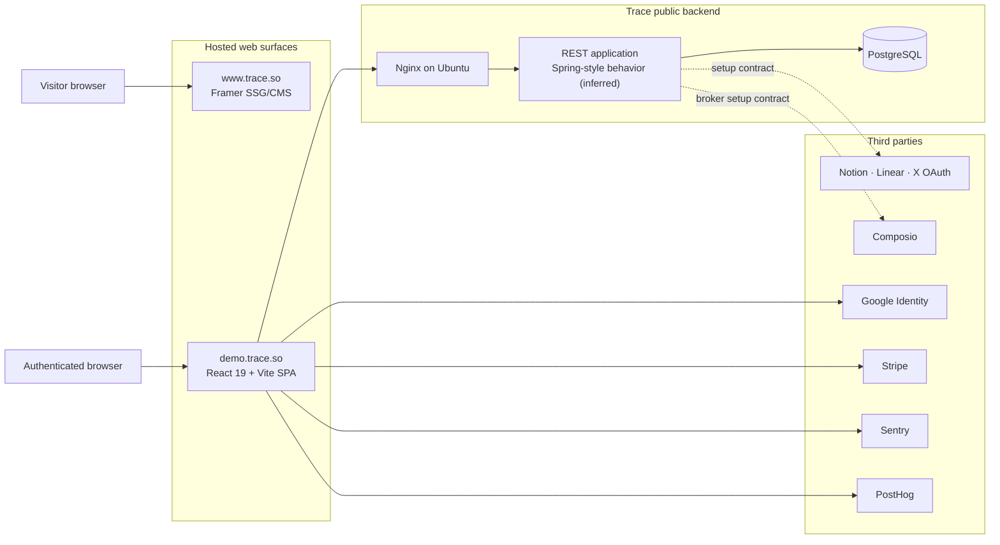

Solid edges represent observed delivery/client relationships. Dashed connector
edges represent public setup/API contracts; they do not prove the private
runtime topology.

### 7.5 Limits of the observable architecture

The public surface does not identify:

- an LLM or embedding provider;
- a queue, scheduler, or workflow engine;
- a vector or graph database;
- the database hosting topology;
- object storage;
- webhook ingestion architecture;
- model routing and evaluation;
- secrets management;
- backup and disaster-recovery configuration;
- CI/CD or infrastructure-as-code tooling;
- agent isolation and sandboxing.

The remainder of the document supplies a coherent implementation for those
required layers and labels it as proposed.

## 8. Complete production reference architecture

### 8.1 Chosen architecture

The recommended implementation is a modular Spring Boot control plane backed by
PostgreSQL, with independent durable workers for workflow orchestration,
connectors, document processing, and agent execution.

Concrete proposed technology choices:

| Concern | Proposed choice | Reason |
|---|---|---|
| Web app | Preserve React 19, TypeScript, Vite, React Flow, Dagre | Matches observed product and graph UI |
| Edge | CloudFront or equivalent CDN, AWS WAF, Application Load Balancer | Managed TLS, filtering, failover, and horizontal routing |
| API | Spring Boot modular monolith on ECS/Fargate | Matches public fingerprints while avoiding premature service sprawl |
| Transactional data | Amazon RDS PostgreSQL Multi-AZ | Confirmed data model fit, durable transactions, operational maturity |
| Vector search | `pgvector` initially | Keeps tenant filters, transactions, and vectors close; split later if needed |
| Object data | Versioned S3 buckets | Raw files, parsed artifacts, exports, and large task outputs |
| Cache/rate limit | Redis/ElastiCache | Short-lived cache, distributed rate limit, presence, and locks |
| Durable orchestration | Temporal Cloud | Long-running workflows, timers, retries, signals, and human waits without operating a second scheduler cluster |
| Event integration | Transactional outbox + EventBridge/SNS/SQS and DLQs | Reliable decoupling for ingestion, usage, notifications, and analytics |
| Secrets | AWS Secrets Manager + KMS envelope encryption | Rotation and tenant-scoped credential protection |
| Model access | Internal model gateway | Vendor abstraction, budgets, redaction, retries, and audit |
| Runtime isolation | Ephemeral ECS tasks or Firecracker-style sandbox | Bound network, filesystem, CPU, memory, and execution duration |
| Telemetry | OpenTelemetry, CloudWatch, Sentry, product analytics | Unified traces, infrastructure signals, UI errors, and usage |
| Infrastructure | Terraform | Reviewable, repeatable environments |

These choices are one complete implementation, not evidence that Trace uses
each vendor privately.

### 8.2 Container-level architecture

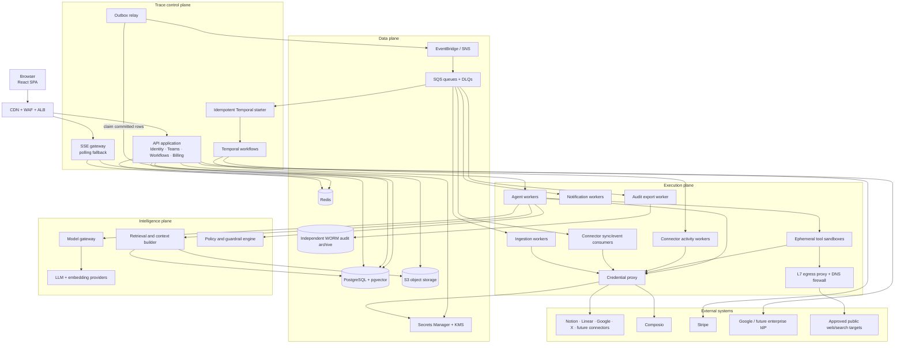

The API-to-secrets edge covers only control-plane service configuration. The
credential proxy is the only component permitted to decrypt reusable customer
connector tokens; agent workers and sandboxes receive operation capabilities,
not raw credentials.

### 8.3 Control, execution, and data-plane separation

| Plane | Owns | Must not do |
|---|---|---|
| Control plane | User requests, authorization, definitions, configuration, run commands, billing | Execute arbitrary long-running tools in API processes |
| Execution plane | Durable workflow scheduling, agent attempts, connector calls, parsing, notifications | Trust browser-supplied tenant or permission data |
| Data plane | Transactional data, objects, embeddings, caches, event durability, secrets | Expose raw storage directly without policy |
| Intelligence plane | Model selection, context building, prompts, guardrails, evaluation | Hold unbounded authority to external systems |

## 9. Logical modules

The initial backend should remain one deployable API with strict internal module
boundaries. Worker pools can be separate deployables because they have different
resource, dependency, and failure profiles.

### 9.1 Identity module

Responsibilities:

- magic-link issuance and validation;
- Google identity validation;
- session creation, refresh, revocation, and device tracking;
- login rate limiting and abuse detection;
- enterprise OIDC/SAML extension point;
- account recovery;
- user profile state.

Observed interface:

- `POST /auth/magic?email=...`
- `GET /auth/magic/validate?code=...`
- `POST /auth/google/validate`

Production changes:

- accept email and codes in request bodies where practical;
- hash one-time codes at rest;
- expire codes in 10–15 minutes;
- bind codes to intent and redirect allowlists;
- set a Secure, HttpOnly, SameSite session cookie;
- use short-lived access sessions with rotating refresh state;
- retain token revocation and session audit records.

### 9.2 Team and authorization module

Responsibilities:

- teams/tenants;
- memberships and invitations;
- roles and permissions;
- active-team selection;
- feature entitlements;
- tenant lifecycle and deletion;
- service-account and API-token policy.

Authorization flow:

1. Resolve the authenticated principal from the session.
2. Resolve tenant from the resource or validated route.
3. Load membership and role.
4. Evaluate action, resource, ownership, plan, and optional policy conditions.
5. attach a server-generated authorization context to the transaction.
6. emit an audit record for privileged or denied operations.

The frontend's selected team is a convenience only; it is never authorization
proof.

### 9.3 Workflow-definition module

Responsibilities:

- workflow metadata;
- draft and published versions;
- nodes and edges;
- graph validation;
- templates;
- graph layout persistence;
- assignments and execution policies;
- import/export;
- external project-management mappings.

Validation includes:

- referenced nodes exist;
- edges are tenant-local;
- duplicate edges are rejected;
- a published graph must be a DAG; repetition is represented by an explicit
  bounded task implementation or child-run pattern, not a dependency cycle;
- every agent configuration is available to the tenant;
- required inputs have upstream producers or defaults;
- side-effecting tasks declare idempotency behavior;
- approval rules reference valid roles;
- graph and task limits match plan entitlements.

### 9.4 Workflow-run module

Responsibilities:

- start, pause, resume, cancel, retry, and terminate a run;
- snapshot a published workflow version;
- maintain run and task state;
- register dependency completion;
- calculate readiness;
- handle timers and human signals;
- preserve attempt history;
- coordinate compensation or manual remediation.

### 9.5 Human-work module

Responsibilities:

- inbox of assigned tasks and approvals;
- due dates and service-level timers;
- comments and attachments;
- assignment, delegation, and escalation;
- completion forms and structured output;
- notification preferences;
- approval decisions and rationale.

### 9.6 Agent catalog and policy module

Responsibilities:

- agent definitions and versioned configurations;
- model and prompt policy;
- tool allowlists;
- input/output schema;
- confidence thresholds;
- human-review thresholds;
- time, token, monetary, and tool-call budgets;
- data-classification policy;
- rollout and rollback.

Observed agent identifiers include `WEB_SEARCH_AGENT` and `T2T_AGENT`. The
public product also describes text processing, scraping, email, X, document,
lead, onboarding, compliance, invoice, and support capabilities.

### 9.7 Agent-execution module

Responsibilities:

- prepare a task execution plan;
- request authorized context;
- obtain scoped, short-lived connector capabilities;
- call models through the gateway;
- execute tools in isolation;
- validate structured output;
- record citations, tool traces, cost, and confidence;
- retry transient errors;
- route uncertain results to human review.

### 9.8 Connector module

Responsibilities:

- connector catalog and setup;
- direct OAuth and brokered connections;
- encrypted credential storage;
- token refresh;
- webhooks;
- full and incremental synchronization;
- per-provider rate limits;
- source-to-canonical mapping;
- outbound actions and reconciliation;
- connector health and reauthorization.

### 9.9 Knowledge module

Responsibilities:

- file and API ingestion;
- parsing and normalization;
- chunking and embedding;
- entity extraction and resolution;
- relationship construction;
- permission-aware indexing;
- hybrid search and graph expansion;
- context packaging and citations;
- retention and deletion propagation.

### 9.10 Billing and entitlement module

Responsibilities:

- Stripe checkout session creation;
- subscription and invoice webhook handling;
- plan and add-on state;
- workflow, agent, storage, connector, and model usage;
- quota enforcement;
- billing portal links;
- payment grace periods and downgrade behavior.

### 9.11 Audit and administration module

Responsibilities:

- immutable audit events;
- tenant configuration;
- feature flags;
- support-safe impersonation with consent and audit;
- connector and agent kill switches;
- data export and deletion;
- incident and policy controls.

## 10. Identity, session, and tenant design

### 10.1 Authentication sequence

```mermaid
sequenceDiagram
    actor U as User
    participant SPA as React SPA
    participant API as Identity API
    participant Mail as Email provider
    participant DB as PostgreSQL

    U->>SPA: Enter email
    SPA->>API: POST /v1/auth/magic-links
    API->>API: Normalize email and rate-limit
    API->>DB: Store hashed one-time token + expiry
    API->>Mail: Send allowlisted callback URL
    API-->>SPA: 202 Accepted
    U->>SPA: Open callback with one-time code
    SPA->>API: POST /v1/auth/magic-links/exchange
    API->>DB: Verify hash, expiry, and unused state
    API->>DB: Mark token consumed; create session
    API-->>SPA: Set Secure HttpOnly session cookie
    SPA->>API: GET /v1/me/bootstrap
    API->>DB: Load user, teams, roles, entitlements
    API-->>SPA: Bootstrap response
```

Google sign-in exchanges a Google credential at the backend, validates issuer,
audience, expiry, nonce, and hosted-domain policy, then uses the same session
creation path.

### 10.2 Session model

| Field | Purpose |
|---|---|
| `session_id` | Random opaque server-side identifier |
| `user_id` | Authenticated user |
| `created_at` / `expires_at` | Lifetime |
| `last_seen_at` | Activity and risk signal |
| `refresh_family_id` | Rotation/reuse detection |
| `device_fingerprint_hash` | Optional security signal, not sole authenticator |
| `ip_prefix` / `user_agent_hash` | Risk and audit metadata with retention limits |
| `revoked_at` / `revocation_reason` | Immediate invalidation |

### 10.3 Tenant isolation

Every stored object has an explicit scope:

- `TENANT`: contains customer or team configuration/data and has a non-null
  immutable `team_id`;
- `PLATFORM`: globally administered definitions such as a public template,
  global agent shell, plan catalog, or model catalog; `team_id` is null and the
  row cannot contain tenant-derived content.

Users and identity-provider subjects are platform identities. Membership is the
explicit bridge into a tenant. A tenant may clone a platform template or agent,
at which point the clone is tenant-scoped.

Every tenant-owned table—including child rows such as versions, nodes, edges,
attempts, chunks, embeddings, citations, and audit records—repeats `team_id`
even when it can be derived from its parent. Composite foreign keys include
`team_id`, making cross-tenant parent/child references invalid at the database
layer.

The application must:

- derive `team_id` from a server-authorized resource or membership;
- never trust `teamUuid` merely because the browser supplied it;
- use compound unique keys that include `team_id`;
- apply repository-level tenant filters;
- apply PostgreSQL row-level security to tenant tables as mandatory defense in
  depth; only tightly controlled migration/repair roles can bypass it, and
  bypass use is audited;
- include tenant identity in object-store paths, queue messages, cache keys,
  traces, metrics labels with cardinality controls, and audit events;
- prevent connector credentials from crossing tenant boundaries;
- test isolation with a two-tenant adversarial suite.

### 10.4 Reference role matrix

| Capability | Member | Workflow owner | Admin | Billing admin | Tenant owner |
|---|---:|---:|---:|---:|---:|
| View permitted workflows | Yes | Yes | Yes | Optional | Yes |
| Complete assigned task | Yes | Yes | Yes | Optional | Yes |
| Create workflow | Policy | Yes | Yes | No | Yes |
| Publish/start workflow | No | Yes | Yes | No | Yes |
| Approve task | If assigned | If assigned | Policy | No | Policy |
| Manage integrations | No | Policy | Yes | No | Yes |
| Manage agents and tools | No | Policy | Yes | No | Yes |
| Invite/remove members | No | No | Yes | No | Yes |
| View audit log | No | Policy | Yes | No | Yes |
| Manage subscription | No | No | Policy | Yes | Yes |
| Transfer ownership | No | No | No | No | Step-up + acceptance |
| Delete tenant | No | No | No | Co-approver | Step-up + two-person approval |

Roles define maximum authority; resource-level policy, ownership, assignment,
data classification, and separation-of-duty rules can reduce it.

### 10.5 Service and machine identities

Machine access is distinct from human sessions:

- Internal workloads use cloud workload identity and short-lived credentials.
- Customer backend integrations use tenant-bound OAuth client credentials or
  scoped API credentials.
- An API credential contains a visible identifier/prefix and random secret; only
  an Argon2id/HMAC-protected verifier is stored, and the secret is shown once.
- Each credential has a tenant, owner, scopes/actions, optional resource
  restrictions, creation/expiry, last-use, rotation overlap, and revocation.
- High-risk credentials can require mTLS, source-network policy, or signed
  requests.
- API-trigger requests include timestamp, nonce/event ID, and idempotency key;
  signed-webhook-style requests also cover the raw body.
- Authentication, denied scope, creation, rotation, and revocation are audited.
- Rate and spend limits apply per credential in addition to tenant limits.
- Credentials cannot create credentials with greater authority than their own.

Long-lived static secrets are not used for service-to-service access when
workload identity is available.

## 11. Workflow definition

### 11.1 Aggregate

```typescript
interface WorkflowDefinition {
  id: UUID;
  teamId: UUID;
  name: string;
  description?: string;
  draftVersionId: UUID;
  publishedVersionId?: UUID;
  status: "DRAFT" | "ACTIVE" | "ARCHIVED";
  createdBy: UUID;
  createdAt: Instant;
  updatedAt: Instant;
}

interface WorkflowVersion {
  id: UUID;
  workflowId: UUID;
  version: number;
  revision: number;
  lifecycle: "EDITING" | "VALIDATING" | "VALID" | "PUBLISHED" | "SUPERSEDED";
  source: "MANUAL" | "PROMPT" | "TEMPLATE" | "IMPORT";
  sourcePrompt?: string;
  definitionHash: string;
  validationStatus: "PENDING" | "VALID" | "INVALID";
  createdBy: UUID;
  createdAt: Instant;
}

interface WorkflowNodeDefinition {
  id: UUID;
  versionId: UUID;
  key: string;
  type: "HUMAN" | "AGENT" | "APPROVAL" | "CONNECTOR" | "BRANCH" | "WAIT";
  summary: string;
  description?: string;
  inputSchema: JSONSchema;
  outputSchema: JSONSchema;
  assignment: AssignmentPolicy;
  execution: ExecutionPolicy;
  joinPolicy: "ALL" | "ANY";
  upstreamFailurePolicy:
    | "FAIL_RUN"
    | "SKIP_DOWNSTREAM"
    | "CONTINUE_WITH_ERROR"
    | "HUMAN_REVIEW";
  uiPosition: { x: number; y: number };
}

interface WorkflowEdgeDefinition {
  id: UUID;
  versionId: UUID;
  fromNodeId: UUID;
  toNodeId: UUID;
  condition?: Expression;
  priority: number;
  mapping?: DataMapping;
}
```

The observed public model is simpler:

```typescript
interface ObservedWorkflow {
  uuid: string;
  name: string;
  status?: string;
  createdAt: string;
  nodes: ObservedNode[];
  edges: ObservedEdge[];
}

interface ObservedNode {
  uuid: string;
  workflowUuid: string;
  summary: string;
  description: string;
  status: string;
  position: { x: number; y: number };
  assigneeUuid: string | null;
  assigneeConfig: string | null;
  output: string | null;
}

interface ObservedEdge {
  uuid: string;
  fromUuid: string;
  toUuid: string;
}
```

The reference model adds versions, typed nodes, schemas, policies, conditional
edges, and immutable execution snapshots.

A version is mutable only in `EDITING`. Each accepted editor mutation increments
its optimistic-concurrency `revision`. Validation pins a revision and hash.
Publishing makes the version immutable. The first edit after publication clones
that version into the next numbered `EDITING` version; individual keystrokes or
graph mutations do not create a new numbered version.

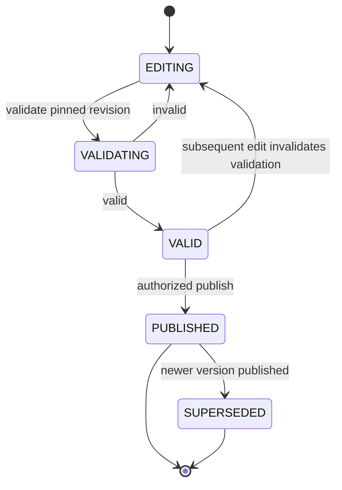

### 11.2 Prompt-to-workflow generation

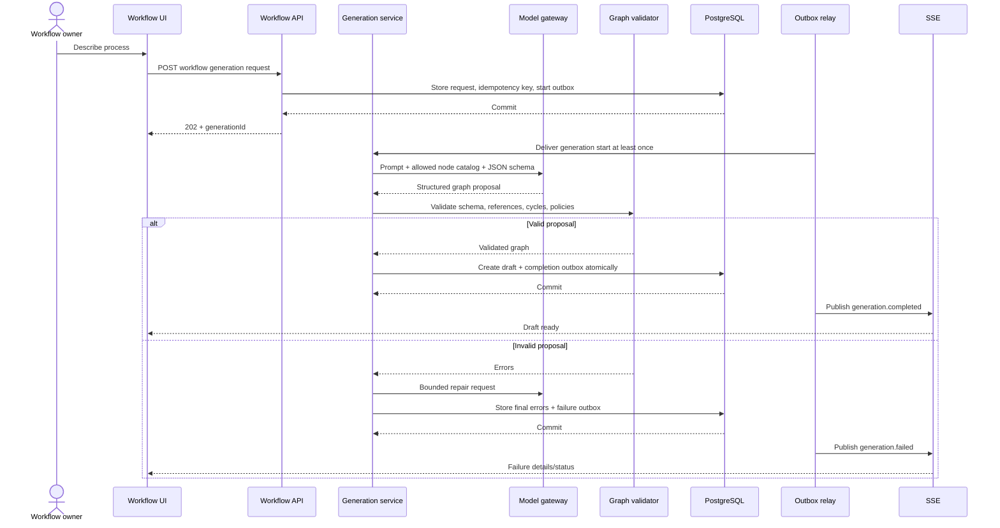

Generation requirements:

- use schema-constrained model output;
- do not execute generated tasks automatically;
- validate maximum node/edge count;
- reject unresolved connectors and agents;
- detect cycles and unreachable nodes;
- show the user what was inferred;
- retain prompt, model, prompt version, output, validation errors, and cost;
- require explicit publish/start authorization.

### 11.3 Graph editing

The observed editor supports:

- adding and removing dependency edges;
- moving nodes and persisting positions;
- adding a node relative to another node;
- updating or deleting a node;
- breaking a node into subtasks;
- auto-assigning tasks;
- starting or updating a workflow;
- synchronizing workflow information to Linear.

Reference write behavior:

1. The SPA sends the last known workflow-version ETag.
2. The API authorizes the workflow and validates the mutation.
3. The update occurs transactionally.
4. Optimistic concurrency rejects stale writes with `409 Conflict`.
5. The server increments draft revision and emits an outbox event.
6. Collaborators receive an SSE update.
7. The UI recomputes Dagre layout only when requested; manual positions remain
   authoritative otherwise.

### 11.4 Workflow validation

Validation produces errors or warnings with:

```typescript
interface ValidationFinding {
  code: string;
  severity: "ERROR" | "WARNING";
  nodeId?: UUID;
  edgeId?: UUID;
  message: string;
  remediation?: string;
}
```

Mandatory checks:

- structural graph validity;
- cycle rejection and explicit bounds on any task-internal iteration;
- valid inputs and outputs;
- assignment availability;
- connector availability and scopes;
- task execution timeout;
- retry and idempotency policy;
- required human approval for high-risk actions;
- cost and plan constraints;
- data-classification compatibility;
- no secret literals in definitions;
- published-version immutability.

## 12. Workflow execution

### 12.1 Run state machine

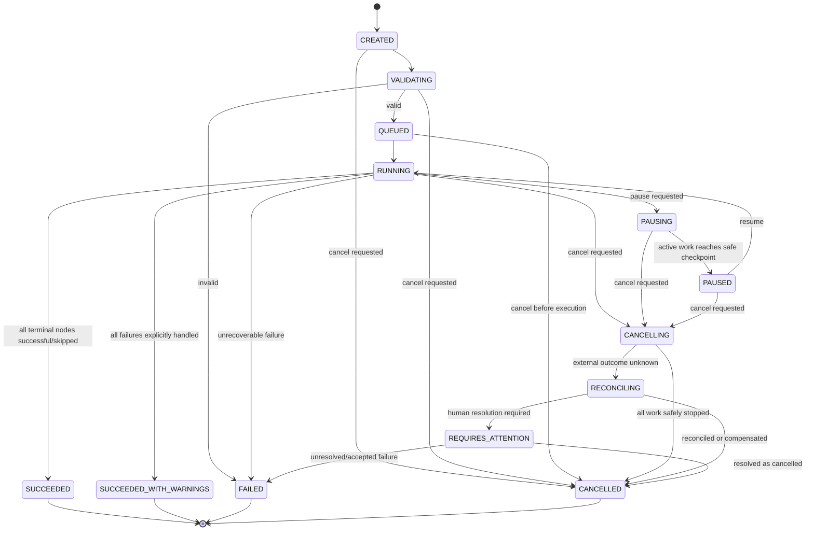

### 12.2 Task-run state machine

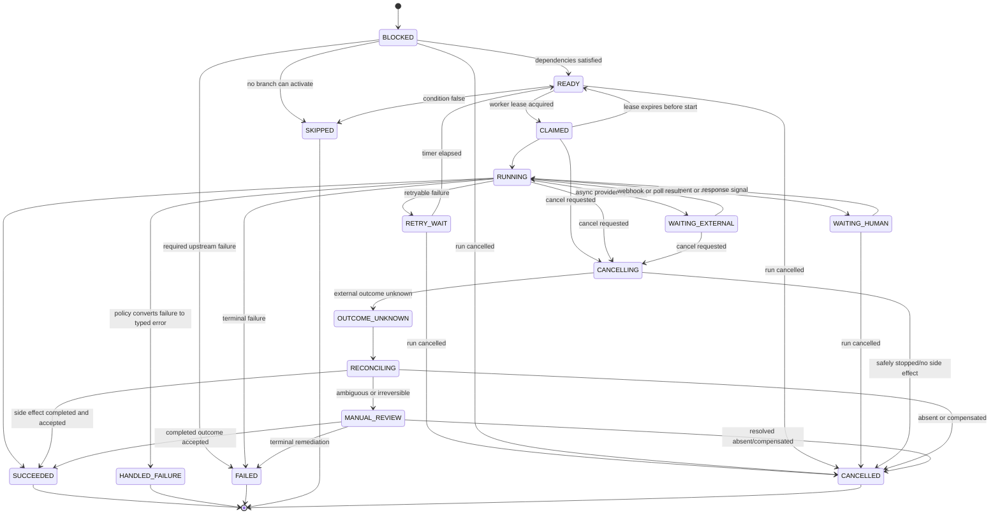

### 12.3 Start-run transaction

When a user starts a workflow:

1. Authorize `workflow.run`.
2. Require a valid published version.
3. Check team plan, quotas, connector health, and agent availability.
4. Create `workflow_run` with an idempotency key.
5. Copy the workflow-version hash and policy snapshot.
6. Create one `task_run` per node.
7. Mark root nodes `READY`; other nodes begin `BLOCKED`.
8. Commit the run and `workflow_run.start_requested` outbox event atomically.
9. Return `202 Accepted` with the run status URL immediately after commit.
10. Asynchronously, an outbox consumer calls Temporal
   `SignalWithStart`/equivalent using the
   deterministic Temporal workflow ID `run_id`.
11. If the consumer crashes after Temporal accepts the start, redelivery sees
    the same workflow ID and becomes an idempotent no-op/signal.

### 12.4 Dependency resolution

For each completed task:

1. Persist output, status, and completion event.
2. Evaluate each outgoing edge condition using a deterministic expression
   engine, not arbitrary code.
3. Persist each run-local edge resolution as `PENDING`, `TRUE`, `FALSE`, or
   `ERROR`, including the expression/data hashes used.
4. Store resolved data mappings for the downstream node.
5. Finalize the active-edge set only after every incoming predecessor is
   terminal or proven unreachable. A `TRUE` edge is active; `FALSE` is
   inactive. This makes readiness independent of worker completion order.
6. Apply the downstream join policy:
   - `ALL` is the default. It consumes every active edge, waits for all active
     producers, and merges mappings in stable `(priority, edge_id)` order.
     Mixed `TRUE`/`FALSE` inputs are valid because inactive false edges do not
     participate;
   - `ANY` selects exactly one active edge only after the active set is final,
     using lowest numeric `priority` and then `edge_id` as a stable tie-breaker;
     authors use `ALL` when multiple true inputs should be combined;
   - no active edge means the node is `SKIPPED` and that terminal fact
     propagates;
   - unresolved edges keep the node `BLOCKED`.
7. Apply upstream failure policy to an active failed/error edge:
   - `FAIL_RUN` marks the dependent task with `UPSTREAM_FAILURE`, transitions
     the run to `FAILED`, and stops ordinary downstream dispatch;
   - `SKIP_DOWNSTREAM` marks the dependent node skipped and propagates;
   - `CONTINUE_WITH_ERROR` changes the upstream outcome to
     `HANDLED_FAILURE`, supplies a typed error input, and makes a successful
     aggregate run `SUCCEEDED_WITH_WARNINGS`;
   - `HUMAN_REVIEW` creates a durable decision task whose explicit result is
     fail, skip, substitute typed input, or create a child retry run.
8. Reject ambiguous input-key collisions unless a versioned merge expression
   resolves them.
9. Transition readiness and related edge/task events in one compare-and-set
   transaction.
10. Deliver any orchestration signal through the committed outbox.

Because published graphs are acyclic, skip and failure propagation terminates.
The validator rejects graph forms whose join or branch semantics cannot be
resolved deterministically.

### 12.5 Retry policy

| Failure | Default behavior |
|---|---|
| Network timeout before known side effect | Exponential backoff with jitter |
| Provider `429` | Honor `Retry-After`, provider/tenant concurrency limit |
| Provider `5xx` | Bounded retry; circuit breaker on sustained failures |
| Invalid model JSON | One or two schema-repair attempts, then review/failure |
| Policy rejection | No automatic retry; request human or configuration change |
| Authentication/refresh failure | Mark integration `REAUTH_REQUIRED` |
| Permanent validation error | Fail task immediately |
| Unknown side-effect outcome | Reconcile by idempotency key or provider lookup |
| Worker crash | Lease expires; retry from durable attempt record |

Every retry creates or updates an attempt record. It must not overwrite the
history of earlier attempts.

### 12.6 Cancellation

Cancellation is cooperative:

- stop scheduling new work;
- signal active workers;
- cancel safe model or read-only operations;
- do not assume an already-issued external side effect can be reversed;
- run configured compensating actions only when they are explicitly safe;
- mark uncertain operations for reconciliation;
- preserve outputs and audit history;
- notify assigned humans and workflow owner.

### 12.7 Orchestration ownership and delivery boundaries

PostgreSQL is the canonical product-state store. Temporal Cloud owns durable
orchestration history, timers, retries, signals, and activity scheduling, but it
does not become an alternative user-facing state database.

The boundary is:

- The API writes commands/state and outbox events in one PostgreSQL
  transaction.
- An idempotent starter consumes start events and uses `run_id` as the Temporal
  workflow ID.
- Temporal agent and connector activity task queues execute work that belongs
  to a workflow run.
- SQS/event consumers handle work not owned by a run: connector discovery and
  bulk ingestion, webhook normalization, notification delivery, usage
  aggregation, analytics, and audit-archive export.
- SQS never independently decides a run/task state transition.
- Every product-state transition goes through one state-transition service
  using expected state, row version, attempt number, and fencing token.
- Temporal activities return outcomes to the workflow, which invokes the same
  idempotent state-transition contract; a replay cannot duplicate the
  transition.
- API pause, resume, and cancellation requests also commit intent plus an
  outbox event before Temporal is signaled.
- A reconciler compares non-terminal PostgreSQL runs with Temporal execution
  status and repairs missing starts/signals or raises an incident.

This avoids an API-commit/Temporal-start crash window and prevents Temporal and
SQS from becoming competing schedulers.

### 12.8 Retry and replay semantics

Automatic transient retries occur inside the same task run through
`RETRY_WAIT`, creating a new immutable attempt each time. Once a task or run
reaches terminal `FAILED`, it does not transition back to ready/queued.

An authorized manual retry creates a new child run:

- it pins the same or an explicitly selected newer workflow version;
- it references the failed parent run and retry reason;
- it can reuse only upstream outputs whose hashes, permissions, freshness, and
  side-effect status remain valid;
- uncertain external operations must reconcile before reuse;
- all non-reused tasks receive new task-run IDs and attempt histories;
- billing and audit treat it as a new run.

`POST /v1/runs/{runId}/retries` therefore returns `201 Created` with a new
`runId`, `parentRunId`, selected version, retry mode, and reused-output manifest;
it never reopens the terminal parent.

This preserves terminal-run history and avoids ambiguous in-place replay.

### 12.9 Pause semantics

The default pause is a drain pause:

- persist `PAUSED` intent plus outbox before signaling Temporal;
- stop claiming new `READY` tasks;
- let `CLAIMED`/`RUNNING` tasks finish their current safe, bounded activity;
- retain human and approval waits;
- continue safety, credential-expiry, approval-expiry, and SLA timers while
  suppressing ordinary downstream scheduling;
- buffer completed results durably without starting dependents;
- on resume, reconcile results and restart readiness evaluation.

An administrator can request an emergency stop, which routes active tasks
through normal cancellation and reconciliation rather than pretending pause is
instantaneous. The UI distinguishes `PAUSING` from fully `PAUSED`.

## 13. Human tasks and approvals

### 13.1 Human task lifecycle

```mermaid
sequenceDiagram
    participant Or as Orchestrator
    participant DB as PostgreSQL
    participant Relay as Outbox relay
    participant Notif as Notification worker
    actor H as Human assignee
    participant SPA as Trace SPA
    participant API as Task API

    Or->>DB: Create WAITING_HUMAN task + assignment outbox
    DB-->>Or: Commit
    Relay->>Notif: Deliver assignment event
    Notif-->>H: Email/in-app/Slack notification
    H->>SPA: Open task
    SPA->>API: GET authorized task
    API->>DB: Load task, inputs, history, permissions
    DB-->>API: Tenant-scoped task data
    API-->>SPA: Authorized task view
    H->>SPA: Submit structured result
    SPA->>API: POST task submission
    API->>API: Authorize and validate
    API->>DB: Store result, audit, and response-signal outbox
    DB-->>API: Commit
    Relay->>Or: Deliver idempotent human-response signal
    Or->>DB: Mark task succeeded; resolve dependents
```

### 13.2 Approval policy

An approval record contains:

- subject run and task;
- requested action and risk classification;
- exact proposed payload or output hash;
- requester identity;
- eligible approver rule;
- assigned approver;
- expiry and escalation;
- decision;
- reason;
- decision timestamp;
- policy version.

High-risk external writes should use approval-on-payload: changing the payload
after approval invalidates the approval.

### 13.3 Timeouts and escalation

- reminders at configurable intervals;
- escalation to a role, manager, or workflow owner;
- optional reassignment;
- optional default reject;
- never default approve a material side effect;
- timer state held by the durable orchestrator;
- all transitions recorded in audit history.

## 14. Agent system

### 14.1 Agent definition

```typescript
interface AgentDefinition {
  id: UUID;
  scope: "TENANT" | "PLATFORM";
  teamId: UUID | null;
  key: string;
  name: string;
  currentVersionId?: UUID;
  status: "DRAFT" | "ACTIVE" | "DISABLED";
}

interface AgentVersion {
  id: UUID;
  agentDefinitionId: UUID;
  version: number;
  modelPolicyId: UUID;
  promptVersionId: UUID;
  inputSchema: JSONSchema;
  outputSchema: JSONSchema;
  allowedToolIds: UUID[];
  retrievalPolicyId: UUID;
  maxIterations: number;
  timeoutSeconds: number;
  tokenBudget: number;
  monetaryBudgetMicros: number;
  confidenceThreshold: number;
  reviewPolicy: ReviewPolicy;
}
```

### 14.2 Execution pipeline

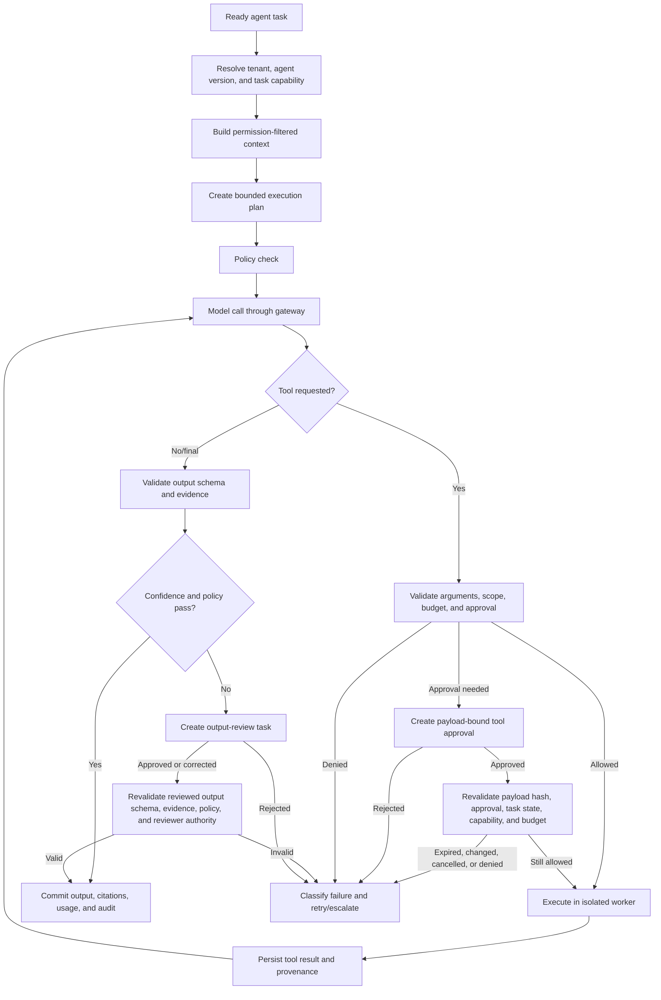

### 14.3 Model gateway

The model gateway provides:

- vendor-neutral request and response contracts;
- model selection by task type, sensitivity, latency, quality, and price;
- tenant policy and data-residency enforcement;
- prompt-template lookup and version stamping;
- token estimation and budget reservation;
- input redaction or pseudonymization;
- retries and fallback models;
- schema-constrained output;
- content-safety hooks;
- request/response hashing;
- usage, latency, error, and cost records;
- provider circuit breakers;
- opt-out controls for provider data retention or training.

The gateway must never log full prompts by default. Debug prompt capture is
time-bound, tenant-approved, access-controlled, and redacted.

### 14.4 Tool registry

Each tool declares:

```typescript
interface ToolDefinition {
  id: UUID;
  key: string;
  version: number;
  risk: "READ_ONLY" | "REVERSIBLE_WRITE" | "IRREVERSIBLE_WRITE";
  inputSchema: JSONSchema;
  outputSchema: JSONSchema;
  requiredConnectorType?: string;
  requiredScopes: string[];
  networkPolicy: NetworkPolicy;
  idempotencyMode: "NATIVE" | "TRACE_KEY" | "RECONCILE" | "NONE";
  approvalPolicy: "NEVER" | "POLICY" | "ALWAYS";
  timeoutSeconds: number;
}
```

Tool execution rules:

- validate all arguments;
- derive connector identity server-side;
- redact secrets from model-visible context;
- use a task-specific capability token;
- restrict egress to approved hosts;
- restrict file access to a task workspace;
- cap response size;
- record request hashes, response hashes, status, timing, and external IDs;
- quarantine unexpected binary content;
- require approval for material writes according to policy.

### 14.5 Runtime isolation

Read-only, low-risk API tools can run in hardened worker processes. Arbitrary
code, browser automation, untrusted document conversion, or customer-provided
tools require ephemeral isolation:

- one task or trust domain per sandbox;
- non-root user;
- read-only base image;
- no host filesystem;
- memory, CPU, process, and wall-clock limits;
- deny-by-default egress;
- short-lived credentials;
- malware scanning for artifacts;
- automatic teardown;
- image signing and vulnerability scanning.

### 14.6 Output contract

Every agent result stores:

- structured output;
- human-readable summary;
- source citations;
- tool calls;
- model and prompt versions;
- retrieved-context identifiers and hashes;
- validation result;
- confidence score and its method;
- token and monetary usage;
- start/end time;
- attempt number;
- human-review state;
- error classification when unsuccessful.

Confidence must not be a model's unsupported self-rating alone. It should combine
schema validity, source coverage, retrieval quality, deterministic checks,
policy checks, and task-specific evaluation.

## 15. Connector and integration architecture

### 15.1 Observed integrations

| Connector | Public evidence |
|---|---|
| Notion | Direct OAuth, setup/list/sync/remove REST methods |
| Linear | Direct OAuth, setup/list/remove, workflow sync |
| Google Drive | Composio initiation and synchronization |
| Google Docs | Composio initiation |
| X/Twitter | Direct OAuth and setup/list/remove |
| File upload | Team file upload and databank deletion |
| Google Sheets, Slack, Jira | Shown as beta/contact setup |
| HubSpot, Gmail, GitHub, Salesforce and others | Marketing/demo presence without current self-service flow |

### 15.2 Connector state machine

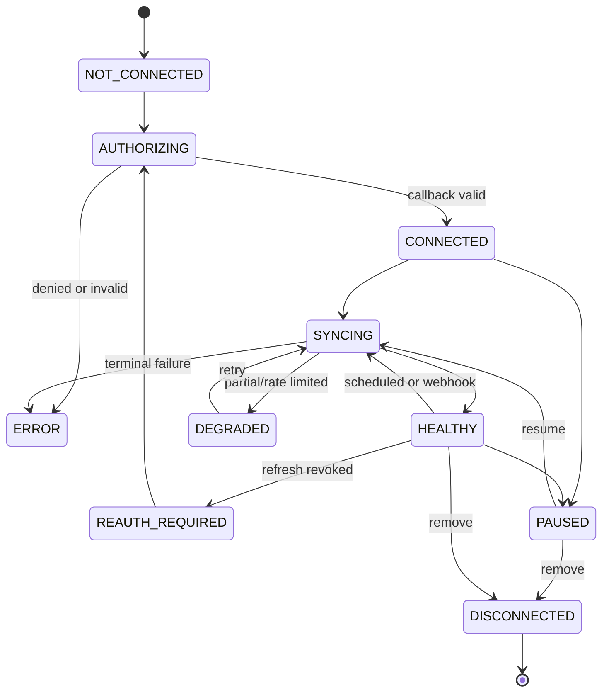

### 15.3 Secure OAuth sequence

```mermaid
sequenceDiagram
    actor A as Team admin
    participant SPA as Trace SPA
    participant API as Connector API
    participant State as Redis/PostgreSQL
    participant P as OAuth provider
    participant Sec as Secrets Manager
    participant Relay as Outbox relay
    participant Q as Sync queue

    A->>SPA: Connect provider
    SPA->>API: POST /v1/integrations/authorizations
    API->>State: Store high-entropy state, PKCE verifier, tenant, expiry
    API-->>SPA: Provider authorization URL with S256 challenge
    SPA->>P: Navigate to authorization URL
    P-->>API: Callback with code and state
    API->>State: Atomically validate/claim state as PROCESSING
    API->>P: Exchange code + PKCE verifier
    P-->>API: Access/refresh token and scopes
    API->>Sec: Envelope-encrypt credential
    API->>State: Save integration/ref/scopes + initial-sync outbox; complete state
    State-->>API: Commit
    Relay->>Q: Deliver initial discovery/sync
    API-->>SPA: Redirect to allowlisted result page
```

If the process fails after encrypted-secret creation but before the database
commit, a deterministic authorization-attempt identifier lets cleanup remove
the orphan. No reusable token is exposed to the browser or queue.

This replaces fixed OAuth state strings and plain/fixed PKCE challenges observed
in the public frontend.

### 15.4 Credential storage

- Access and refresh tokens are never returned to the SPA.
- A credential record stores only a reference to encrypted secret material.
- Use a data-encryption key per tenant or credential, encrypted by KMS.
- The OAuth callback API can ingest a newly issued token and envelope-encrypt it
  immediately, but it cannot decrypt that credential after storage.
- Decrypt existing credentials only inside the credential proxy.
- Cache plaintext only in credential-proxy memory for the operation lifetime.
- Audit token reads without logging token values.
- Rotate refresh tokens when the provider supports it.
- Remove or cryptographically destroy credentials on disconnect.
- Mark integrations `REAUTH_REQUIRED` when refresh fails permanently.

The credential proxy is the only runtime allowed to decrypt reusable connector
tokens. A worker presents a signed, short-lived capability containing tenant,
task/sync job, connector, exact operation/resource pattern, expiry, nonce, and
budget. The proxy reauthorizes it and performs or signs the provider operation;
it never returns a reusable credential.

| Runtime | Connector-secret access |
|---|---|
| Control-plane/callback API | Can ingest and envelope-encrypt a new OAuth token, then stores only metadata/reference; cannot decrypt stored connector tokens |
| Agent worker | No decrypt permission; requests a capability-scoped operation |
| Connector activity worker | No raw-token return; invokes credential proxy |
| Sync/ingestion worker | No raw-token return; invokes credential proxy |
| Tool sandbox | No Secrets Manager/KMS access; only one-use capability endpoint |
| Model gateway | Separate model-provider service credential; no connector secrets |
| Credential proxy | Exact integration-secret decrypt permission with KMS encryption-context checks and full audit |
| Notification worker | Only its channel-provider credential, not customer connectors |

Workload IAM denies broad secret listing. Decryption policies bind secret path,
environment, workload identity, and tenant/integration encryption context.

### 15.5 Ingestion pipeline

```mermaid
flowchart LR
    Trigger["Schedule · webhook · manual sync"]
    Discover["Discover changed source objects"]
    Cursor["Read/update sync cursor"]
    Fetch["Fetch with provider rate limits"]
    Raw["Store immutable raw payload/object"]
    Normalize["Normalize canonical metadata"]
    ACL["Resolve source permissions"]
    Parse["Parse text/tables/attachments"]
    Chunk["Chunk and classify"]
    Entity["Extract/resolve entities and relations"]
    Embed["Create embeddings"]
    Index["Write search/vector/graph indexes"]
    Event["Commit index state + source.indexed outbox"]

    Trigger --> Discover --> Cursor --> Fetch --> Raw --> Normalize --> ACL
    ACL --> Parse --> Chunk
    Chunk --> Entity --> Index
    Chunk --> Embed --> Index
    Index --> Event
```

### 15.6 Incremental synchronization

Each integration maintains:

- provider account/workspace identifier;
- granted scopes;
- last successful cursor or watermark;
- last attempted and successful sync times;
- next scheduled sync;
- webhook subscription metadata;
- per-resource checkpoint;
- error code and retry time;
- ingestion generation.

The cursor advances only after all durable records for that page or batch are
committed. Partial failures retain enough state to retry without losing source
objects.

### 15.7 Webhook ingestion

Webhook endpoints:

1. capture raw bytes;
2. verify provider signature and timestamp before parsing;
3. reject replay windows outside policy;
4. store tenant, integration, provider account, provider event ID, and payload
   hash;
5. deduplicate on
   `(team_id, integration_id, provider_account_id, provider_event_id)`; a
   repeated event ID with a different payload hash is a security/integrity
   alert;
6. insert the webhook record and processing outbox event in one transaction;
7. acknowledge quickly after that commit;
8. let the outbox relay enqueue normalized processing;
9. make repeated delivery safe;
10. retain a replayable event record according to data policy.

### 15.8 Outbound synchronization

For Linear or another external project manager:

1. Persist a requested external operation with an idempotency key.
2. Confirm connector scopes and tenant policy.
3. Require approval for configured write classes.
4. Commit the operation intent and dispatch outbox event atomically.
5. Let the outbox relay enqueue the operation.
6. Execute under provider rate limits.
7. Save provider object ID, version, result, and completion outbox atomically.
8. Reconcile uncertain timeouts through lookup.
9. Update the local mapping.
10. Deliver success/failure to the workflow through the outbox.

Conflict strategy:

- Trace-owned fields can be last-write-wins with version checks.
- Shared fields require provider version/ETag checks.
- Material conflicts become human reconciliation tasks.

### 15.9 Permission and group synchronization

Permissions are synchronized independently from content. A source document that
has not changed can still become newly restricted.

- Each integration maintains an ACL/group generation and freshness timestamp.
- Provider permission, sharing, group-membership, role, and ownership events
  commit permission-sync outbox work.
- Scheduled reconciliation catches providers that do not emit complete
  permission events.
- Source ACL versions and hashes propagate to documents, chunks, and retrieval
  manifests without requiring text re-embedding.
- An ACL-generation change invalidates authorization-sensitive retrieval
  caches immediately.
- Until a stricter ACL refresh completes, access fails closed or performs a
  provider/live-policy check for high-sensitivity content.
- Connector degradation that exceeds the tenant's ACL freshness objective
  blocks sensitive retrieval and surfaces `PERMISSIONS_STALE`.

Canonical entities and relations do not have one overly broad visibility flag.
Each supporting alias, fact, and relation assertion retains its own provenance
and access binding. A principal can see an entity or relation only through
visible supporting facts; hidden aliases, relationship counts, and neighboring
nodes cannot leak through graph traversal.

## 16. Knowledge and context architecture

### 16.1 Goals

The knowledge layer must:

- unify content without erasing source ownership;
- enforce source and Trace permissions;
- support freshness and deletion;
- provide evidence-backed context;
- avoid sending an entire company corpus to a model;
- expose entity and relationship context;
- be explainable and auditable.

### 16.2 Storage model

The reference design uses:

- PostgreSQL for source metadata, canonical entities, relationships,
  permissions, ingestion state, and provenance;
- `pgvector` for chunk embeddings at early and medium scale;
- PostgreSQL full-text search or OpenSearch when lexical scale requires it;
- S3 for raw documents, normalized artifacts, and large extracted content;
- no dedicated graph database initially;
- optional graph-store extraction only if traversal workload and scale justify
  operational complexity.

This choice respects the only publicly confirmed datastore, PostgreSQL. It does
not assert that Trace uses `pgvector`.

### 16.3 Canonical objects

| Object | Purpose |
|---|---|
| `source_object` | Provider-native item with external ID, version, URI, timestamps, and raw-object reference |
| `document` | Normalized logical document or record |
| `document_version` | Immutable parsed version and content hash |
| `chunk` | Retrieval unit with offsets and metadata |
| `embedding` | Model/version-specific vector for a chunk or entity |
| `entity` | Canonical person, team, project, client, ticket, company, system, or custom type |
| `entity_alias` | Source name/identifier used for entity resolution |
| `relation` | Directed typed relationship with provenance and confidence |
| `access_binding` | Tenant and subject/role visibility inherited from source or Trace |
| `citation` | Link from generated output to source version and location |
| `sync_cursor` | Durable connector checkpoint |

### 16.4 Entity resolution

Resolution pipeline:

1. Normalize identifiers, email, URLs, provider IDs, and names.
2. Apply deterministic keys first.
3. Generate candidate matches within the same tenant.
4. Score candidates using identifiers, names, organizational context, and
   relationships.
5. Auto-merge only above a conservative threshold.
6. Preserve aliases and source provenance.
7. Route ambiguous high-impact merges to review.
8. Support split and merge corrections without losing lineage.

### 16.5 Permission-aware indexing

Every retrieval object contains:

- `team_id`;
- source integration;
- source object and version;
- visibility policy or ACL hash;
- allowed principals/roles where needed;
- data classification;
- retention/deletion state.

Retrieval applies tenant and authorization filters before ranking. Post-filtering
an already cross-tenant vector result is insufficient as the only boundary.

### 16.6 Retrieval pipeline

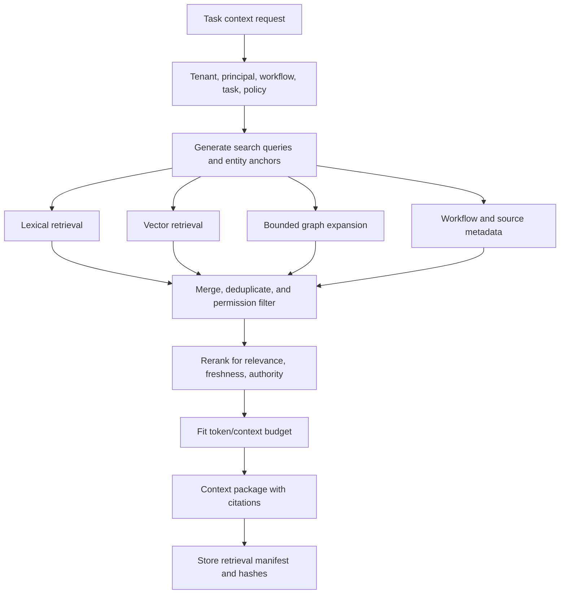

### 16.7 Retrieval contract

```typescript
interface ContextRequest {
  teamId: UUID;
  workflowRunId: UUID;
  taskRunId: UUID;
  principal: CapabilityPrincipal;
  query: string;
  entityAnchors?: UUID[];
  sourceTypes?: string[];
  freshnessAfter?: Instant;
  maxTokens: number;
  maxItems: number;
  classificationCeiling: string;
}

interface ContextPackage {
  items: ContextItem[];
  citations: Citation[];
  omittedCount: number;
  retrievalPolicyVersion: string;
  queryHash: string;
  createdAt: Instant;
}
```

### 16.8 Freshness, deletion, and provenance

- Every result carries source modification and ingestion times.
- Stale integrations lower rank or block freshness-sensitive tasks.
- Source deletion tombstones derived chunks, vectors, entities when orphaned,
  and future retrieval visibility.
- Tenant deletion propagates to database, object store, caches, indexes,
  provider credentials, backups according to policy, and analytics identifiers.
- Generated outputs retain citation metadata according to audit policy even if
  the original content later becomes inaccessible; protected content itself is
  not copied indefinitely without a lawful retention reason.

## 17. Data architecture

### 17.1 Transaction boundaries

PostgreSQL transactions cover:

- authorization-sensitive mutations;
- workflow definition and version changes;
- run/task state transitions;
- idempotency claims;
- usage reservations;
- audit metadata;
- outbox events.

Network calls never occur inside a long database transaction. The application
commits intent, then workers execute external calls.

### 17.2 Core relational schema

The following is a logical schema; names can change while constraints should
remain. Every row described as tenant-scoped includes `team_id` and uses
tenant-inclusive foreign keys even when the abbreviated field list below does
not repeat the word `team`. Rows explicitly marked platform-scoped cannot
contain tenant-derived data.

#### Identity and tenancy

| Table | Key fields and constraints |
|---|---|
| `users` | `id`, normalized unique email, profile, status, timestamps |
| `identity_links` | `user_id`, provider, unique provider subject |
| `sessions` | `id`, `user_id`, expiry, rotation family, revocation |
| `magic_link_tokens` | hashed token, email, expiry, consumed timestamp |
| `teams` | `id`, name, status, region, data policy |
| `memberships` | unique `(team_id, user_id)`, role, state |
| `invitations` | team, normalized email, hashed reference, role, expiry |
| `roles` | team/system role definition |
| `role_permissions` | role/action/resource relation |
| `service_principals` | tenant; stable machine identity, owner, status, policy |
| `api_credentials` | tenant; principal, identifier prefix, verifier, scopes/resources, expiry, rotation family, revocation, last use |
| `oauth_clients` | tenant; client ID, secret verifier or JWK/mTLS binding, grants/scopes, redirect policy, expiry/revocation |

#### Workflow definition and execution

| Table | Key fields and constraints |
|---|---|
| `workflows` | tenant; name, status, draft/published version pointers |
| `workflow_versions` | tenant; unique `(team_id, workflow_id, version)`, definition hash, immutable after publish |
| `workflow_nodes` | tenant; version, stable node key, type, schemas, assignment and policy JSON |
| `workflow_edges` | tenant; version, from/to node, condition and mapping; unique edge |
| `workflow_triggers` | tenant; workflow/version, trigger type, schedule/filter, timezone, input mapping |
| `workflow_runs` | tenant; workflow/version, state, policy snapshot, idempotency key, optional parent run, retry mode/initiator/reason |
| `run_reused_outputs` | tenant; child/parent run and task IDs, output/content hash, source attempt, validation/freshness/permission evidence |
| `task_runs` | tenant; run, node, state, assignment, input/output references, timing |
| `task_attempts` | tenant; task, attempt number, worker, error class, usage, trace ID |
| `task_dependencies` | tenant; run-local dependency resolution |
| `human_tasks` | tenant; task run, assignee, acknowledgement, SLA, escalation and submission state |
| `approvals` | tenant; task, payload hash, eligible/assigned approver, decision, expiry |
| `human_task_comments` | tenant; task, author, body/object reference, timestamp |
| `artifacts` | tenant; run/task/attempt, object URI, media type, size, content hash, classification |
| `run_events` | tenant; append-only sequence per run |

#### Agents and tools

| Table | Key fields and constraints |
|---|---|
| `agent_definitions` | explicit tenant or platform scope; stable key/name and current-version pointer |
| `agent_versions` | same scope as agent; immutable status, schemas, budgets, model/prompt/retrieval policy references |
| `prompt_versions` | same scope as agent; immutable prompt/config hash and rollout metadata |
| `model_policies` | tenant or platform scope; allowed providers/models, routing, budgets, residency |
| `tool_definitions` | platform or tenant scope; key/version, risk, scopes, schemas, timeout |
| `agent_tool_policies` | same tenant/platform scope as agent; tool version and approval policy |
| `retrieval_policies` | tenant or platform scope; sources, filters, ranking, token limits |
| `agent_evaluations` | same scope as agent; dataset/version, result, metrics, reviewer |

#### Integrations and knowledge

| Table | Key fields and constraints |
|---|---|
| `integrations` | tenant; provider, external account, state, scopes, credential reference |
| `encrypted_credentials` | tenant; integration, encrypted data-key/ciphertext reference, version, expiry, rotation state |
| `sync_jobs` | tenant; integration, job type, state, generation, counts, attempts, timing |
| `sync_cursors` | tenant; integration/resource, cursor, watermark, status |
| `webhook_events` | tenant; integration/provider account, externally unique event ID, payload hash, status |
| `external_operations` | tenant; integration, operation, idempotency key, payload/result refs |
| `source_objects` | tenant; integration, provider type/ID/version, raw object URI |
| `documents` | tenant; source object, canonical metadata |
| `document_versions` | tenant; document, content hash, parsed object URI |
| `chunks` | tenant; document version, offsets, text/object reference, ACL hash |
| `embeddings` | tenant; chunk/entity, model version, vector |
| `entities` | tenant; type, canonical name, status |
| `entity_aliases` | tenant; entity, provider and external identifier/name |
| `relations` | tenant; from/to entity, type, confidence, provenance |
| `access_bindings` | tenant; object, subject/role/policy, permission |
| `citations` | tenant; output, source object/version, location, content hash |
| `retrieval_manifests` | tenant; task/attempt, policy/query hash, selected source versions, ranking metadata |

#### Platform, billing, and governance

| Table | Key fields and constraints |
|---|---|
| `plans` | platform scope; versioned plan and feature definition |
| `subscriptions` | tenant; Stripe customer/subscription, plan, state |
| `entitlements` | tenant; feature, limit, effective interval |
| `usage_ledger` | tenant; meter, quantity, source, idempotency key, timestamp |
| `usage_reservations` | tenant; run/task, meter/budget, reserved/consumed/released quantities |
| `credit_ledger` | tenant; grant/debit/expiry/adjustment, source, append-only balance inputs |
| `notification_preferences` | tenant/user; channel/event class, quiet hours and policy |
| `notification_deliveries` | tenant; event/recipient/channel, attempt, provider reference and state |
| `idempotency_records` | tenant or explicit platform scope; operation/key, request hash, response reference |
| `outbox_events` | same scope as aggregate; type, payload, publish state |
| `event_receipts` | same scope as event; consumer, event ID, result and processed timestamp |
| `audit_events` | tenant or platform security scope; actor, action, resource, result, metadata hash |
| `feature_flags` | platform default or tenant override; environment/percentage rollout |
| `data_deletion_jobs` | tenant or user scope; state, evidence, completion |

### 17.3 Required constraints

- Foreign keys include or validate tenant ownership.
- Unique constraints prevent duplicate membership, edges, webhook events,
  attempts, usage records, and idempotency keys.
- Published workflow versions and prompt versions are immutable.
- State-transition services use compare-and-set version columns.
- Soft deletion is reserved for recoverable business objects; secrets and
  privacy deletion follow explicit destruction policy.
- Audit events are append-only to ordinary application roles and are exported
  through the outbox to an independently administered, write-only integrity
  archive.

### 17.4 Index strategy

Examples:

```text
memberships (user_id, state)
memberships (team_id, state)
workflows (team_id, status, updated_at desc)
workflow_runs (team_id, state, created_at desc)
task_runs (workflow_run_id, state)
task_runs (team_id, assignee_user_id, state, due_at)
task_runs (state, next_attempt_at) where state in ('READY', 'RETRY_WAIT')
integrations (team_id, provider, state)
source_objects unique (team_id, integration_id, provider_type, external_id)
chunks (team_id, document_version_id)
entities (team_id, type, normalized_name)
relations (team_id, from_entity_id, type)
relations (team_id, to_entity_id, type)
usage_ledger (team_id, meter, occurred_at)
audit_events (team_id, occurred_at desc)
outbox_events (publish_state, created_at) where publish_state = 'PENDING'
```

Vector indexes should be partitioned or filtered by tenant/data domain when
scale justifies it. Index choice—HNSW versus IVFFlat—depends on update rate,
recall, and corpus size and must be benchmarked with representative tenants.

### 17.5 Object-storage layout

```text
s3://trace-<env>-customer-data/
  tenants/<team-id>/
    integrations/<integration-id>/raw/<source-id>/<version>
    documents/<document-id>/<version>/normalized.json
    files/<file-id>/<version>/original
    task-runs/<task-run-id>/attempts/<n>/artifacts/
    exports/<export-id>/
```

Controls:

- block public access;
- TLS-only bucket policy;
- KMS encryption;
- tenant-aware application authorization;
- short-lived signed URLs only when required;
- object versioning for recoverability;
- malware scanning and quarantine;
- lifecycle rules by data class;
- access logs and object-level audit where appropriate.

### 17.6 Cache design

Redis may store:

- session lookups when sessions are not fully cookie-contained;
- membership/entitlement cache with short TTL and explicit invalidation;
- rate-limit counters;
- OAuth state with a database fallback;
- SSE connection/presence metadata;
- provider concurrency semaphores;
- short-lived retrieval-result cache keyed by authorization and corpus version.

Redis is never the only durable store for workflow state, approvals, billing,
credentials, ingestion cursors, or audit events.

### 17.7 Transactional outbox

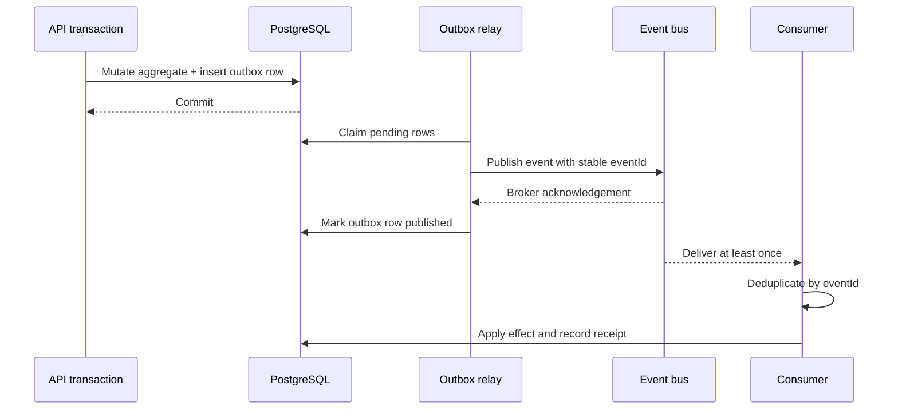

The relay marks publication after broker acknowledgement, independently of
consumer processing. It must tolerate publishing twice if it crashes around
that acknowledgement. Consumers must tolerate receiving the same event more
than once.

## 18. API design

### 18.1 Observed public client

The public SPA embeds this production base URL:

```text
https://api.trace.so
```

The following routes are observed in the public REST client. They document the
current browser/backend contract; they are not necessarily the backend's
complete route set.

#### Workflow routes

| Method | Route | Purpose |
|---|---|---|
| POST | `/workflows?teamUuid={team}&message={message}&shouldSave={value}` | Generate from natural language |
| POST | `/workflows?teamUuid={team}&templateUuid={template}&shouldSave={0-or-1}` | Generate from template |
| GET | `/workflows/vibeManage?uuid={workflow}` | Auto-assign tasks; state-changing GET should be redesigned |
| GET | `/workflows?teamUuid={team}` | List team workflows |
| GET | `/workflows/externalPMSyncs?workflowUuids={ids}&system={system}` | List external project-management syncs |
| GET | `/workflows/externalPMSyncs/children?workflowUuid={id}&system={system}` | List child sync records |
| GET | `/workflows/{workflow}` | Get workflow |
| PUT | `/workflows` | Update workflow |
| DELETE | `/workflows/{workflow}` | Delete workflow |
| POST | `/workflows/{workflow}/nodes/{node}/add?direction={direction}` | Add related node |
| PUT | `/workflows/{workflow}/nodes/{node}` | Update one node |
| PUT | `/workflows/{workflow}/nodes` | Update nodes/positions |
| POST | `/workflows/{workflow}/nodes/{node}/break` | Split task into subtasks |
| DELETE | `/workflows/{workflow}/nodes/{node}` | Delete node |

#### Identity, user, and team routes

| Method | Route | Purpose |
|---|---|---|
| POST | `/auth/magic?email={email}` | Send or resolve magic-link login |
| GET | `/auth/magic/validate?code={code}` | Validate magic-link code |
| POST | `/auth/google/validate` | Validate/exchange Google identity |
| GET | `/user/{user}` | Get user |
| PUT | `/user` | Save user |
| POST | `/user/{user}/onboarding-checked` | Record onboarding state |
| GET | `/teams?userUuid={user}` | List user teams |
| PUT | `/teams` | Save team |
| GET | `/teams/{team}/files` | List team files |
| POST | `/teams/{team}/files` | Upload team file |
| GET | `/teams/{team}/users` | List team members |
| POST | `/teams/{team}/users/invite?email={email}` | Invite member |
| DELETE | `/teams/{team}/users/{user}` | Remove member |
| POST | `/teams/invite/respond?reference={ref}&accepted={boolean}` | Accept/reject invitation |

#### Databank and integration routes

| Method | Route | Purpose |
|---|---|---|
| POST | `/databank/notion/sync?integrationUuid={id}` | Sync Notion |
| POST | `/databank/googledrive/sync?uuid={id}` | Sync Google Drive |
| DELETE | `/databank/file?teamUuid={team}&source={source}&externalIdentifier={id}` | Delete indexed file |
| DELETE | `/databank/googledrive/{id}` | Remove Drive integration |
| DELETE | `/databank/x/{id}` | Remove X integration |
| DELETE | `/databank/notion/{id}` | Remove Notion integration |
| DELETE | `/databank/linear/{id}` | Remove Linear integration |
| POST | `/databank/notion/setup?teamUuid={team}&code={code}` | Complete Notion OAuth |
| POST | `/databank/linear/setup?teamUuid={team}&code={code}` | Complete Linear OAuth |
| POST | `/databank/x/setup?teamUuid={team}&code={code}` | Complete X OAuth |
| POST | `/databank/google/setup?teamUuid={team}&code={code}&type={type}` | Complete Google setup |
| POST | `/databank/composio/initiate_account?teamUuid={team}&type={type}` | Start Composio connection |
| GET | `/databank/notion?teamUuid={team}` | List Notion integrations |
| GET | `/databank/linear?teamUuid={team}` | List Linear integrations |
| GET | `/databank/x?teamUuid={team}` | List X integrations |
| GET | `/databank/google?teamUuid={team}` | List Google integrations |

#### Template, connector, billing, and health routes

| Method | Route | Purpose |
|---|---|---|
| GET | `/templates?teamUuid={optional-team}` | List public/team templates |
| POST | `/templates/workflow/{workflow}` | Create template from workflow |
| POST | `/connector/linear/workflow/{workflow}/sync` | Sync workflow to Linear |
| POST | `/checkout/session?teamUuid={team}&priceId={price}` | Create Stripe checkout |
| GET | `/healthcheck` | Application/PostgreSQL health |

### 18.2 Problems to correct in the current-style contract

- State-changing assignment behavior uses `GET`.
- Sensitive email, codes, OAuth codes, invitation references, and prompts can
  enter query strings.
- Tenant identifiers appear prominently in browser-controlled parameters.
- Resource creation lacks a visible standard idempotency contract.
- Workflow definition and workflow execution are not clearly separated.
- Polling is the primary workflow-update mechanism.
- Route versioning is absent from the observed paths.

### 18.3 Proposed public API conventions

- Base path: `/v1`.
- JSON request and response bodies.
- Opaque UUID identifiers.
- Secure session cookie; CSRF protection for cookie-authenticated mutations.
- `Idempotency-Key` on creation, generation, checkout, invitations, and
  side-effecting operations.
- `If-Match`/ETag or explicit `version` on concurrent mutations.
- Cursor-based pagination.
- RFC 3339 UTC timestamps.
- Consistent correlation header such as `Trace-Request-Id`.
- `202 Accepted` for asynchronous work, with status resource and event stream.
- `429` responses include `Retry-After`.
- Structured validation errors with stable machine-readable codes.
- No internal stack, provider secret, or raw exception in client errors.

Example error:

```json
{
  "error": {
    "code": "WORKFLOW_VALIDATION_FAILED",
    "message": "The workflow contains invalid nodes or dependencies.",
    "requestId": "req_...",
    "details": [
      {
        "path": "nodes[4].assignment",
        "code": "AGENT_NOT_AVAILABLE",
        "message": "The selected agent is not enabled for this team."
      }
    ]
  }
}
```

### 18.4 Proposed resource API

#### Bootstrap, identity, and teams

```text
POST   /v1/auth/magic-links
POST   /v1/auth/magic-links/exchange
POST   /v1/auth/google/exchange
POST   /v1/auth/logout
POST   /v1/auth/sessions/refresh
GET    /v1/auth/sessions
DELETE /v1/auth/sessions/{sessionId}
GET    /v1/me/bootstrap

GET    /v1/teams
POST   /v1/teams
GET    /v1/teams/{teamId}
PATCH  /v1/teams/{teamId}
GET    /v1/teams/{teamId}/members
POST   /v1/teams/{teamId}/invitations
POST   /v1/invitation-responses
PATCH  /v1/teams/{teamId}/members/{memberId}
DELETE /v1/teams/{teamId}/members/{memberId}
GET    /v1/teams/{teamId}/service-principals
POST   /v1/teams/{teamId}/service-principals
GET    /v1/teams/{teamId}/api-credentials
POST   /v1/teams/{teamId}/api-credentials
POST   /v1/api-credentials/{credentialId}/rotations
DELETE /v1/api-credentials/{credentialId}
GET    /v1/teams/{teamId}/oauth-clients
POST   /v1/teams/{teamId}/oauth-clients
POST   /v1/oauth-clients/{clientId}/rotations
DELETE /v1/oauth-clients/{clientId}
```

`POST /v1/invitation-responses` receives the invitation token in the request
body. OAuth providers necessarily return an authorization code to the callback
URL; the edge and application redact that query string, the backend consumes it
once, and the callback immediately redirects to a clean result URL.

#### Workflow definitions and templates

```text
GET    /v1/teams/{teamId}/workflows
POST   /v1/teams/{teamId}/workflows
POST   /v1/teams/{teamId}/workflow-generations
GET    /v1/workflow-generations/{generationId}
GET    /v1/workflows/{workflowId}
PATCH  /v1/workflows/{workflowId}
DELETE /v1/workflows/{workflowId}
GET    /v1/workflows/{workflowId}/versions
POST   /v1/workflows/{workflowId}/versions
POST   /v1/workflows/{workflowId}/versions/{version}/validate
POST   /v1/workflows/{workflowId}/versions/{version}/publish
PUT    /v1/workflows/{workflowId}/draft/nodes/{nodeId}
DELETE /v1/workflows/{workflowId}/draft/nodes/{nodeId}
POST   /v1/workflows/{workflowId}/draft/nodes/{nodeId}/split
PUT    /v1/workflows/{workflowId}/draft/edges/{edgeId}
DELETE /v1/workflows/{workflowId}/draft/edges/{edgeId}
POST   /v1/workflows/{workflowId}/draft/auto-assignments
GET    /v1/workflows/{workflowId}/triggers
POST   /v1/workflows/{workflowId}/triggers
PATCH  /v1/workflow-triggers/{triggerId}
DELETE /v1/workflow-triggers/{triggerId}
GET    /v1/templates
POST   /v1/templates
```

#### Runs, tasks, and approvals

```text
GET    /v1/workflows/{workflowId}/runs
POST   /v1/workflows/{workflowId}/runs
GET    /v1/runs/{runId}
POST   /v1/runs/{runId}/pause
POST   /v1/runs/{runId}/resume
POST   /v1/runs/{runId}/cancel
POST   /v1/runs/{runId}/retries
GET    /v1/runs/{runId}/events
GET    /v1/runs/{runId}/stream
GET    /v1/tasks?assignee=me&state=...
GET    /v1/task-runs/{taskRunId}
POST   /v1/task-runs/{taskRunId}/submissions
POST   /v1/task-runs/{taskRunId}/reassignments
GET    /v1/task-runs/{taskRunId}/comments
POST   /v1/task-runs/{taskRunId}/comments
GET    /v1/task-runs/{taskRunId}/artifacts
POST   /v1/task-runs/{taskRunId}/artifacts
GET    /v1/approvals?assignee=me&state=...
POST   /v1/approvals/{approvalId}/decisions
```

#### Integrations and knowledge

```text
GET    /v1/teams/{teamId}/integrations
POST   /v1/teams/{teamId}/integration-authorizations
GET    /v1/integration-authorizations/{authorizationId}
GET    /v1/integrations/oauth/{provider}/callback
POST   /v1/integrations/{integrationId}/syncs
GET    /v1/integrations/{integrationId}/syncs
POST   /v1/integrations/{integrationId}/pause
POST   /v1/integrations/{integrationId}/resume
DELETE /v1/integrations/{integrationId}
POST   /v1/webhooks/{provider}
GET    /v1/teams/{teamId}/documents
POST   /v1/teams/{teamId}/files
DELETE /v1/documents/{documentId}
POST   /v1/teams/{teamId}/search
GET    /v1/entities/{entityId}
GET    /v1/entities/{entityId}/relations
```

#### Agents, billing, usage, and audit

```text
GET    /v1/teams/{teamId}/agents
POST   /v1/teams/{teamId}/agents
POST   /v1/agents/{agentId}/versions
POST   /v1/agents/{agentId}/evaluations
POST   /v1/agents/{agentId}/disable
POST   /v1/teams/{teamId}/checkout-sessions
GET    /v1/teams/{teamId}/subscription
GET    /v1/teams/{teamId}/usage
POST   /v1/webhooks/stripe
GET    /v1/me/notification-preferences
PATCH  /v1/me/notification-preferences
GET    /v1/teams/{teamId}/audit-events
POST   /v1/teams/{teamId}/exports
POST   /v1/teams/{teamId}/deletion-requests
```

### 18.5 Idempotency

An idempotency record is scoped by:

```text
team_id
authenticated_principal_id
operation
idempotency_key
canonical_request_hash
```

Rules:

- the first caller atomically claims the key;
- an identical retry receives the original status/result;
- reuse with a different request hash returns `409`;
- the key lives longer than every browser, queue, worker, and provider retry
  window;
- provider-native idempotency receives a derived stable key;
- expensive in-progress operations return their current status resource.

### 18.6 Internal event contract

```json
{
  "eventId": "evt_...",
  "eventType": "task_run.succeeded",
  "eventVersion": 1,
  "occurredAt": "2026-07-29T12:00:00Z",
  "teamId": "team_...",
  "aggregateType": "task_run",
  "aggregateId": "task_...",
  "correlationId": "run_...",
  "causationId": "attempt_...",
  "actor": {
    "type": "agent",
    "id": "agent_version_..."
  },
  "trace": {
    "traceparent": "00-..."
  },
  "data": {}
}
```

Event compatibility rules:

- consumers ignore unknown fields;
- breaking changes require a new `eventVersion`;
- event IDs remain stable across redelivery;
- large payloads are object-store references, not queue bodies;
- secrets and raw customer document text are excluded;
- consumers authenticate the bus and authorize the tenant context.

## 19. Browser application design

### 19.1 Route structure

Observed routes include:

```text
/
/dashboard
/workflows
/workflow/:uuid
/agents
/account
/pricing
/onboarding
/onboarding/:workflow
/auth/magic/validate
/teams/invite/accept
```

### 19.2 Frontend boundaries

Recommended modules:

- application shell and routing;
- session/bootstrap provider;
- active-team provider;
- permission/entitlement provider;
- workflow list;
- workflow graph editor;
- run inspector and event stream;
- human task and approval inbox;
- integrations/account settings;
- agent catalog and configuration;
- usage and billing;
- audit and administration.

### 19.3 State strategy

- Server state is authoritative.
- Query/cache state uses a data-fetching library with keys that include tenant
  and resource.
- Local component state holds temporary editor interactions.
- Unsaved drafts use bounded browser persistence with schema/version checks.
- Authentication secrets are not readable from browser JavaScript.
- Team selection can be locally remembered but is validated on bootstrap.
- Sensitive workflow content is not placed in analytics properties.

### 19.4 Real-time updates

The current public editor polls every two seconds. The proposed design uses:

1. `GET /v1/runs/{runId}/stream` using Server-Sent Events;
2. monotonically increasing run-event sequence numbers;
3. `Last-Event-ID` resume;
4. tenant/session authorization on connection and periodically on long-lived
   streams;
5. bounded connection lifetimes and reconnect jitter;
6. polling with ETags as fallback;
7. database/event-bus state as truth, never the ephemeral stream.

SSE is sufficient because the dominant flow is server-to-browser status. Normal
REST mutations remain browser-to-server. WebSocket becomes worthwhile only for
high-frequency collaborative editing.

### 19.5 Graph rendering and performance

Observed layout parameters:

```text
direction: LR or RL
node width: 172
node height: 36
nodesep: 200
ranksep: 200
```

Frontend safeguards:

- virtualize side panels and long task lists;
- cap graph size by plan and UX limits;
- move expensive auto-layout to a web worker for large graphs;
- debounce position writes;
- batch node-position updates;
- render summarized output and load large artifacts on demand;
- protect Markdown rendering from unsafe HTML and URLs;
- preserve keyboard navigation and accessible task alternatives.

### 19.6 Telemetry boundary

The public app includes Sentry and PostHog. Production policy should:

- scrub tokens, OAuth codes, invitation references, emails, prompts, documents,
  task inputs/outputs, and connector data;
- mask sensitive DOM in session replay;
- disable replay by default for document/workflow screens unless deliberately
  approved;
- sample traces based on route and error budget;
- separate product analytics from operational audit;
- respect tenant-level telemetry policy and applicable consent.

## 20. Billing, plans, entitlements, and usage

### 20.1 Observed product behavior

The public application exposes Stripe checkout-session creation. Public pricing
assets showed Free, Pro, Team, and Enterprise concepts at the analysis date.
Exact commercial offerings can change independently of this architecture.

### 20.2 Billing model

Stripe is the payment source of truth for:

- customer;
- subscription;
- price;
- invoice;
- payment status;
- cancellation and renewal.

Trace remains the source of truth for:

- team entitlement snapshot;
- usage;
- credits;
- feature access;
- grace-period behavior;
- audit history.

### 20.3 Checkout sequence

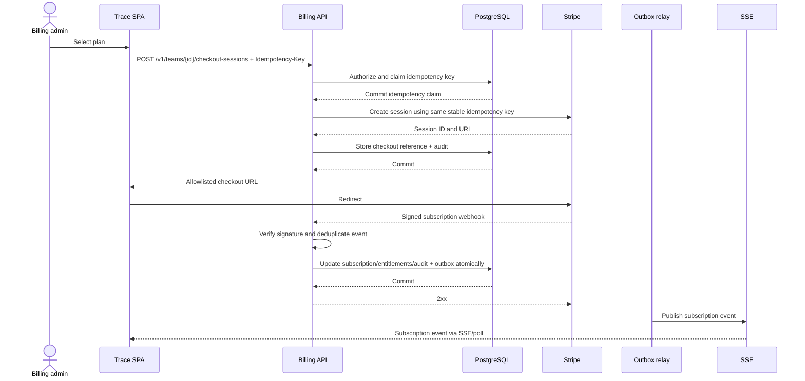

The browser may request a plan key, but the backend selects the canonical Stripe
price. It does not trust an arbitrary client-supplied price identifier.

### 20.4 Usage ledger

Usage is append-only and idempotent. Suggested meters:

- workflow runs;
- task attempts;
- agent tasks;
- model input/output tokens;
- model cost;
- tool calls;
- connector operations;
- indexed documents and bytes;
- stored artifact bytes and days;
- active integrations;
- seats.

Execution reserves the maximum permitted budget, decrements actual usage, and
releases unused reservation. Hard-limit behavior must be known before a run
starts; a task should not stop halfway through an irreversible write merely
because usage accounting arrived late.

### 20.5 Billing failure behavior

- Payment failure enters a defined grace period.
- Existing data remains readable during grace.
- New costly work may be restricted by policy.
- Active irreversible work is not terminated unsafely.
- Downgrade does not silently delete data.
- Entitlement changes are audited.
- Stripe outage prevents new checkout changes but not ordinary workflow reads.

## 21. Scheduling, triggers, and notifications

### 21.1 Trigger types

The product can support:

- manual start;
- scheduled start;
- connector webhook;
- source-object change;
- inbound API trigger;
- completion of another workflow;
- threshold or policy event.

These are required for a complete orchestration product but are not all
confirmed in the public client.

### 21.2 Trigger design

`workflow_triggers` stores:

- team and workflow version;
- type;
- schedule or filter;
- timezone;
- enabled state;
- deduplication window;
- input mapping;
- creator and policy;
- last/next firing time.

Scheduled work uses durable timers. Timezone and daylight-saving behavior are
explicit. Trigger firing creates a normal run through the same idempotent start
path as the UI.

### 21.3 Notifications

Notification events are consumed asynchronously. Channels can include:

- in-app;
- email;
- Slack when available;
- webhook;
- future mobile push.

Preferences apply per user, team, event class, urgency, and quiet hours. Security
events can override ordinary marketing/notification opt-outs where legally and
contractually appropriate.

## 22. Security architecture

### 22.1 Trust boundaries

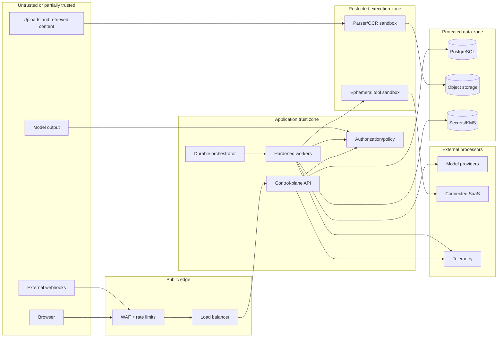

### 22.2 Observed review signals

The public analysis found:

- browser-readable token storage in `localStorage`;
- no obvious Content Security Policy on inspected surfaces;
- no HSTS header on inspected API responses;
- permissive API CORS including the custom authentication header;
- exact Nginx/Ubuntu version disclosure;
- fixed OAuth state strings;
- a fixed plain X PKCE challenge;
- sensitive values in query strings;
- Sentry `sendDefaultPii: true` and high trace/error-replay sampling;
- development configuration in the production frontend;
- direct EC2 API DNS rather than a visible managed edge/load balancer.

These are review signals, not proof of compromise. The reference design closes
them.

### 22.3 Edge and browser controls

- Managed DDoS protection and WAF.
- Current TLS policy with automated certificate rotation.
- HSTS on all production hosts.
- Explicit CORS allowlist, methods, and headers.
- CSRF protection for cookie-authenticated mutation.
- Strict CSP with nonce/hash policy and constrained vendor hosts.
- Trusted Types where browser support and framework integration allow it.
- `X-Content-Type-Options: nosniff`.
- `Referrer-Policy: strict-origin-when-cross-origin` or stricter on sensitive
  flows.
- `Permissions-Policy` denying unused capabilities.
- No detailed server version header.
- Request/body/file-size limits.
- Secure Markdown and URL rendering.
- Dependency integrity, supply-chain scanning, and lockfile review.

### 22.4 Authorization controls

- Deny by default.
- Object-level authorization on every identifier.
- Tenant check at API and repository layers plus mandatory PostgreSQL RLS on
  tenant tables.
- Short-lived worker capabilities.
- Reauthorization before delayed, high-impact operations.
- Step-up authentication for billing, credential export, tenant deletion, and
  other privileged actions.
- Two-person approval for destructive tenant-wide changes.
- Just-in-time operator access with recorded reason and expiry.

### 22.5 Agent-specific threats and controls

| Threat | Control |
|---|---|
| Prompt injection from documents/web | Mark data as untrusted; system policy cannot be overridden by retrieved text; tool calls pass independent policy |
| Cross-tenant retrieval | Pre-query tenant/ACL filter, namespace controls, RLS, adversarial tests |
| SSRF | URL normalization, DNS/IP validation, block private/link-local ranges, redirect revalidation, egress proxy |
| Credential exfiltration | Credential proxy; model and sandbox never receive reusable raw tokens |
| Excessive agency | Tool allowlists, budgets, approval gates, timeouts, kill switches |
| Unsafe external write | Payload-bound approval, idempotency, external reconciliation |
| Malicious file/parser exploit | Type validation, malware scan, parser isolation, archive limits |
| Model data retention | Provider policy routing and contractual no-training/no-retention controls |
| Hallucinated evidence | Required citations, deterministic validation, human review |
| Runaway cost | Preauthorization, token/tool budgets, tenant quotas, anomaly alerts |

### 22.6 Data classification

Suggested classes:

| Class | Examples | Minimum handling |
|---|---|---|
| Public | Marketing copy, public templates | Integrity controls |
| Internal | Non-sensitive workflow metadata | Tenant authorization, encryption |
| Confidential | Customer documents, prompts, outputs, business entities | Strict tenant controls, limited telemetry, retention policy |
| Restricted | OAuth tokens, session secrets, billing identifiers, regulated data | Vault/KMS, minimal access, no general logs/model context |

### 22.7 Audit design

Audit events capture:

- authentication and session changes;
- membership, role, invitation, and team changes;
- service-principal, API-credential, and OAuth-client creation, scope, rotation,
  use, and revocation;
- workflow version, publication, start, pause, cancel, and retry;
- human assignment and approval;
- agent/model/tool version and decision;
- connector authorization, scope, sync, write, and revocation;
- billing and entitlement changes;
- data export/deletion;
- support/operator access;
- security-policy and kill-switch changes.

An event includes actor, tenant, action, resource, result, request/correlation
IDs, timestamp, source IP category, authorization decision, and a safe metadata
hash. Raw secrets and unrestricted content are excluded.

PostgreSQL holds the searchable audit copy. Security-critical events are also
exported, through a dedicated outbox consumer, to a separate security account's
write-only WORM archive (for example, object lock with protected retention).
Events form per-tenant/time-window hash chains whose signed checkpoints are
stored separately. Application and ordinary database operator roles cannot
rewrite or shorten the archive retention. Archive reads are just-in-time,
approved, and themselves audited.

### 22.8 Security kill switches

Operators need controls to:

- revoke one/all user sessions;
- suspend a team;
- disable an integration or provider globally;
- disable one tool or agent version;
- block all external writes;
- pause new model calls;
- pause selected worker queues;
- rotate credentials;
- force human review for a risk class;
- disable a compromised release.

### 22.9 Threat model

| Scenario | Primary controls | Detection/recovery |
|---|---|---|
| Change a team/workflow/node/file ID to access another tenant | Server-derived tenant, object authorization, compound constraints, RLS | Denial/anomaly audit, two-tenant tests |
| XSS steals a browser token | HttpOnly session, CSP, Trusted Types, encoding, dependency controls | Session-risk alerts and global revocation |
| Magic-link interception/replay/enumeration | Hashed high-entropy single-use code, short expiry, uniform response, log/referrer redaction | Replay/rate-limit events; revoke sessions |
| OAuth login CSRF or account misbinding | Random one-time session-bound state, exact redirect allowlist, S256 PKCE | Callback mismatch alarms and authorization audit |
| Forged/replayed webhook | Raw-body signature/timestamp validation, event-ID uniqueness | Rejection metrics and replay investigation |
| Compromised over-scoped connector | Least scope, KMS vault, credential broker, tenant policy | Mass revocation, connector kill switch, operation audit |
| Prompt injection in file/page/source system | Untrusted-data boundary, independent tool policy, structured output, approval | Injection/policy metrics, quarantine, evaluation replay |
| SSRF/internal discovery through web tools | Egress proxy, URL/IP/DNS/redirect validation, private-range deny | Egress/DNS alerts and sandbox termination |
| Model/worker retrieves another tenant's context | Pre-query ACL/tenant filter, RLS/namespaces, capability token | Cross-tenant canaries and retrieval audit |
| Retry/failover repeats an external side effect | Stable idempotency key, provider lookup, fencing, reconciliation | Duplicate-operation detector and manual repair |
| Malicious archive/parser exploit | Size/depth limits, real type validation, malware scan, isolated parser | Quarantine, image/worker revocation |
| Resource exhaustion or runaway model spend | Per-tenant quotas, budgets, concurrency, admission control | Cost/queue anomaly alerts and model kill switch |
| Telemetry leaks prompts, documents, codes, or PII | Central redaction, DOM masking, allowlisted fields, scoped retention | DLP sampling, telemetry purge and credential rotation |
| Supply-chain compromise | Locked dependencies, SCA/SBOM/provenance, signed artifacts, least-privilege CI | Artifact disable/rollback and key rotation |
| Privileged operator abuse | SSO/MFA, JIT access, separation of duties, reason, session record | Immutable access audit and periodic review |
| Region/database failure during an external write | Commit intent first, external operation state, idempotency, restore reconciliation | Freeze writes, provider comparison, controlled replay |

Security review is repeated when a new connector, model provider, tool class,
data region, agent sandbox, or privileged administrative capability is added.

### 22.10 Encryption, key, and workload-access matrix

| Component/data | In transit | At rest/key | Runtime access and recovery |
|---|---|---|---|
| Browser/edge/API | TLS 1.2+ with modern TLS 1.3 preference; HSTS | Session/server secrets outside images | Certificate automation; edge and API identities separated |
| Internal service traffic | TLS; mTLS or signed workload identity on sensitive service boundaries | N/A | Private networking, security groups, short-lived workload identity |
| RDS PostgreSQL | Required TLS and certificate validation | KMS production CMK; encrypted snapshots/WAL | API/state services only; recovery replica/snapshot re-encrypted with authorized regional key |
| Redis | TLS with authentication | ElastiCache/service encryption using KMS where supported | Disposable state only; no connector tokens; recovery by cache rebuild |
| S3 customer objects | TLS-only bucket policy | SSE-KMS with environment and tenant/integration encryption context | Scoped roles/access points; recovery copy uses separately controlled regional key |
| SQS/SNS/EventBridge | TLS and workload-signed requests | KMS-encrypted queues/topics/bus | Resource policies restrict producers/consumers; durable truth reconstructable from PostgreSQL |
| Temporal Cloud | Provider-authenticated encrypted connection | Contractually verified provider encryption and namespace durability | Dedicated production namespace and least-privilege worker credentials; recovery procedure tested against tier target |
| Connector credentials | TLS only inside proxy boundary | Per-credential envelope encryption; KMS context binds environment/team/integration | Credential proxy alone can decrypt; replicated secret metadata/key strategy tested for DR |
| Application/service secrets | TLS Secrets Manager API | KMS-encrypted secret versions | Exact workload IAM, rotation, recovery replica where required |
| Logs/traces/audit search | TLS exporter | KMS-encrypted stores | Redacted; operator access by JIT role; audit WORM copy separately administered |
| Database/object backups | TLS during copy | Encrypted and re-keyed in recovery account/region | Restore role cannot alter source retention; keys included in recovery testing |
| Sandbox ephemeral disk | Encrypted host/task storage | Ephemeral key destroyed at teardown | Sandbox has no general KMS/Secrets permission; selected artifacts copied through scanner |
| CI artifacts/images | TLS registry | Encrypted registry/object store plus artifact signature | Deployment verifies signature/provenance; recovery uses immutable artifact digest |
| Model/SaaS processors | TLS with hostname/certificate validation | Governed by provider contract and configuration | Minimum data/scope; provider access and deletion/residency terms reviewed |

Key policy:

- separate production from non-production keys and accounts;
- avoid one key whose loss compromises every recovery path;
- rotate aliases/credentials without rewriting immutable identifiers;
- log decrypt/grant/policy operations;
- rehearse compromised-key rotation and recovery-key use;
- include multi-region key/replica readiness in enhanced-tier DR tests;
- use cryptographic erasure only where key scope is narrow enough to avoid
  deleting unrelated tenant data.

## 23. Privacy and compliance design

### 23.1 Data-flow inventory

For every data class, maintain:

- source and collection purpose;
- tenant and data subject;
- processing purpose and lawful basis where applicable;
- storage locations and regions;
- model, connector, telemetry, billing, and infrastructure subprocessors;
- retention;
- encryption/key;
- access roles;
- export and deletion procedure;
- backup expiry.

### 23.2 Privacy defaults

- Customer data is not used to train shared models by default.
- Model/provider retention is configured to the strictest contracted setting.
- PII is minimized before model calls.
- Product analytics never receives document or workflow content.
- Session replay masks inputs and customer-data regions.
- Logs use stable pseudonymous identifiers when practical.
- Debug capture is off by default and time-bound when enabled.
- Retention is set per data class and tenant agreement.

### 23.3 Data-subject and tenant requests

Export and deletion jobs are durable workflows:

1. validate request authority;
2. record scope and legal-hold status;
3. freeze or snapshot relevant identifiers;
4. export/delete primary records;
5. delete objects, indexes, caches, credentials, and derived data;
6. notify subprocessors where required;
7. record backup-expiry handling;
8. produce non-sensitive evidence of completion;
9. require approval for tenant-wide destruction.

### 23.4 Enterprise control set

Production enterprise readiness should include:

- SAML/OIDC SSO;
- SCIM provisioning;
- MFA and session policy;
- configurable retention;
- audit export;
- data residency choices;
- private connector networking where needed;
- customer-managed or customer-dedicated keys where justified;
- role and approval policies;
- DPA and subprocessor list;
- security documentation and incident commitments;
- evidence-backed SOC 2/ISO claims only after formal completion.

## 24. Observability

### 24.1 Correlation model

Propagate:

```text
request_id
trace_id
team_id (not as uncontrolled high-cardinality metric)
workflow_id
workflow_version_id
workflow_run_id
task_run_id
attempt_id
integration_id
provider_request_id
deployment_version
```

These identifiers connect a browser action to API transaction, outbox event,
queue delivery, workflow step, model/tool call, and external provider response.

### 24.2 Metrics

#### API and infrastructure

- request rate, error rate, and latency;
- saturation, CPU, memory, thread/connection pools;
- database connection use, locks, slow queries, failover, replication lag;
- cache hit rate and errors;
- queue depth, oldest-message age, receive/delete rate, and DLQ count;
- worker concurrency, utilization, lease expiry, and crash count;
- object-store and network errors.

#### Workflow

- runs started/completed/failed/cancelled;
- scheduling delay;
- end-to-end duration;
- task duration by type;
- blocked and human-wait time;
- retries and terminal failures by class;
- stuck-run count;
- approval latency and rejection rate;
- side-effect reconciliation count.

#### Agents and knowledge

- model latency, tokens, and cost;
- fallback and throttling rates;
- schema-validation failures;
- tool calls and errors;
- context item/token count;
- retrieval latency and freshness;
- citation/source coverage;
- human override/rework rate;
- evaluation quality by agent/prompt/model version;
- prompt-injection/policy blocks.

#### Connectors

- connection health;
- webhook verification/deduplication failures;
- sync lag and cursor age;
- objects discovered/fetched/indexed/deleted;
- provider quota/throttle state;
- reauthorization count;
- outbound operation success and reconciliation.

### 24.3 Logs

Structured logs contain safe metadata and error classifications, not:

- access/refresh/session tokens;
- magic-link or OAuth codes;
- full email addresses unless a tightly controlled security case requires it;
- raw prompts, documents, task outputs, or provider payloads by default;
- payment data;
- secret headers;
- full signed URLs.

Central redaction operates before export. Retention differs for debug,
operational, security, and audit records.

### 24.4 Distributed tracing

OpenTelemetry spans cover:

- browser navigation and API request;
- API handler and database transaction;
- outbox publish;
- queue wait and worker processing;
- orchestration decision;
- retrieval;
- model request;
- tool/connector call;
- object storage;
- notification.

Sampling:

- 100% of errors and selected high-risk operations after redaction;
- tail-based sampling for slow/failed traces;
- lower baseline for ordinary successful traffic;
- tenant opt-out or restrictions where required.

### 24.5 Alerting

Alert on symptoms:

- SLO burn;
- auth or workflow-control failure;
- queue age above dispatch objective;
- database saturation/failover;
- sharp cross-tenant authorization-denial anomalies;
- elevated agent policy failures;
- connector freshness breach;
- DLQ growth;
- cost anomaly;
- backup/restore verification failure.

Each alert links to a runbook and names an owner.

## 25. Reliability and failure handling

### 25.1 Service objectives

These are proposed initial targets.

| User journey | SLI | Objective |
|---|---|---|
| Sign in and control workflows | Successful eligible requests | 99.9% monthly |
| Read ordinary metadata | p95 server latency | < 400 ms |
| Accept durable mutation | p95 until transaction committed | < 750 ms |
| Dispatch ready task | p95 ready-to-claimed under normal load | < 5 s |
| Browser run freshness | p95 event-to-visible | < 5 s |
| Scheduled run start | p95 deviation | < 60 s |
| Webhook ingestion | p95 verified event to durable queue | < 60 s |
| Connector freshness | Provider-specific age objective | Contracted by connector tier |

No acknowledged command loss during ordinary process, instance, or
availability-zone failures—and no cross-tenant disclosure—are invariants, not
percentage-based objectives. A regional disaster remains bounded by the
published RPO unless a zero-RPO multi-region design is implemented.

#### Measurement and error-budget policy

- API availability denominator: authenticated, syntactically valid requests
  within published tenant limits at the edge. Numerator: requests that return
  the documented successful result before the latency deadline.
- Expected user/authorization errors are excluded; platform-capacity `429`,
  incorrect `5xx`, timeouts, and malformed service responses count.
- Workflow dispatch denominator: tasks that become durably `READY` while the
  tenant is active and required dependencies are healthy. Numerator: tasks
  claimed within five seconds.
- End-to-end user-journey SLIs include provider effects visible to users;
  separate Trace-controlled SLIs remove third-party time so ownership remains
  actionable.
- Planned maintenance counts unless a customer contract explicitly defines a
  communicated exclusion.
- Edge logs, durable state timestamps, and independent synthetic probes are the
  measurement sources; `/healthcheck` alone is not an availability measure.
- SLI definitions and queries are versioned and changes require SRE/product
  review.

For a 99.9% 30-day objective, the approximate availability error budget is 43.8
minutes. Multi-window burn alerts page when both a fast and sustained threshold
are met—for example, 14.4× over one hour plus 6× over six hours. A slower 3×
multi-day burn creates an owned reliability action. Exhausting the monthly
budget freezes risky feature/model rollouts; only security, rollback, and
reliability changes proceed until service health and review criteria recover.

### 25.2 Failure matrix

| Failure | User-visible behavior | System response |
|---|---|---|
| API instance loss | Brief retry/reconnect | Load balancer routes to healthy replica |
| Availability-zone loss | Limited disruption | Multi-AZ API and database failover |
| PostgreSQL failover | Writes briefly pause | Connection reset/retry, no external call inside transaction |
| Redis loss | Reduced caching/SSE coordination | Fall back to database and polling; no workflow truth lost |
| Queue backlog | Execution delayed, UI shows queued | Admission control, autoscale, fairness, provider protection |
| Worker crash | Task may retry | Lease/fencing token prevents stale completion |
| LLM outage | Agent tasks delayed/degraded | Circuit breaker, model fallback, human fallback |
| Connector rate limit | Sync/write delayed | Honor reset, per-provider queue and backoff |
| OAuth token revoked | Integration needs attention | `REAUTH_REQUIRED`, no blind retries |
| Object store outage | File-dependent work waits | Retry; metadata/control plane remains available |
| Stripe outage | New checkout unavailable | Existing entitlement reads continue |
| Sentry/PostHog outage | No product impact | Telemetry exporter drops/buffers within limits |
| Region loss | Service recovery mode | Restore/fail over per DR plan, reconcile external writes |

### 25.3 Backpressure and fairness

- Separate queues for interactive/high-priority work, agents, connectors,
  ingestion, notifications, and maintenance.
- Per-tenant concurrency and rate limits.
- Weighted fair scheduling prevents one tenant from starving others.
- Reserve capacity for auth, approval, cancellation, and workflow-control paths.
- Shed analytics and optional enrichment before core control-plane work.
- Do not autoscale workers beyond database, provider, model, or cost limits.
- Surface queue delay to users instead of displaying indefinite `RUNNING`.

### 25.4 Stuck-work reconciliation

Periodic reconcilers detect:

- expired worker leases;
- ready tasks with no dispatch;
- runs with no progress beyond threshold;
- external operations with unknown outcomes;
- missing provider callbacks;
- cursor divergence;
- billing webhook gaps;
- orphaned objects or vectors;
- outbox events not published.

Repair is idempotent and audited. Operators can inspect, replay, skip, or
terminate work with explicit authorization.

## 26. Backup and disaster recovery

### 26.1 Recovery objectives

| Tier | RPO | RTO |
|---|---:|---:|
| Standard production target | ≤ 15 minutes | ≤ 4 hours |
| Enterprise enhanced target | ≤ 5 minutes | ≤ 60 minutes |

Actual commitments must be validated against infrastructure, restore tests, and
customer contracts.

### 26.2 Backup controls

| Store/control | Standard mechanism | Enhanced-tier mechanism |
|---|---|---|
| PostgreSQL product data | Multi-AZ, continuous WAL/PITR, encrypted automated snapshots and cross-account/region recovery copies | Continuously replicated cross-region database or WAL with monitored lag <5 min; pre-created recovery instance/cluster and promotion runbook |
| S3 customer objects | Versioning, deletion protection, cross-region replication with replication-lag alarms | Critical writes durably journaled/dual-written to a recovery-region bucket before acknowledgement; bulk/rebuildable derivatives may replicate asynchronously |
| Temporal Cloud | Dedicated production namespace; PostgreSQL mirrors every business state, deadline, approval, and external-operation identity needed for reconstruction | Contracted provider DR capability must meet target, or recovery workflows are deterministically reconstructed in a pre-provisioned recovery namespace from PostgreSQL; enhanced tier is not offered until tested |
| SQS/SNS/EventBridge | Not treated as source of truth; pending work rebuilt from outbox, sync jobs, run/task state, and event receipts | Same reconstruction with pre-created queues/policies and measured backlog-rebuild throughput |
| Redis | No backup dependency for correctness | Rebuild empty from authoritative stores |
| Secrets/KMS | Encrypted recovery copy of secret versions/config; recovery key and grants pre-provisioned | Replicated secret metadata/ciphertext and multi-region or independent recovery keys tested without circular dependency |
| Search/vector indexes | Rebuildable from normalized objects/chunks and embedding version | Warm replicated index only if a 60-minute full rebuild is impossible; authorization remains source-driven |
| Audit archive | Write-only WORM plus separate-account retention | Cross-region protected archive and signed checkpoint copy |
| IaC/config/artifacts | Versioned source, signed immutable artifacts, environment configuration backup | Recovery region continuously deployable with certificates, DNS records, quotas, and minimum warm capacity |

Additional controls:

- Recovery lag and replication health are monitored continuously.
- DNS failover uses pre-provisioned certificates and a tested low-enough TTL.
- Enhanced tier maintains warm API, credential-proxy, and worker capacity rather
  than provisioning the entire stack during the incident.
- Recovery queues are reconstructed deterministically from authoritative
  records; queue contents are never assumed to replicate.
- Search/vector data can be stale only if authorization filters still use the
  current source ACL generation.
- Restore tests run in an isolated account/environment.
- Quarterly end-to-end DR exercises and more frequent automated restore checks
  measure each store's achieved RPO and RTO.
- A tier target is not published until the slowest required store and dependency
  has demonstrated it.

### 26.3 Regional recovery sequence

```mermaid
sequenceDiagram
    participant IC as Incident command
    participant Edge as DNS/edge
    participant Infra as IaC platform
    participant DB as Recovery PostgreSQL
    participant Obj as Object storage replica
    participant App as API/workers
    participant Q as Queues/Temporal recovery
    participant Ext as External systems

    IC->>IC: Declare regional incident and freeze risky writes
    IC->>Infra: Provision/activate recovery environment
    Infra->>DB: Restore latest valid point
    Infra->>Obj: Verify replicated/versioned objects
    Infra->>App: Deploy signed known-good artifacts/config
    Infra->>Q: Bind recovery namespace; rebuild queues from authoritative state
    App->>App: Run integrity and tenant-isolation checks
    App->>Ext: Reconcile uncertain external operations
    IC->>Edge: Shift controlled canary traffic
    IC->>IC: Validate SLOs and expand traffic
    IC->>IC: Preserve evidence and begin post-incident review
```

### 26.4 Restore safety

Restoring old internal state can duplicate external actions. Recovery therefore:

- freezes new side effects initially;
- preserves external-operation idempotency keys;
- compares provider state for operations near the recovery point;
- replays only operations proven absent or natively idempotent;
- asks humans to reconcile uncertain irreversible actions;
- resumes queues gradually under provider rate limits.

## 27. Deployment topology

### 27.1 Proposed AWS topology

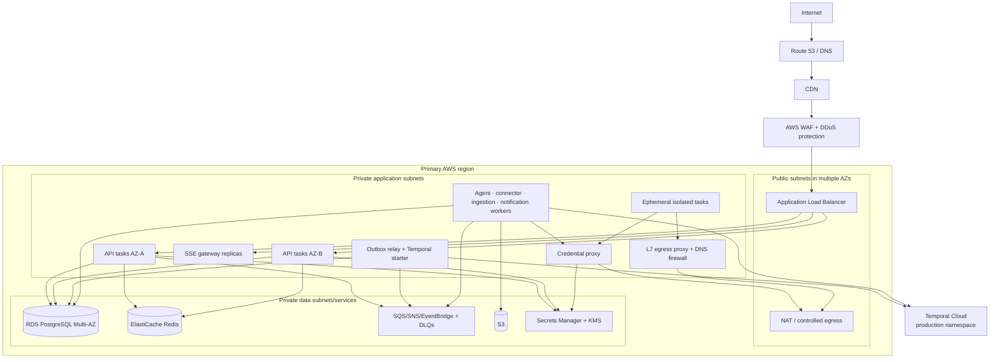

The SPA may remain on Vercel. If enterprise residency or network policy requires
one cloud boundary, the same built static assets can be served from S3/CDN.

### 27.2 Network policy

- API and workers run without public IPs.
- Only the load balancer accepts public application traffic.
- Database and Redis accept only workload security groups.
- Administrative access uses SSO-controlled session tooling, not public SSH.
- Connector and model egress traverses controlled NAT/proxy paths.
- Agent sandboxes have no direct NAT route. Connected-system operations use the
  credential proxy; unauthenticated web/search access uses an L7 egress proxy
  with DNS/IP/redirect revalidation, private/link-local range blocking, domain
  allowlists, response-size limits, and logged policy decisions.
- Private endpoints are used for S3, Secrets Manager, telemetry, and other AWS
  services where practical.
- DNS and egress logs support incident investigation.

### 27.3 Deployment units

| Unit | Scaling signal | Isolation reason |
|---|---|---|
| API | RPS, latency, CPU, DB pool | Interactive control plane |
| SSE gateway | open connections, event fanout | Long-lived connections |
| Orchestrator worker | workflow-task lag | Durable decisions/timers |
| Agent worker | queue age, model concurrency | High latency/cost |
| Connector worker | provider queue age/quota | Provider-specific faults |
| Ingestion worker | bytes/pages queued, CPU/memory | Parsing and embedding load |
| Notification worker | queue age | External delivery |
| Sandbox task | task demand with hard caps | Untrusted execution |
| Outbox relay | unpublished-event age | Delivery durability |

### 27.4 Database migration

Use expand/contract:

1. deploy additive schema compatible with old code;
2. backfill idempotently;
3. deploy code that writes both/new representation if needed;
4. compare and reconcile;
5. switch reads;
6. stop old writes;
7. remove old schema in a later release.

Migrations are versioned, tested against production-like size, lock-time
bounded, observable, and never coupled to an unrecoverable application rollout.

## 28. Scalability and capacity

### 28.1 Reference planning scenario

The following numbers are explicit assumptions for sizing, not observed Trace
traffic:

| Dimension | Planning value |
|---|---:|
| Teams | 1,000 |
| Registered users | 20,000 |
| Concurrent active users at peak | 5,000 |
| Workflow runs per team per day | 25 |
| Average tasks per run | 12 |
| Agent-assigned tasks | 15% |
| Average model input/output per agent task | 8,000 / 1,000 tokens |
| Changed source objects per team per day | 20 |
| Average raw changed object | 200 KB |
| Average chunks per object | 8 |
| Peak-to-average task-start ratio | 20× |

### 28.2 Derived load

```text
workflow runs/day = 1,000 × 25 = 25,000
tasks/day = 25,000 × 12 = 300,000
average task starts/second = 300,000 / 86,400 ≈ 3.5
planning peak task starts/second ≈ 70
agent tasks/day = 300,000 × 15% = 45,000
model input tokens/day ≈ 360 million
model output tokens/day ≈ 45 million
changed source objects/day = 20,000
raw source growth/day ≈ 4 GB before replicas/versions
new chunks/vectors/day ≈ 160,000
```

If 5,000 concurrent users all poll every two seconds, the browser alone creates
approximately 2,500 requests per second before ordinary API traffic. SSE plus
conditional polling fallback removes most of that amplification.

If an average task creates five durable state/audit/event writes, task
transitions create roughly 1.5 million writes/day, about 17/second average and
roughly 350/second at a 20× peak. This is within a well-tuned PostgreSQL system,
but indexes, connection pooling, event retention, and hot-run contention must
be measured.

### 28.3 Scaling approach

- Scale APIs, SSE, agent, connector, and ingestion pools independently.
- Autoscale workers using oldest-message age plus utilization, not queue depth
  alone.
- Enforce provider and tenant concurrency semaphores.
- Use connection pooling and cap each replica's database connections.
- Batch embeddings and low-risk ingestion writes.
- Partition high-volume `run_events`, `task_attempts`, `usage_ledger`, and
  `audit_events` by time when data proves necessary.
- Archive cold execution detail to object storage while keeping searchable
  summaries.
- Add read replicas for deliberate reporting/search workloads, not as a fix for
  inefficient queries.
- Split pgvector/search only when corpus, update rate, or latency benchmarks
  exceed PostgreSQL's measured envelope.
- Shard transactional tenants only after schema, operational tooling, and
  cross-shard constraints are designed.

### 28.4 Hot-tenant protection

Per-tenant controls:

- interactive API rate;
- concurrent active runs;
- ready/running tasks;
- model calls and tokens;
- connector operations;
- file size/count;
- indexed bytes/vectors;
- outbound side effects;
- daily/monthly spend.

Large enterprise tenants can receive dedicated concurrency lanes, data
partitions, or isolated deployment only when contract and scale justify it.

### 28.5 Concurrency, storage, and initial fleet envelope

Additional sizing assumptions:

- average agent task duration: 45 seconds;
- 30% of agent tasks require an isolated sandbox;
- average sandbox duration: 90 seconds;
- embedding dimension: 1,536 float32 values for raw-size illustration;
- two-times headroom at the stated planning peak.

Derived concurrency:

```text
peak agent starts/second ≈ 70 × 15% = 10.5
peak agent concurrency ≈ 10.5 × 45 = 473
planned agent concurrency with 2× headroom ≈ 950
peak sandbox concurrency ≈ 10.5 × 30% × 90 = 284
planned sandbox ceiling with 2× headroom ≈ 570
peak model input quota ≈ 10.5 × 8,000 × 60 = 5.04 million tokens/minute
peak model output quota ≈ 10.5 × 1,000 × 60 = 630,000 tokens/minute
```

Provider quotas and tenant budgets must sustain or deliberately throttle these
rates before the worker fleet scales to them.

Initial deployment/load-test envelope:

| Unit | Minimum HA footprint | Scale/load-test target | Guardrail |
|---|---:|---:|---|
| API | 4 tasks across ≥2 AZs | 500 mixed RPS at p95 objective; autoscale up to tested 30 tasks | Aggregate DB pool ≤300 connections |
| SSE gateway | 4 tasks | 5,000 connected clients plus reconnect storm; 2,000 tested connections/task | Connection-age and fanout limits |
| Outbox relay/starter | 2 tasks | ≥500 events/s and no pending event >5 s | Deterministic start ID and DB claim lease |
| Temporal workers | ≥2 per task-queue class | 70 task starts/s and 2× timer/signal peak | Per-team fairness |
| Agent execution | Warm pool sized for ordinary load | 950 concurrent bounded activities | Provider token/cost quotas take precedence |
| Connector/ingestion | ≥2 per critical class | 100 operations/s plus rate-limit simulation | Per-provider bulkhead |
| Credential proxy | 4 tasks | 400 authorized operations/s with KMS/provider latency | Exact-secret IAM; no broad listing |
| Sandbox | Scale to zero where safe | Ceiling around 570 concurrent tasks in scenario | Account/region quota and spend cap |
| PostgreSQL | Multi-AZ, connection pool | ≥700 writes/s and 2,000 indexed reads/s under failover test | <70% sustained CPU/IO/connection saturation |
| Event queues | Durable multi-day retention | Accept 1 million-event backlog and drain ≤6 h without provider overload | DLQ and replay authorization |

These counts are starting test hypotheses. Benchmark results determine actual
instance sizes and autoscaling thresholds.

Annualized storage at the planning rate:

```text
raw source objects ≈ 4 GB/day ≈ 1.46 TB/year before versions/replicas
chunks/vectors ≈ 160,000/day ≈ 58.4 million/year
raw 1,536-dimension float32 vectors ≈ 359 GB/year
vector metadata/index overhead can bring that corpus to roughly 0.7–1.5 TB/year
task-run rows ≈ 109.5 million/year before attempts and events
```

This volume requires lifecycle policy and likely time partitioning for run,
attempt, usage, audit, and event tables. Recovery tests must prove that the
database, object, and vector corpus can be restored/rebuilt within the tier RTO.

## 29. Cost architecture

### 29.1 Main cost drivers

1. Model input and output tokens.
2. Web search, browser automation, and paid tools.
3. Embedding generation.
4. Integration broker/provider charges.
5. PostgreSQL compute, I/O, backups, and storage.
6. Worker and sandbox compute.
7. Object storage and data transfer.
8. Vector/search capacity.
9. Sentry, replay, logs, traces, and product analytics.
10. Email and notification delivery.

### 29.2 Cost attribution

Every chargeable action maps to:

```text
team
workflow
workflow run
task run
attempt
agent/tool/model/connector
usage meter
provider request
timestamp
```

Cost formulas use current provider prices in a versioned pricing catalog rather
than hard-coded application logic.

### 29.3 Controls

- estimate and reserve budget before agent execution;
- cap retrieval context;
- route simple tasks to appropriate lower-cost models;
- cache only safe, authorization-equivalent deterministic results;
- batch embeddings;
- stop repeated low-value model repair loops;
- require approval for high-cost plans;
- alert on tenant/model/workflow anomalies;
- place hard ceilings below financial exposure limits;
- ensure autoscaling cannot multiply runaway external spend;
- tune Sentry traces and replays instead of defaulting to maximum capture.

### 29.4 Model-cost sensitivity

At the planning volume, monthly model traffic is approximately 10.8 billion
input tokens and 1.35 billion output tokens. The table uses hypothetical unit
prices to show sensitivity; it is not a vendor quote.

| Scenario | Input price / 1M | Output price / 1M | Approximate monthly model cost |
|---|---:|---:|---:|
| Low-cost routing | $1 | $5 | $17,550 |
| Mid-cost routing | $3 | $15 | $52,650 |
| Higher-cost routing | $10 | $30 | $148,500 |

Add embeddings, search/browser/tool calls, connector-broker charges, compute,
database, storage, egress, and telemetry to obtain the full cost of service.
The capacity test must verify that autoscaling respects a configured hourly
model-spend ceiling while preserving auth, approval, and cancellation capacity.

## 30. CI/CD and software supply chain

### 30.1 Pipeline

```mermaid
flowchart LR
    Commit["Reviewed commit"]
    Checks["Format · lint · unit · property tests"]
    Security["SAST · SCA · secrets · IaC · license scan"]
    Build["Reproducible frontend/JAR/container build"]
    SBOM["SBOM + provenance + signature"]
    Integration["Integration · migration · contract tests"]
    Stage["Ephemeral/staging deployment"]
    E2E["Browser E2E · load slice · agent evaluations"]
    Canary["Production canary"]
    Gate["Health + SLO + security gate"]
    Promote["Progressive promotion"]
    Rollback["Artifact rollback / forward-fix migration"]

    Commit --> Checks --> Security --> Build --> SBOM --> Integration --> Stage
    Stage --> E2E --> Canary --> Gate
    Gate -->|Pass| Promote
    Gate -->|Fail| Rollback
```

### 30.2 Controls

- Protected branches and required review.
- Additional approval for security, infrastructure, migration, and policy
  changes.
- OIDC workload identity; no long-lived CI cloud keys.
- Build once, promote the same signed artifact.
- Locked and reviewed npm/Maven dependencies.
- Secret scanning and dependency update policy.
- Container image signing and verification.
- Software bill of materials and provenance.
- Synthetic data in non-production.
- No production provider secrets in preview environments.
- Server-authoritative feature flags and emergency rollback.
- Deployment record containing commit, artifact digest, migration, config,
  flags, actor, and time.

### 30.3 Model/prompt delivery

Models, prompts, tools, retrieval policies, and agent configurations follow a
release process:

1. version immutable configuration;
2. run offline golden evaluations;
3. test adversarial and injection cases;
4. compare quality, latency, and cost;
5. shadow production traffic when allowed;
6. canary by team/workflow percentage;
7. monitor human overrides and failures;
8. promote or roll back independently of application code.

## 31. Testing strategy

### 31.1 Application and data

- Unit tests for state transitions, policy, usage, and error classification.
- Property tests for DAGs, cycles, retries, cancellation, and concurrent
  completion.
- Repository tests for tenant filters and constraints.
- Direct PostgreSQL RLS tests for every tenant table and bypass role.
- Migration tests from realistic older schemas and data volumes.
- API contract and backward-compatibility tests.
- Idempotency and duplicate-delivery tests.
- Outbox crash-window and replay tests.

### 31.2 Connectors

- Provider sandbox/fixture contract tests.
- OAuth state, PKCE, callback replay, and scope-change tests.
- Webhook forgery, reorder, replay, duplication, and delay tests.
- Cursor checkpoint and partial-page failure tests.
- Token refresh/revocation tests.
- Provider throttling and outage tests.
- Outbound side-effect idempotency and reconciliation tests.

### 31.3 Workflow runtime

- Large and deep graph tests.
- Fan-out/fan-in.
- Conditional branches, dependency-cycle rejection, and bounded iteration
  inside explicit task implementations.
- Human waits across deployment/restart.
- Retry exhaustion and DLQ repair.
- Worker lease expiry and fencing.
- Pause/resume/cancel races.
- Database failover during state transition.
- Restore followed by external reconciliation.

### 31.4 Agents and knowledge

- Golden datasets for decomposition, assignment, extraction, and tool use.
- Schema/output validation tests.
- Retrieval recall, precision, citation coverage, and freshness tests.
- Cross-tenant retrieval-negative tests.
- Prompt injection and malicious document tests.
- SSRF, redirect, DNS rebinding, and egress tests.
- Tool-budget and monetary-limit tests.
- Human-review calibration and false-accept/false-reject measurement.
- Model/prompt regression gates.

### 31.5 End-to-end and resilience

- Browser flows for login, team selection, workflow editing, start, approval,
  retry, billing, invitation, and connector setup.
- Load, spike, stress, and soak tests.
- Queue-drain recovery without provider overload.
- Availability-zone and worker-pool fault injection.
- Backup restore and regional recovery exercises.
- Penetration tests and cross-tenant BOLA/IDOR review.
- Tabletop exercises for token compromise, unsafe agent action, data exposure,
  and region loss.

## 32. End-to-end system sequences

### 32.1 Workflow creation through completion

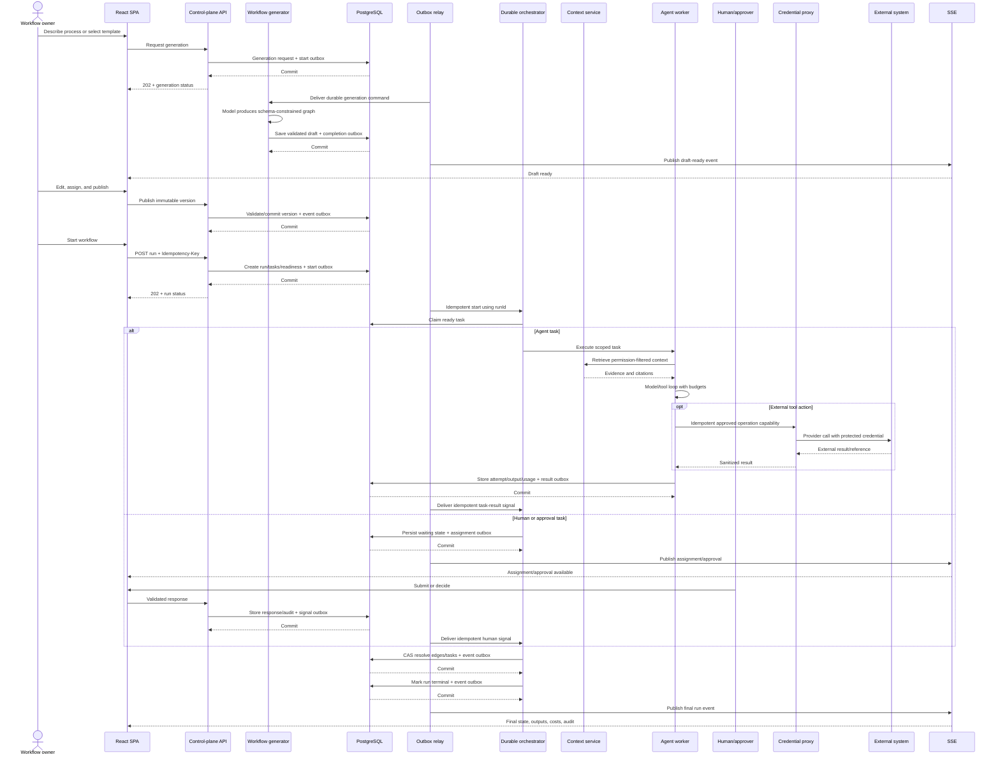

### 32.2 Agent task with retrieval, approval, and side effect

```mermaid
sequenceDiagram
    participant Or as Orchestrator
    participant AW as Agent worker
    participant Authz as Policy service
    participant R as Retrieval
    participant MG as Model gateway
    participant AP as Approval service
    actor H as Approver
    participant CP as Credential proxy
    participant P as SaaS provider
    participant DB as PostgreSQL
    participant Relay as Outbox relay

    Or->>AW: Activity(taskRunId, attempt, capability)
    AW->>Authz: Validate task, tenant, agent, tools, budgets
    Authz-->>AW: Scoped execution policy
    AW->>R: Retrieve context under policy
    R-->>AW: Context manifest + citations
    AW->>MG: Structured model request
    MG-->>AW: Proposed output/tool call
    AW->>Authz: Evaluate tool, payload, risk, cost
    alt Approval required
        Authz-->>AW: REVIEW_REQUIRED
        AW->>DB: Save payload hash/approval + notification outbox
        DB-->>AW: Commit
        Relay->>AP: Deliver approval notification
        AP-->>H: Notify
        H->>AP: Approve exact payload
        AP->>DB: Save decision/audit + signal outbox
        DB-->>AP: Commit
        Relay-->>Or: Idempotent approval signal
        Or->>AW: Resume with decision
        AW->>Authz: Recheck hash, expiry, task state, capability, budget
        Authz-->>AW: ALLOW or DENY
    else Allowed
        Authz-->>AW: ALLOW
    end
    alt Final policy decision ALLOW
        AW->>CP: Execute operation with stable idempotency key
        CP->>P: Provider call using protected credential
        P-->>CP: Provider result/reference
        CP-->>AW: Sanitized result
        AW->>DB: Commit output/citations/usage/audit + result outbox
        DB-->>AW: Commit
        Relay-->>Or: Idempotent activity-result signal
    else DENY/expired/cancelled
        AW->>DB: Commit policy failure + result outbox
        DB-->>AW: Commit
        Relay-->>Or: Idempotent failure signal
    end
```

### 32.3 Signed webhook to workflow trigger

```mermaid
sequenceDiagram
    participant P as Provider
    participant Edge as Edge/WAF
    participant WH as Webhook receiver
    participant DB as PostgreSQL
    participant Relay as Outbox relay
    participant Q as Queue
    participant C as Connector worker
    participant T as Trigger service
    participant Start as Workflow starter

    P->>Edge: Signed webhook with provider event ID
    Edge->>WH: Raw body and signature headers
    WH->>WH: Verify signature, timestamp, size
    WH->>DB: Insert event + processing outbox if new
    DB-->>WH: Commit
    WH-->>P: 2xx quickly
    Relay->>Q: Publish durable processing event
    Q->>C: At-least-once delivery
    C->>P: Fetch authoritative changed object if needed
    C->>DB: Upsert source/checkpoint + source.changed outbox
    DB-->>C: Commit
    Relay->>T: Deliver canonical source.changed event
    T->>T: Match enabled trigger and deduplication window
    T->>DB: Create trigger firing/run request + start outbox
    DB-->>T: Commit
    Relay->>Start: Start workflow with stable trigger key
```

### 32.4 Workflow cancellation during an external operation

```mermaid
sequenceDiagram
    actor O as Owner
    participant API as Control API
    participant DB as PostgreSQL
    participant Relay as Outbox relay
    participant Or as Orchestrator
    participant W as Worker
    participant P as Provider
    participant Rec as Reconciler

    O->>API: Cancel run
    API->>DB: Set CANCELLING + cancellation outbox
    DB-->>API: Commit
    Relay->>Or: Idempotent cancellation signal
    Or->>W: Cooperative cancel
    alt Provider call not issued
        W->>DB: Mark attempt cancelled + result outbox
        DB-->>W: Commit
    else Provider call in flight or outcome unknown
        W->>DB: Mark UNKNOWN + reconciliation outbox
        DB-->>W: Commit
        Relay->>Rec: Enqueue reconciliation
        Rec->>P: Lookup by external/idempotency reference
        P-->>Rec: Actual provider state
        Rec->>DB: Record result/remediation + signal outbox
        DB-->>Rec: Commit
    end
    Relay->>Or: Deliver cancellation/reconciliation result
    Or->>DB: Cancel unstarted tasks and finalize when safe
```

### 32.5 Tenant deletion

```mermaid
sequenceDiagram
    actor A as Authorized tenant admin
    participant API as Administration API
    participant DB as PostgreSQL
    participant Relay as Outbox relay
    participant Or as Deletion workflow
    participant Sec as Secrets store
    participant Obj as Object storage
    participant Idx as Search/vector index
    participant SaaS as Subprocessors/providers
    participant Audit as Audit evidence
    participant Notif as Notification worker

    A->>API: Request tenant deletion + step-up auth
    API->>DB: Record approved request + deletion-start outbox
    DB-->>API: Commit
    Relay->>Or: Idempotent deletion-workflow start
    Or->>DB: Suspend tenant and stop new executions
    Or->>Sec: Revoke/destroy connector credentials
    Or->>SaaS: Send required deletion requests
    Or->>Obj: Delete tenant objects/versions per policy
    Or->>Idx: Delete vectors/search entries
    Or->>DB: Delete/anonymize data + completion/audit outbox
    DB-->>Or: Commit
    Relay->>Audit: Store non-sensitive completion evidence
    Relay->>Notif: Deliver completion event
    Notif-->>A: Completion and backup-expiry notice
```

## 33. Operational model and incident response

### 33.1 Ownership

Suggested service ownership:

| Area | Primary owner | Critical partners |
|---|---|---|
| Identity, teams, authorization | Platform/backend | Security |
| Workflow definitions and UI | Product engineering | Design |
| Runtime/orchestration | Platform/runtime | SRE |
| Agents, model gateway, evaluations | AI engineering | Security, product |
| Connectors and ingestion | Integrations | Data/platform |
| Knowledge and retrieval | AI/data | Integrations |
| Billing and entitlements | Platform/business systems | Finance |
| Infrastructure and delivery | SRE/platform | Security |
| Security and privacy | Security/privacy | Every service owner |

Each deployable, queue, datastore, and third-party dependency has an owner,
runbook, dashboard, SLO, escalation policy, and dependency map.

### 33.2 Incident severity

Critical production services have 24×7 on-call coverage.

| Severity | Example | Initial target |
|---|---|---|
| SEV-1 | Cross-tenant exposure, destructive agent action at scale, total control-plane outage, unrecoverable accepted-work loss | Acknowledge ≤5 min; incident command ≤15 min; containment objective ≤60 min when technically possible; initial status/customer coordination ≤30 min |
| SEV-2 | Major tenant/workflow failures, prolonged queue outage, database failover with material impact, compromised connector | Acknowledge ≤15 min; lead assigned ≤30 min; update cadence ≤60 min |
| SEV-3 | Degraded connector/model, partial feature outage, sustained SLO burn | Acknowledge during on-call/business policy ≤4 h; owner and mitigation date |
| SEV-4 | Minor bug, isolated failed task, cosmetic/low-impact issue | Normal prioritized backlog |

Legal, regulatory, and contractual notification clocks supersede these
operational targets and begin from the defined discovery/awareness event.

### 33.3 Required runbooks

- authentication/session compromise;
- OAuth or connector-token compromise;
- cross-tenant authorization or retrieval incident;
- unsafe agent/tool behavior;
- database failure or corruption;
- queue backlog and DLQ growth;
- model/provider outage;
- connector-provider outage/rate limit;
- object-storage/parser security event;
- Stripe/billing incident;
- telemetry PII leakage;
- supply-chain compromise;
- regional failure and DR;
- tenant deletion/export failure.

### 33.4 Incident controls

The incident commander can invoke the kill switches in Section 22.8 without a
new deployment. Roles are explicitly assigned: incident commander, operations
lead, security/privacy lead, customer/exec communications lead, and scribe.

Evidence sources include synchronized audit, cloud, application, deployment,
queue, database, connector, and provider logs. Security-relevant evidence has
protected retention and access. Collection records source, collector,
timestamp, cryptographic hash, storage location, transfers, and every access so
chain of custody can be demonstrated.

After containment:

1. establish a precise event timeline;
2. determine affected tenants/data/actions;
3. reconcile external side effects;
4. follow contractual and regulatory notification decision trees;
5. recover under change control;
6. complete a blameless postmortem;
7. assign owners and verification dates;
8. add recurrence-detection tests and monitoring.

Tabletop exercises occur at least twice yearly; technical recovery exercises
occur quarterly for critical paths.

## 34. Graceful degradation

| Dependency unavailable | Allowed behavior | Blocked behavior |
|---|---|---|
| Model provider | Show queued/degraded, use approved fallback or human task | Do not silently change model/data policy |
| Retrieval index | Use authoritative metadata or request human input when safe | Do not run evidence-dependent tasks without evidence |
| Connector provider | Queue within age limit, allow local reads | Do not report external write success |
| Stripe | Existing entitled product usage | New plan/payment mutation |
| PostHog/Sentry | Full product operation | Telemetry must not block requests |
| Redis | Database-backed auth/state and polling fallback | High-scale SSE/cache optimizations |
| Email provider | In-app tasks and retry queue | Do not lose magic-link/notification intent |
| Object storage | Metadata and unaffected tasks | File-dependent execution |
| Orchestrator | Read current durable state, accept pause/cancel intent if durable | Starting execution that cannot be durably scheduled |

Degraded state is visible in the UI and operator dashboards. The platform must
not display stale `RUNNING` indefinitely when it knows a dependency is blocked.

## 35. Architectural decisions and tradeoffs

### ADR-001: Modular monolith before microservices

**Decision:** Use a Spring Boot modular monolith for synchronous control-plane
business logic, with separate worker deployables.

**Why:** The public company appears small, transactions span several domains,
and premature service fragmentation increases operational and consistency cost.

**Extraction triggers:** a module needs distinct security isolation, language
runtime, scaling profile, release cadence, or availability objective.

### ADR-002: PostgreSQL as transactional truth

**Decision:** Keep workflow, execution, tenancy, billing, and provenance state in
PostgreSQL.

**Why:** PostgreSQL is publicly confirmed and fits relational constraints,
transactions, JSON metadata, and moderate vector/graph workloads.

**Tradeoff:** Very large retrieval or traversal workloads may later require
specialized stores.

### ADR-003: Temporal plus product-state records

**Decision:** Use Temporal for long-lived orchestration while retaining
queryable workflow/run/task state in PostgreSQL.

**Why:** Human waits, timers, retries, cancellation, and durable signals are
core. Temporal avoids rebuilding those mechanics.

**Tradeoff:** It adds a platform and consistency integration. A simpler first
step can use PostgreSQL leases plus SQS/outbox if scale and workflow complexity
are low. Product state must not exist only in Temporal history.

### ADR-004: At-least-once delivery

**Decision:** Assume duplicate delivery and make operations idempotent.

**Why:** Queues, webhooks, worker crashes, and disaster recovery can redeliver.

**Tradeoff:** Requires idempotency records and provider reconciliation, but
produces an exactly-once user experience without making an unsound distributed
guarantee.

### ADR-005: `pgvector` and relational graph first

**Decision:** Start with PostgreSQL entity/relation tables and `pgvector`.

**Why:** Simplifies tenant filtering, deletion, backups, and operations.

**Extraction triggers:** measured recall/latency/corpus limits, specialized graph
traversals, or independent scale justify OpenSearch/vector/graph services.

### ADR-006: SSE over two-second polling

**Decision:** Use SSE for run status and polling fallback.

**Why:** Updates are mostly server-to-client and polling amplifies traffic.

**Tradeoff:** Requires connection management and resume semantics. WebSocket is
reserved for true collaborative editing.

### ADR-007: Direct and brokered connectors behind one interface

**Decision:** Hide Notion/Linear/X direct adapters and Composio-backed Google
adapters behind a common capability contract.

**Why:** Workflow and agent code should not care how credentials or operations
are implemented.

**Tradeoff:** Lowest-common-denominator abstractions must not hide
provider-specific capabilities; adapters expose typed extensions.

### ADR-008: Human approval for risk, not every task

**Decision:** Approval depends on action risk, data classification, confidence,
tenant policy, and agent evaluation.

**Why:** Always approving defeats automation; never approving permits excessive
agency.

**Tradeoff:** Policies require calibration and tenant-visible explanations.

### ADR-009: Shared SaaS with optional isolation

**Decision:** Default to shared multi-tenant control and execution planes with
strong logical isolation. Offer regional/dedicated deployment only for justified
enterprise requirements.

**Why:** Shared operation is cost-efficient; dedicated infrastructure increases
deployment, upgrade, support, and observability complexity.

## 36. Migration from the observable system

The sequence below is designed to improve safety without requiring a complete
rewrite.

### Phase 0: Establish truth and guardrails

- Inventory private code, infrastructure, data stores, queues, providers, and
  current SLOs.
- Add request/correlation IDs and structured redaction.
- Put API behind a managed edge/load balancer.
- Add API HSTS, strict CORS, server-version suppression, request limits, and CSP.
- Remove development configuration from production bundles.
- Audit `sendDefaultPii`, trace, replay, and product analytics.
- Add tenant-isolation and authorization regression tests.

### Phase 1: Harden identity and integrations

- Migrate browser-readable long-lived auth to hardened sessions.
- Move sensitive query inputs to request bodies.
- Hash and single-use magic-link tokens.
- Add OAuth random state and S256 PKCE.
- Move provider credentials into KMS-backed vault storage.
- Verify/deduplicate webhooks.
- Make state-changing GET operations POST.

### Phase 2: Separate definition from execution

- Add immutable workflow versions.
- Add `workflow_runs`, `task_runs`, and immutable attempts.
- Define state machines and compare-and-set transitions.
- Introduce idempotency keys and external-operation records.
- Preserve current API through an adapter during client migration.

### Phase 3: Durable asynchronous execution

- Add transactional outbox.
- Move long work from API processes to bounded worker queues.
- Add leases/fencing, retries, backoff, DLQs, pause/cancel, and reconciliation.
- Evaluate/adopt Temporal for long-lived human/agent workflows.
- Add SSE with polling fallback.

### Phase 4: Secure agent platform

- Introduce versioned agents, tools, prompts, policies, and model gateway.
- Add time/token/cost/tool budgets.
- Add credential proxy and egress restrictions.
- Sandbox parsing, browsing, code, and untrusted tools.
- Add output schemas, citations, evaluations, and risk-based approvals.

### Phase 5: Knowledge and connector maturity

- Establish canonical source/document/entity/relation schema.
- Add S3 raw/versioned objects.
- Add permission-aware parsing, chunking, embedding, retrieval, and deletion.
- Add connector cursors, health, provider quotas, and reconciliation.
- Start with relational graph/pgvector and measure specialization needs.

### Phase 6: Enterprise operations

- Multi-AZ workloads and managed PostgreSQL PITR.
- Restore and regional recovery tests.
- SSO/SCIM, audit export, retention, residency, and policy controls.
- SLO/error-budget operation.
- Security assurance, incident exercises, and evidence-backed compliance.

## 37. Implementation roadmap

### 37.1 Milestone 1 — Safe control plane

Deliver:

- hardened session and OAuth;
- strict tenant authorization;
- versioned `/v1` API;
- immutable workflow definitions;
- production edge controls;
- structured logs/audit.

Exit criteria:

- two-tenant negative tests pass on every protected endpoint;
- auth and connector threat tests pass;
- all privileged actions are audited;
- no sensitive token/code is intentionally stored in browser-readable storage
  or ordinary logs.

### 37.2 Milestone 2 — Durable workflow runtime

Deliver:

- runs/tasks/attempts;
- outbox;
- durable orchestrator;
- idempotency;
- human waits and approvals;
- retries, cancellation, DLQs;
- SSE.

Exit criteria:

- active run survives worker/API restarts;
- duplicated messages do not duplicate side effects;
- human approval survives deployment;
- restore/replay test preserves externally consistent outcomes.

### 37.3 Milestone 3 — Agent execution

Deliver:

- versioned agent/tool registry;
- model gateway;
- retrieval contract;
- sandbox/credential proxy;
- budgets and guardrails;
- evaluation and review pipeline.

Exit criteria:

- agent cannot exceed tool, network, token, or spend policy;
- every result has provenance;
- high-risk writes require approval;
- model/prompt releases pass quality, safety, and cost gates.

### 37.4 Milestone 4 — Context and integrations

Deliver:

- canonical ingestion;
- raw object/artifact storage;
- incremental sync/webhooks;
- hybrid permission-aware retrieval;
- entity resolution/relations;
- deletion propagation;
- connector health and reconciliation.

Exit criteria:

- changed/deleted source objects propagate correctly;
- retrieval cannot cross tenants or source permissions;
- every cited item resolves to a versioned source;
- connector restart/replay does not corrupt cursors.

### 37.5 Milestone 5 — Enterprise scale and assurance

Deliver:

- SSO/SCIM;
- configurable retention/residency;
- full audit/export;
- multi-AZ and DR;
- SLOs, cost allocation, fairness;
- formal security/compliance program.

Exit criteria:

- restore and regional recovery targets are demonstrated;
- capacity test meets peak assumptions with headroom;
- penetration-test findings meet remediation policy;
- operational owners and runbooks cover all critical dependencies.

## 38. Domain relationship map

```mermaid
erDiagram
    USER ||--o{ MEMBERSHIP : has
    TEAM ||--o{ MEMBERSHIP : contains
    TEAM ||--o{ WORKFLOW : owns
    WORKFLOW ||--o{ WORKFLOW_VERSION : versions
    WORKFLOW_VERSION ||--o{ WORKFLOW_NODE : contains
    WORKFLOW_VERSION ||--o{ WORKFLOW_EDGE : contains
    WORKFLOW_VERSION ||--o{ WORKFLOW_RUN : instantiates
    WORKFLOW_RUN ||--o{ TASK_RUN : contains
    TASK_RUN ||--o{ TASK_ATTEMPT : attempts
    TASK_RUN ||--o{ APPROVAL : may_require
    AGENT_DEFINITION ||--o{ AGENT_VERSION : versions
    AGENT_VERSION ||--o{ TASK_RUN : executes
    TEAM ||--o{ INTEGRATION : connects
    INTEGRATION ||--o{ SOURCE_OBJECT : imports
    SOURCE_OBJECT ||--o{ DOCUMENT : normalizes
    DOCUMENT ||--o{ DOCUMENT_VERSION : versions
    DOCUMENT_VERSION ||--o{ CHUNK : contains
    CHUNK ||--o{ EMBEDDING : embeds
    TEAM ||--o{ ENTITY : models
    ENTITY ||--o{ RELATION : source
    ENTITY ||--o{ RELATION : target
    TASK_ATTEMPT ||--o{ CITATION : cites
    DOCUMENT_VERSION ||--o{ CITATION : supports
    TEAM ||--o{ SUBSCRIPTION : history
    TEAM ||--o{ USAGE_LEDGER_ENTRY : incurs
    TEAM ||--o{ AUDIT_EVENT : records
```

## 39. Core invariants

The implementation is not complete unless all of these hold:

1. Every tenant-owned resource has one immutable tenant owner.
2. The server proves membership/authorization; a browser-provided team ID is
   never sufficient.
3. A published workflow version cannot change.
4. Every run pins exactly one workflow version and policy snapshot.
5. Every task has one current state and an immutable attempt history.
6. Only legal state transitions can commit.
7. A stale worker cannot commit after its lease/fencing token expires.
8. Acknowledged mutations survive process, instance, and availability-zone
   failure; regional recovery is bounded by the published RPO.
9. Events and webhooks may repeat without duplicating logical effects.
10. External writes have a stable operation identity and reconciliation path.
11. Approval applies to the exact payload/version executed.
12. Agent authority is explicitly bounded per task.
13. Connector/model credentials never appear in browser, prompt, artifact, or
    ordinary log data.
14. Retrieval enforces tenant and source permissions before content reaches a
    model.
15. Every generated result can identify its source context, agent/prompt/model,
    tools, attempt, cost, and reviewer.
16. Usage and audit history are append-only through ordinary application roles.
17. Source and tenant deletion propagates to derived objects and indexes.
18. Telemetry failure cannot fail product transactions.
19. Restore/replay cannot silently repeat uncertain irreversible actions.
20. Operators can stop unsafe execution without deploying code.

## 40. Known unknowns and verification plan

The public system cannot answer the following. An internal design review should
resolve each item before treating this document as an as-built design.

| Unknown | Why it matters | Verification artifact |
|---|---|---|
| Actual LLM and embedding providers/models | Quality, data handling, residency, cost | Model gateway config and vendor contracts |
| Actual queue/scheduler/workflow engine | Durability, retry, cancellation | Runtime deployment and state-machine code |
| Actual agent planning loop | Safety and reproducibility | Agent executor and prompt/tool policy |
| Actual sandboxing | RCE, SSRF, credential exposure | Runtime isolation/network policy |
| Actual graph/vector storage | Retrieval scale and isolation | Data architecture and schemas |
| PostgreSQL hosting/topology | Availability, backup, RPO/RTO | Cloud inventory and restore evidence |
| Secret storage/rotation | Connector and session security | Secrets inventory and rotation logs |
| Server-side tenant enforcement | Cross-tenant risk | Authorization code, DB policies, negative tests |
| Webhook design | Forgery, replay, missed updates | Receiver code and provider configuration |
| Workflow versioning/idempotency | Reproducibility and duplicate writes | Schema, constraints, replay tests |
| Data retention/deletion | Privacy and enterprise obligations | Policy and deletion evidence |
| CI/CD and IaC | Supply chain and recovery | Pipeline, SBOM, signed artifacts, Terraform |
| Internal telemetry | Detection and privacy | Dashboards, redaction rules, retention |
| Production SLOs and scale | Capacity and commitments | SLI definitions and historical measurements |
| Backup and DR | Business continuity | Restore logs and DR exercise report |
| Enterprise security certifications | Procurement and trust | Current audit/certification evidence |
| Live versus simulated screens | Product scope and operational truth | Authenticated product/API validation |

## 41. Requirements traceability

| Requirement group | Primary design sections |
|---|---|
| Authentication and teams | 9, 10, 18, 22 |
| Workflow generation and editing | 11, 18, 19, 32 |
| Durable workflow execution | 12, 17, 25, 32 |
| Human tasks and approvals | 13, 18, 32 |
| Agent runtime and tools | 14, 22, 32 |
| Connectors and external sync | 15, 18, 32 |
| Knowledge graph and retrieval | 16, 17, 22 |
| Billing and usage | 20, 29 |
| Scheduling and notification | 21 |
| Security, privacy, compliance | 22, 23, 33 |
| Observability and operations | 24, 25, 33 |
| Availability and recovery | 25, 26, 34 |
| Deployment and scaling | 27, 28 |
| Delivery and assurance | 30, 31 |
| Migration and implementation | 36, 37 |

## 42. Definition of done

An implementation conforming to this reference design is production-ready only
when:

- functional requirements have automated acceptance tests;
- architecture boundaries and ownership are documented;
- every protected API and worker has tenant-isolation tests;
- workflow definitions, runs, tasks, attempts, approvals, and state transitions
  are durable and queryable;
- duplicate delivery, worker crash, retry, cancellation, and restore scenarios
  have been exercised;
- agent tools are scoped, budgeted, isolated, evaluated, and auditable;
- retrieval is permission-aware and outputs preserve citations/provenance;
- connector credentials are protected and provider operations reconcile;
- SLOs, dashboards, alerts, and runbooks are active;
- backups and regional recovery have achieved stated targets in a test;
- privacy retention/export/deletion paths are tested end to end;
- supply-chain, application, tenant-isolation, and agent-security reviews pass;
- cost attribution and tenant limits prevent unbounded spend;
- public documentation clearly distinguishes currently available, simulated,
  beta, and planned functionality.

## 43. Final architecture summary

Trace's public product already reveals a credible foundation:

- Framer marketing delivery;
- a React/Vite graph-editing SPA on Vercel;
- a REST backend behind Nginx on AWS EC2;
- PostgreSQL;
- magic-link and Google authentication;
- multi-team state;
- workflow/node graph APIs;
- direct and brokered integrations;
- Stripe billing;
- Sentry and PostHog telemetry.

The private mechanisms that make orchestration safe and durable are not publicly
visible. A complete implementation therefore adds:

- immutable workflow versions and durable run/task/attempt records;
- a workflow orchestrator and at-least-once/idempotent execution;
- human approvals that survive restarts;
- versioned agents, tools, prompts, model routing, budgets, and evaluations;
- isolated execution and protected credentials;
- permission-aware ingestion, entity/relationship modeling, hybrid retrieval,
  and citations;
- transactional outbox, queues, DLQs, reconciliation, and SSE;
- tenant-enforced authorization and enterprise identity;
- managed multi-AZ data, object storage, secrets, backups, and recovery;
- comprehensive security, privacy, observability, cost, and operational
  controls.

The result is an implementable system design that stays aligned with what is
publicly known while making every unobserved architectural choice explicit.

## Appendix A: Evidence basis

The detailed passive-analysis evidence, public asset links, DNS/TLS findings,
library versions, pricing details, API behavior, and confidence assessment are
maintained in:

- [Trace.so Technical Architecture and Public-Surface Analysis](../../research/trace-so/2026-07-29-trace-so-technical-analysis.md)

First-party public references:

- [Trace homepage](https://www.trace.so/)
- [Trace product application](https://demo.trace.so/)
- [Trace API](https://api.trace.so/)
- [Trace funding announcement](https://www.trace.so/blog/trace-raised-dollar3m-to-build-the-context-layer-for-ai-at-work)
- [Y Combinator company profile](https://www.ycombinator.com/companies/trace-so)
- [Y Combinator launch](https://www.ycombinator.com/launches/OAG-trace-route-repetitive-tasks-to-ai-agents)

## Appendix B: Evidence labels by major subsystem

| Subsystem | Evidence status |
|---|---|
| Framer marketing site | Observed |
| React 19/Vite/Vercel product SPA | Observed |
| React Flow/Dagre workflow editor | Observed |
| Nginx on Ubuntu and AWS EC2 API host | Observed |
| Spring Boot/Spring Security backend | High-confidence inference |
| PostgreSQL | Observed |
| Magic-link and Google auth | Observed |
| Browser `localStorage` token/custom auth header | Observed |
| Multi-team/tenant UI and routes | Observed; server isolation unknown |
| Workflow graph model and REST client | Observed |
| Two-second polling | Observed |
| Notion/Linear/X/Google/file integrations | Observed to varying degrees |
| Composio for Google connections | Observed |
| Stripe checkout | Observed |
| Sentry/PostHog | Observed |
| Durable workflow engine | Unknown; Temporal is proposed |
| Queues/outbox/event bus | Unknown; proposed |
| Agent runtime/model providers | Unknown; gateway/workers are proposed |
| Object store | Unknown; S3 is proposed |
| Vector store | Unknown; `pgvector` is proposed |
| Graph database | Unknown; relational graph is proposed |
| Redis | Unknown; proposed for disposable state |
| Multi-AZ load-balanced production topology | Unknown; proposed |
| WAF, secrets manager, KMS, IaC, CI/CD | Unknown; proposed |
| SLOs, RPO, RTO, DR | Unknown; targets in this document are proposed |
